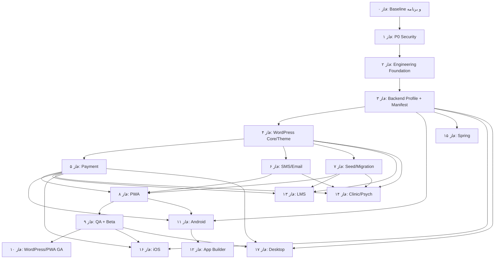

# چک‌لیست اجرایی مادر Carmilla

> بازنگری فعال: ۶ سپتامبر ۲۰۲۶ — [تعریف محصولات مستقل](INDEPENDENT_PRODUCTS_SPEC_FA.md) و [ADR-006](architecture/adr/ADR-006-INDEPENDENT-PRODUCTS-AND-ENTITLEMENTS.md) مرجع کارهای باقی‌مانده‌اند. جدول‌های این سند با صف همگام شده‌اند؛ checkboxهای تاریخی بدون مدرک جدید تیک نخورده‌اند. فصل «صف شروع دقیق» در انتهای نسخه قدیمی تاریخی است؛ اولین READY فقط از docs/tasks.md خوانده شود.
>
> قرارداد سراسری پذیرش: Theme-only،Plugin-only با UI روی قالب ثالث و co-install؛ SKU موجود/خریداری‌شده/روشن؛ App Builder مستقل هر میزبان؛ کلاینت مستقل با WORDPRESS یا SPRING. WooCommerce مجاز است. Fake runner فاز چهار و fixture Spring گواهی تحویل تجاری نیستند. انتقال قابلیت موجود در P04 جای تکمیل و Gate تخصصی P13/P14 را نمی‌گیرد.

> نسخه سند: ۱.۱ — بازبرنامه‌ریزی محصولات مستقل
> تاریخ: ۲۸ ژوئیه ۲۰۲۶  
> وضعیت: سند زنده اجرای پروژه از وضعیت فعلی تا انتشار و توسعه پلتفرم‌های بعدی  
> سند مرجع ممیزی: [`PROJECT_AUDIT_AND_PUBLICATION_PLAN_FA.md`](./PROJECT_AUDIT_AND_PUBLICATION_PLAN_FA.md)  
> اولویت محصول: `WordPress Theme/Plugin → PWA → Android → LMS → Clinic/Psych → Spring → iOS/Desktop`

---

### دامنه مجاز و پذیرش مشترک کارهای باقی‌مانده

این قرارداد برای TODO/READYهای مرتبط به P04/P05/P06/P07/P13/P14 و تست‌های آن‌ها، scope قدیمی «فقط مسیر افزونه» را در حد **همان قابلیت کارت** اصلاح می‌کند: `wordpress/packages/carmilla-core/**`، adapter همان قابلیت در `wordpress/carmilla-theme/**` و `wordpress/carmilla-bridge/**` و تست مربوط مجازند. این مجوز refactor سایر دامنه‌ها یا گسترش اندازه کارت نیست. Secret فقط در خدمات PHP سمت سرور مدیریت می‌شود و نباید به template خروجی،مرورگر یا KMP برسد. تغییر متن قدیمی «Theme هیچ secret ندارد» به معنی حذف نیاز backend داخلی پوسته به تنظیم provider نیست.

| فاز | قرارداد اضافه برای پذیرش |
|---|---|
| P03 | تنظیمات ساخت از برند جدا؛ runtime مؤثر به UI/route/عملیات وصل؛ WORDPRESS/SPRING فقط دو profile |
| P04 | manifest ساخت ZIP شامل features و چهار builder target مستقل؛ ماژول false واقعاً بسته نشود؛ API اتصال از خرید builder جدا |
| P05/P06/P07 | خدمات پرداخت/پیام/import از هسته مشترک هر دو میزبان؛ حفظ Woo و داده؛ کنترل SKU هنگام import |
| P08/P11 | Web/PWA/Android artifact مستقل؛ WP سه mode واقعی؛ Spring fixture فقط در مرحله contract و شاهد واقعی در P15 |
| P09/P10 | ماتریس آزمون و فروش per محصول/SKU/قابلیت/backend/target؛ هیچ فروش بیلد mock |
| P12 | build واقعی Android/Web/PWA از Theme تنها،Plugin تنها و portal؛ حق هر target جدا |
| P13/P14 | منطق و UI دو محصول + کلاینت؛ booking از consultation/psych/data خصوصی تفکیک؛ Gate تخصصی حفظ |
| P15 | backend Spring مستقل،manifest/enforcement و QA واقعی Android/Web/PWA؛ سرویس build وابستگی runtime سرور نیست |
| P16/P17 | اپ مستقل و Gate خودش؛ سپس adapter اپ‌ساز هر target از دو میزبان و portal؛ استقلال مسیر انتشار حفظ |
| CT/CB | کاتالوگ و قیمت خانواده محصول + feature + builder target؛ update/release/support مطابق بسته واقعی |

ابزار قدیمی `tools/generate_task_cards.ps1 -Overwrite` روی صف فعال اجرا نشود؛ ممکن است scope و dependency اختصاصی این بازبرنامه‌ریزی را با الگوی تاریخی جایگزین کند. تغییر generator اگر لازم شد کارت محدود جدا می‌خواهد.

## ۱. هدف و روش استفاده

این فایل Roadmap سطح‌بالا نیست؛ **دفتر اجرای قابل ممیزی** است. هر تیک باید یک خروجی واقعی، تست اجراشده و شاهد قابل بازبینی داشته باشد. این فایل برای سه نوع استفاده نوشته شده است:

1. برنامه‌ریزی شخصی و تیمی؛
2. تحویل یک Task اتمیک به هوش مصنوعی؛
3. تصمیم Go/No-Go در انتهای هر فاز.

این سند ترتیب فازهای `wordpress/IMPLEMENTATION_PLAN.md` را از نظر اولویت انتشار و معماری جایگزین می‌کند. آن فایل برای تاریخچه و جزئیات UI مفید است، اما تصمیم‌های flavor `wp`، عدم تغییر KMP و ترتیب verticalهای آن دیگر مبنای نهایی نیستند.

### نتیجه بازبینی پلن پیشنهادی شما

هسته فکری پلن شما درست است:

```text
ساخت → بهبود → تست → انتشار → اندازه‌گیری → یادگیری
```

اصلاح اصلی این است که این چرخه باید برای **هر Feature و هر فاز** اجرا شود؛ Security، QA، Analytics، Documentation و Business نباید فقط یک فاز انتهایی باشند.

### تغییرهای ضروری نسبت به پلن اولیه

| موضوع پلن اولیه | حکم نهایی |
|---|---|
| انتشار `1.0` بعد از Foundation | نادرست؛ تا اولین محصول قابل پشتیبانی از `0.x/alpha/beta/rc` استفاده شود |
| Security بعد از refactor کامل | نادرست؛ P0های قابل exploit بلافاصله پس از baseline رفع شوند |
| App Builder قبل از Feature Manifest | برعکس شود؛ Builder مصرف‌کننده Manifest و template پایدار است |
| Manual Test در یک فاز دیرهنگام | تست هر Task همان فاز؛ یک فاز مستقل فقط برای regression سراسری باقی بماند |
| Analytics بعد از Closed Beta | taxonomy، consent و instrumentation باید قبل از beta آماده باشند |
| شروع beta با ۲۰ مشتری | ابتدا ۳ تا ۵ design partner، سپس ۸ تا ۱۲، بعد cohort تجاری ۲۰تایی |
| Android قبل از PWA | طبق اولویت تجاری، PWA زودتر به RC می‌رسد |
| Import/Export بعد از providerها | باید پیش از beta آماده باشد؛ reset، demo، migration و UAT به آن وابسته‌اند |
| Public Launch بعد از iOS/Desktop | هر SKU جداگانه GA می‌شود؛ WordPress/PWA نباید منتظر پلتفرم‌های آخر بمانند |
| یک شماره نسخه برای کل پروژه | Theme، Plugin، PWA، Android Template، Builder، Add-on و API stream مستقل دارند |
| Foundation به‌صورت refactor بزرگ | فقط refactor لازم با characterization test؛ از «بازسازی بی‌پایان» جلوگیری شود |

---

## ۲. وضعیت واقعی نقطه شروع

این موارد در تاریخ سند از خود مخزن استخراج شده‌اند:

| حوزه | وضعیت فعلی | نتیجه برای چک‌لیست |
|---|---|---|
| Version Catalog | `gradle/libs.versions.toml` موجود است | ایجاد مجدد ممنوع؛ فقط audit و انتقال versionهای inline |
| Convention Plugin | `build-logic`/convention plugin وجود ندارد | به‌صورت تدریجی و بعد از baseline اضافه شود |
| Gradle modules | حدود ۳۰ فایل `build.gradle.kts` | duplication اندازه‌گیری و فقط patternهای مشترک استخراج شوند |
| Navigation | `AppNavigation.kt` حدود ۷۹۳ خط | refactor رفتاری‌خنثی، سپس Feature Route Guard |
| Android/KMP | AGP `8.11.2` و `com.android.application` داخل KMP | برای AGP 9، Android host باید به subproject مناسب مهاجرت کند |
| Build variants | شش flavor برند/vertical | به دو Backend Profile کاهش یابد؛ هویت مشتری flavor نیست |
| تست KMP | تست معنادار `commonTest/androidTest/jsTest` پیدا نشد | قبل از refactorهای بزرگ characterization test لازم است |
| WordPress tests | smokeهای PHP و screenshot CI، نه regression واقعی | محیط integration و matrix WordPress/Woo لازم است |
| PWA | manifest/service worker/install metadata وجود ندارد | Compose Web فعلی PWA محسوب نمی‌شود |
| Plugin version | `0.7.3` | تا GA در stream `0.x` بماند |
| Theme version | header برابر `0.8.0` و constant برابر `0.7.7` | mismatch باید در فاز صفر رفع شود |
| Android version | `versionName=1.0`, `versionCode=1` | قبل از تغییر باید معلوم شود در store منتشر شده یا فقط internal است |
| CI | build/debug، ZIP و screenshot موجود؛ gate کامل نیست | به‌جای حذف، مرحله‌ای سخت‌گیرانه شود |
| Spring test | context test به PostgreSQL محلی وابسته است | full Spring مؤخر، ولی test isolation باید اصلاح شود |
| دستورهای workspace | ارجاع `@RTK.md` اعلام شده، اما `AGENTS.md`/`RTK.md` محلی در دو ریشه پیدا نشد | در `P00-PROGRAM-DISC-001` به‌عنوان ابهام ثبت شود؛ AI حق ساختن دستور فرضی ندارد |

### قاعده شروع

- تغییر موجود کاربر در `PlatformConfig.android.kt` و crash logهای untracked متعلق به کاربرند و نباید حذف یا overwrite شوند.
- قبل از هر Task، `git status --short` ثبت شود.
- هیچ Task این سند مجوز deploy، publish، پرداخت واقعی، حذف داده یا تغییر Production نیست؛ چنین عملیات‌هایی Task و تأیید انسانی جدا می‌خواهند.

---

## ۳. مدل اجرایی پروژه

### ۳.۱ فازها و جریان‌های دائمی

فازها milestoneهای برنامه‌اند؛ در کنار آن‌ها این جریان‌ها از روز اول تا پایان فعال می‌مانند:

- Architecture و ADR
- Security و Privacy
- Automated/Manual QA
- Accessibility و RTL
- Analytics/Observability
- Documentation و Support
- Pricing/Marketing/Sales/Partner
- Release/Upgrade/Rollback

### ۳.۲ چرخه اجباری هر Feature

برای هر Feature، حتی یک تغییر کوچک:

- [ ] نیاز، کاربر هدف و مسئله قابل‌اندازه‌گیری ثبت شده است.
- [ ] Acceptance Criteria و حالت‌های منفی قبل از کدنویسی نوشته شده‌اند.
- [ ] اثر Security/Privacy/Payment/Migration بررسی شده است.
- [ ] Test data و محیط اجرا معلوم‌اند.
- [ ] حداقل refactor لازم انجام شده است.
- [ ] Unit/Integration/Static test نوشته و واقعاً اجرا شده‌اند.
- [ ] تست دستی Golden Path، خطا و accessibility اجرا شده است.
- [ ] مستند، changelog و compatibility به‌روز شده‌اند.
- [ ] rollout، kill switch و rollback مشخص‌اند.
- [ ] event/KPI لازم بدون PII/secret ثبت می‌شود.
- [ ] پس از انتشار observation window و feedback review انجام شده است.
- [ ] تصمیم `KEEP / ITERATE / REMOVE` ثبت شده است.

### ۳.۳ نقشه وابستگی کلان



مهندسی Android می‌تواند پس از تثبیت فازهای ۳ تا ۵ موازی با beta بازار شروع شود، اما GA آن مستقل است. مذاکره بازار و partner نیز از فاز صفر آغاز می‌شود؛ این نمودار dependency تحویل است، نه ممنوعیت کار موازی.
انتخاب SPRING برای هر پروژه کلاینت اختیاری است،اما پشتیبانی واقعی آن جزو تحویل نهایی P18 است. شروع مهندسی iOS/Desktop به پایان Spring وابسته نیست؛ LMS و
Clinic/Psych نیز Add-onهای مستقل‌اند و نبود یکی، دیگری را از نظر فنی مسدود نمی‌کند.
یال فاز ۷ به PWA فقط به معنی `Seed/Import Core Gate` است؛ سرویس کامل مهاجرت مشتری
مسیر موازی و Gate مستقل دارد.

### ۳.۴ جدول فازهای نهایی

| فاز | خروجی اصلی | کانال انتشار | بازه تقریبی تیم موازی |
|---|---|---|---|
| ۰ | baseline، ADR، QA/Business setup | بدون انتشار | ۱–۲ هفته |
| ۱ | رفع P0 قابل exploit | internal security build | ۲–۴ هفته |
| ۲ | CI/test/build foundation | internal | ۲–۵ هفته |
| ۳ | دو profile و Feature Manifest | shadow/internal | ۳–۶ هفته |
| ۴ | Theme مستقل + Bridge/App Builder مستقل + Shared Core | alpha/RC | پس از تخمین Taskهای P04 |
| ۵ | Payment Platform و gatewayها | sandbox/RC | ۳–۶ هفته |
| ۶ | SMS/Email Integrations | sandbox/RC | ۲–۴ هفته |
| ۷ | Seed/Import/Export/Migration | RC | ۳–۶ هفته |
| ۸ | PWA WordPress | RC | ۳–۵ هفته |
| ۹ | regression و beta مرحله‌ای | closed beta | حداقل ۴–۸ هفته |
| ۱۰ | Theme/Plugin/PWA قابل فروش | limited GA → stable | ۲–۴ هفته |
| ۱۱ | Android WordPress | internal/closed/staged | ۴–۸ هفته |
| ۱۲ | App Builder automated | private alpha/beta | ۸–۱۶ هفته |
| ۱۳ | LMS add-on | beta/GA مستقل | ۴–۸ هفته |
| ۱۴ | Clinic/Psych | restricted pilot | وابسته به review |
| ۱۵ | Spring product | private beta | ۴–۸ هفته پس از شروع |
| ۱۶ | iOS | TestFlight/Store | بر اساس تقاضا |
| ۱۷ | Desktop | قراردادی | بر اساس تقاضا |

این تخمین‌ها تعهد زمانی نیستند. برای توسعه انفرادی باید دوباره تخمین زده شوند و فازهای پرریسک ممکن است چند برابر طول بکشند.

---

## ۴. قواعد وضعیت، مالکیت و تیک‌زدن

### ۴.۱ نوع مجری

- `[AI]`: قابل اجرا و اعتبارسنجی خودکار توسط AI در workspace
- `[HUMAN]`: نیازمند تصمیم، مشاهده، credential، قرارداد یا تست واقعی انسان
- `[BOTH]`: AI پیاده‌سازی/شاهد را آماده می‌کند؛ انسان تکمیل را تأیید می‌کند
- `[EXTERNAL]`: وابسته به marketplace، بانک، provider، مشتری یا reviewer بیرونی
- `[HUMAN/EXTERNAL]`: مالک تصمیم داخلی است، اما Evidence یا اقدام طرف بیرونی هم لازم است

### ۴.۲ وضعیت‌های مجاز

```text
TODO
READY
IN_PROGRESS
BLOCKED
CODE_COMPLETE
AWAITING_MANUAL_QA
IN_REVIEW
DONE
DEFERRED
CANCELLED
```

- `[x]` فقط معادل `DONE` است.
- Task با وضعیت دیگر `[ ]` باقی می‌ماند.
- AI نمی‌تواند Task دستی را بدون نام Tester، تاریخ، محیط و Evidence تیک بزند.
- `CODE_COMPLETE` به‌معنای `DONE` نیست.
- `DEFERRED` به‌صورت پیش‌فرض Gate را پاس نمی‌کند؛ Risk Acceptance انسانی لازم است.

### ۴.۳ شناسه Task

```text
P{Phase}-{Area}-{Type}-{Number}
```

Areaهای ثابت:

```text
PROGRAM, ARCH, CORE, SECURITY, QA, CI, MANIFEST,
WPPLUGIN, WPTHEME, PAYMENT, MESSAGE, SEED, MIGRATION,
PWA, ANDROID, BUILDER, LMS, CLINIC, PSYCH,
OBSERVABILITY, BUSINESS, SPRING, IOS, DESKTOP
```

Typeها:

```text
DISC, ADR, CODE, AUTO, MANUAL, SEC, PERF, DATA,
OPS, DOC, BIZ, EXPERIMENT, API, LEGAL, PRIVACY,
REVIEW, SAFETY, GATE
```

### ۴.۴ اندازه Task

| Size | تعریف | حکم |
|---|---|---|
| XS | مستند/تنظیم کوچک، بدون contract/migration | مناسب AI |
| S | یک رفتار در یک ماژول، حدود ۱ تا ۴ فایل | اندازه ایده‌آل |
| M | vertical slice محدود به دو boundary | با checkpoint |
| L | چند module/platform یا migration + UI + API | قبل از اجرا شکسته شود |
| XL | Epic یا یک فاز کامل | هرگز به‌عنوان یک prompt اجرا نشود |

Auth، Payment، Wallet، Migration، Encryption، Signing و Health Data حتی با diff کوچک حداقل `Risk=HIGH` و `Completion authority=BOTH` دارند.

جدول‌های فازی خلاصه backlog هستند و عمداً ستون Size ندارند. هر ردیفی که هنوز
Task Card و Size ندارد، به‌صورت پیش‌فرض `L / NOT_READY` تلقی می‌شود؛ قبل از تحویل
به AI باید Size تعیین و هر مورد بزرگ‌تر از `M` به child Task شکسته شود.

---

## ۵. پروتکل واگذاری یک Task به AI

### ۵.۱ قبل از اجرا

- [ ] فقط یک Task ID انتخاب شده است.
- [ ] dependencyهای آن `DONE` هستند.
- [ ] Task Card کامل شده است.
- [ ] allowed scope و forbidden actions نوشته شده‌اند.
- [ ] `git status` و تغییرات کاربر ثبت شده‌اند.
- [ ] baseline command واقعاً اجرا شده یا blocker ثبت شده است.
- [ ] برای Task پرریسک ADR/contract تصویب شده است.

### ۵.۲ Prompt استاندارد

```text
نقش تو Implementer و Verifier فقط همین Task است.

Repository:
D:\Android\AndroidStudioProjects\kmp-shop

Master checklist:
D:\Android\AndroidStudioProjects\kmp-shop\docs\MASTER_IMPLEMENTATION_CHECKLIST_FA.md

Source audit:
D:\Android\AndroidStudioProjects\kmp-shop\docs\PROJECT_AUDIT_AND_PUBLICATION_PLAN_FA.md

Task ID:
<TASK-ID>

قبل از تغییر:
1. AGENTS.md و هر دستور ارجاع‌شده‌ای که واقعاً وجود دارد را بخوان.
2. Task، dependency، scope، acceptance و source reference را کامل بخوان.
3. git status را بررسی و تغییرات موجود کاربر را حفظ کن.
4. baseline test مشخص‌شده را اجرا کن.
5. اگر Task بزرگ‌تر از M یا مبهم است، اجرا نکن؛ آن را به Taskهای کوچک‌تر پیشنهاد بده.

قواعد:
- فقط همین Task را انجام بده.
- کمترین diff لازم را بساز.
- خارج از Allowed scope تغییر نده.
- dependency upgrade، refactor جانبی یا تغییر API contract انجام نده.
- secret یا داده واقعی ایجاد/ثبت نکن.
- deploy/publish/production/payment واقعی انجام نده مگر Task صریح و تأییدشده باشد.
- ابتدا تست شکست یا characterization مناسب را اضافه کن.
- همه commandهای verification را واقعاً اجرا کن.
- تست دستی اجرا‌نشده را تیک نزن و وضعیت را AWAITING_MANUAL_QA بگذار.
- بدون Evidence Task را DONE نکن.
- فقط checkbox/status/evidence همین Task را به‌روزرسانی کن.
- به Task بعدی نرو.

شرایط توقف:
- تداخل با تغییرات حل‌نشده کاربر
- نبود credential/contract/تصمیم ضروری
- نیاز به عملیات مخرب یا Production
- baseline failure مرتبط
- نیاز به تغییر contract خارج از Scope

پاسخ نهایی:
1. Outcome
2. Changed files
3. Automated tests و نتیجه واقعی
4. Manual test status
5. Acceptance Criteria status
6. Evidence paths
7. Checklist status change
8. Remaining risks/blockers
9. Rollback instructions
```

### ۵.۳ Task Card اجباری

قبل از اجرای Taskهای `CODE/SEC/DATA/OPS`، یک فایل مانند زیر ساخته شود:

```text
docs/tasks/<TASK-ID>.md
```

قالب:

```markdown
# <TASK-ID> — <عنوان>

- Status:
- Phase/Area/Type:
- Priority/Risk/Size:
- Owner:
- Completion authority:
- Depends on:
- Blocks:
- Requirement source:

## هدف قابل اندازه‌گیری
## خروجی مورد انتظار
## خارج از محدوده
## Preconditions
## Allowed files/directories
## Forbidden actions
## مراحل پیاده‌سازی
## Automated tests با command و expected result
## Manual tests با environment/data/steps/expected
## Acceptance Criteria
## Security/Privacy/Migration checks
## Evidence
## Rollback
## Completion record
```

### ۵.۴ Definition of Ready

- [ ] هدف observable و قابل تست است.
- [ ] dependencyها Done هستند.
- [ ] scope و non-goal روشن است.
- [ ] command تست یا دلیل نبود آن مشخص است.
- [ ] fixture/environment معلوم است.
- [ ] مسئول Manual QA و Review تعیین شده است.
- [ ] rollback اولیه وجود دارد.

### ۵.۵ Definition of Done

- [ ] خروجی واقعاً ایجاد شده است.
- [ ] همه Acceptance Criteria پاس شده‌اند.
- [ ] تست‌ها نوشته و اجرا شده‌اند.
- [ ] تست دستی لازم توسط انسان اجرا شده است.
- [ ] Security/Privacy/Migration checks پاس شده‌اند.
- [ ] diff داخل scope است.
- [ ] مستند/changelog/compatibility هماهنگ‌اند.
- [ ] Evidence فاقد secret/PII ثبت شده است.
- [ ] rollback در حد ریسک Task قابل اجراست.
- [ ] blocker/critical باز وجود ندارد.
- [ ] completion authority تأیید کرده است.

---

## ۶. سیاست Version و Release

نسخه نام فاز نیست. تغییر major فقط برای contract شکسته یا محصول GA بعدی است.

### streamهای مستقل

- `Carmilla Theme`
- `Carmilla Core/Connector`
- `PWA Template`
- `Android Template`
- `App Builder`
- `LMS Add-on`
- `Clinic/Psych Add-on`
- `Spring API`
- `Feature Manifest schemaVersion`
- `Seed/Export formatVersion`

### الگوی pre-GA

```text
0.x.y-internal
0.x.y-beta.n
0.9.y-rc.n
1.0.0 stable
```

### کانال‌ها

```text
nightly/internal → alpha → beta → release-candidate → stable
                                              ↘ security-hotfix
```

### قواعد

- [ ] mismatch نسخه Theme header و constant در فاز صفر رفع شود.
- [ ] اگر Android قبلاً منتشر شده، applicationId/signing/versionCode حفظ شود.
- [ ] هر artifact مشتری fingerprint زیر را داشته باشد:

```text
templateVersion
connectorVersion
featureManifestRevision
customerOverlayVersion
buildNumber/versionCode
artifactChecksum
```

- [ ] برای هر مشتری branch دائمی ساخته نشود؛ customization در overlay نسخه‌دار باشد.
- [ ] `1.0.0` Theme/Plugin/PWA فقط پس از Gate فاز ۱۰.
- [ ] Android، Builder و add-onها مستقل از نسخه WordPress GA شوند.

---

## ۷. فاز ۰ — کنترل پروژه، Baseline، QA و Business Foundation

### هدف

بدون تغییر گسترده رفتار، نقطه شروع تکرارپذیر، scope نسخه اول، تصمیم‌های معماری، محیط تست و معیار موفقیت ساخته شود.

### Entry

- مخزن فعلی قابل خواندن است.
- سند ممیزی نسخه ۲ پذیرفته شده است.
- هنوز هیچ تعهد عمومی برای release جدید داده نشده است.

### Tasks

| انجام | Task ID | مجری | اولویت/ریسک | کار و خروجی قابل مشاهده | اعتبارسنجی و Evidence |
|---|---|---|---|---|---|
| [x] | `P00-PROGRAM-DISC-001` | BOTH | P0/HIGH | AI وضعیت فنی و فایل baseline را read-only تهیه کند؛ انسان مالکیت repo/artifact و درستی نتیجه را تأیید کند | `git status`, branch و آخرین commit در `docs/baseline/repository-state.md`؛ هیچ تغییری حذف نشود |
| [x] | `P00-PROGRAM-DISC-002` | BOTH | P0/HIGH | inventory همه applicationId/bundleId، signing key owner، store track، domain و artifact قبلی | جدول امضاشده انسانی؛ موارد نامعلوم `UNKNOWN` بمانند، حدس زده نشوند |
| [x] | `P00-PROGRAM-ADR-003` | BOTH | P0/MEDIUM | scope اولین release روی `shop-only + WordPress + Theme + PWA` freeze شود | ADR با in-scope/out-of-scope؛ LMS/Clinic/Spring/iOS/Desktop صریحاً خارج نسخه اول |
| [x] | `P00-ARCH-ADR-004` | BOTH | P0/HIGH | ADR دو `BackendProfile`، Feature Manifest hybrid، Theme/Core boundary و customer overlay تصویب شود | امضای Product/Tech؛ ارجاع به بخش‌های ۲۱ تا ۲۹ سند ممیزی |
| [x] | `P00-MANIFEST-DISC-005` | AI | P0/MEDIUM | catalog همه featureهای فعلی و consumerهای UI/route/API/DI تهیه شود | فهرست path/line و dependency graph؛ feature بدون owner مشخص نباشد |
| [x] | `P00-CORE-DISC-006` | AI | P0/HIGH | snapshot قرارداد API فعلی KMP/WordPress/Spring و mismatchها تهیه شود | response/schema نمونه redacted؛ endpointهای `/api` و deep link mismatch ثبت شوند |
| [x] | `P00-QA-DISC-007` | BOTH | P0/MEDIUM | Test Strategy، severity، test case template و traceability تعریف شود | فایل `docs/qa/TEST_STRATEGY_FA.md` و حداقل smoke suite shop-only |
| [x] | `P00-QA-DATA-008` | BOTH | P0/HIGH | حساب‌ها و داده synthetic برای Guest/Customer/Admin/Shop Manager تعریف شوند | هیچ شماره، سفارش، payment یا health data واقعی؛ reset procedure مستند |
| [x] | `P00-QA-OPS-009` | AI | P0/MEDIUM | baseline build/test فعلی اجرا و command/result ثبت شود | KMP JS/JVM compile، Android task موجود، PHP CI/smoke و Spring test result با exit code |
| [x] | `P00-QA-OPS-010` | BOTH | P0/MEDIUM | محیط‌های مرجع `F0 minimal`, `F1 shop`, `F2 academy`, `F3 clinic/psych`, `F4 all` طراحی شوند | versionهای OS/PHP/WP/Woo/browser/device و روش reset ثبت |
| [x] | `P00-PROGRAM-CODE-011` | AI | P0/LOW | mismatch نسخه Theme (`style.css`/constant) بدون تغییر رفتار رفع شود | یک منبع نسخه یا validation؛ ZIP نام صحیح؛ smoke بدون regression |
| [x] | `P00-PROGRAM-OPS-012` | BOTH | P0/HIGH | policy backup/restore و محل artifact/evidence تعریف شود | restore آزمایشی روی داده synthetic؛ مسیر `docs/evidence/P00/...` |
| [x] | `P00-SECURITY-DISC-013` | BOTH | P0/HIGH | data classification، retention اولیه، threat surfaces و secret inventory ساخته شود | Public/Internal/PII/Financial/Health/Secret؛ secret value در سند نباشد |
| [x] | `P00-OBSERVABILITY-ADR-014` | BOTH | P1/MEDIUM | تفکیک audit log، operational log و product analytics + event dictionary نسخه صفر | eventهای onboarding/import/PWA/checkout/build؛ هیچ PII/PHI/secret |
| [x] | `P00-BUSINESS-BIZ-015` | HUMAN | P1/MEDIUM | SKU اولیه، pricing hypothesis، support scope، refund taxonomy و unit economics sheet | Theme، PWA Pack، Android Service جدا؛ سهم بازار و هزینه پشتیبانی پارامتر باشند |
| [x] | `P00-BUSINESS-BIZ-016` | HUMAN | P1/MEDIUM | ۱۰ lead بالقوه و ۳ تا ۵ design partner کاندید شناسایی شوند | رضایت تماس و segment ثبت؛ هیچ داده مشتری در repo |
| [x] | `P00-BUSINESS-BIZ-017` | HUMAN/EXTERNAL | P1/MEDIUM | شرایط کتبی ژاکت/راست‌چین برای سهم، انحصار، تسویه، refund و support درخواست شود | سند تاریخ‌دار؛ انتخاب marketplace هنوز نهایی نشود |
| [x] | `P00-QA-MANUAL-018` | BOTH | P0/HIGH | exploratory baseline نسخه فعلی روی WordPress Theme/Plugin و targetهای قابل اجرای Android/Web/Desktop؛ iOS بدون محیط `BLOCKED` ثبت شود | tester/date/build/matrix، screenshot/video و defect inventory؛ در همین Task fix انجام نشود |
| [x] | `P00-PROGRAM-GATE-019` | HUMAN | P0/HIGH | Gate خروج فاز صفر | تمام P0های بالا Done، baseline خودکار/دستی تکرارپذیر و backlog امنیتی ownerدار |

### Baseline commandهای پیشنهادی

Task Card باید command دقیق محیط را ثبت کند؛ نمونه Windows:

```powershell
git status --short
$env:GRADLE_USER_HOME = Join-Path (Get-Location) '.gradle-user-home'
.\gradlew.bat :composeApp:compileKotlinJs :composeApp:compileKotlinJvm
.\gradlew.bat :composeApp:tasks --all
```

PHP CLI در ممیزی محلی موجود نبود؛ نتیجه WordPress باید در container/CI اجرا شود، نه اینکه به‌دلیل نبود PHP تیک بخورد.

### Gate فاز صفر

- [x] baseline commit/hash و build result ثبت شده است.
- [x] تغییرات کاربر حفظ شده‌اند.
- [x] scope `shop-only` و non-goalها تأیید شده‌اند.
- [x] ADRهای اصلی تصویب شده‌اند.
- [x] test environment و synthetic fixture تعریف شده است.
- [x] P0ها owner، priority و acceptance دارند.
- [x] انتشار عمومی freeze است.
- Gate decision: `PASS`
- Approved by: USER
- Evidence index: docs/evidence/P00-PROGRAM-GATE-019/

---

## ۸. فاز ۱ — Stop-Ship Security و صحت تراکنش

### هدف

مسیرهای قابل‌دسترسی WordPress/KMP/Payment ایمن شوند، بدون اینکه منتظر refactor بزرگ Foundation بمانند. Security پس از این فاز نیز در DoD هر Task ادامه دارد.

### Entry

- Gate فاز صفر Pass است.
- مسیرهای در معرض اینترنت و محیط‌های واقعاً فعال معلوم‌اند.
- characterization tests حداقلی قبل از تغییر نوشته می‌شوند.
- اگر harness لازم برای یک regression وجود ندارد، همان Security Task باید حداقل
  harness hermetic و محدود به surface خود را بسازد؛ رفع امنیت منتظر فاز ۲ نمی‌ماند.

### Tasks

| انجام | Task ID                 | مجری  | اولویت/ریسک | کار و خروجی                                                                                                                                                       | اعتبارسنجی                                                                                |
|-------|-------------------------|-------|-------------|-------------------------------------------------------------------------------------------------------------------------------------------------------------------|-------------------------------------------------------------------------------------------|
| [x]   | `P01-SECURITY-DISC-001` | BOTH  | P0/HIGH     | تمام یافته‌های P0 سند ممیزی به ticketهای اتمیک خصوصی تبدیل شوند                                                                                                   | هر ticket owner، exploit surface، test و rollback دارد                                    |
| [x]   | `P01-SECURITY-OPS-002`  | HUMAN | P0/HIGH     | اگر Spring فعلی public است، تا hardening allowlist/خاموش یا محدود شود                                                                                             | scan بیرونی و config evidence؛ full Spring به فاز ۱۵ می‌رود                               |
| [x]   | `P01-SECURITY-CODE-003` | AI    | P0/HIGH     | request/response/token logging کلاینت redacted و debug-only شود                                                                                                   | تست عدم ثبت Authorization، OTP، payment و health fields                                   |
| [x]   | `P01-SECURITY-CODE-004` | BOTH  | P0/HIGH     | cleartext و trust-all TLS حذف؛ debug exception صریح و محدود                                                                                                       | HTTPS production pass؛ MITM/invalid cert fail                                             |
| [x]   | `P01-SECURITY-CODE-005` | BOTH  | P0/HIGH     | token storage پلتفرم‌ها امن‌تر و Bearer فقط به host مجاز ارسال شود                                                                                                | foreign host test فاقد header؛ logout/expiry/rotation test                                |
| [x]   | `P01-SECURITY-CODE-006` | AI    | P0/HIGH     | `?api=` و override origin آزاد از production حذف یا allowlist شود                                                                                                 | localhost/private/foreign URL در release رد شود                                           |
| [x]   | `P01-PAYMENT-CODE-007`  | BOTH  | P0/HIGH     | نتیجه deep link فقط trigger query باشد؛ status کلاینت trusted نباشد                                                                                               | success جعلی سفارش/cart را تغییر ندهد                                                     |
| [x]   | `P01-PAYMENT-CODE-008`  | BOTH  | P0/HIGH     | پاک‌شدن cart فقط بعد از verify authoritative موفق انجام شود                                                                                                       | fail/cancel/timeout cart را حفظ کنند؛ retry duplicate نسازد                               |
| [x]   | `P01-PAYMENT-CODE-009`  | BOTH  | P0/HIGH     | قرارداد callback و نام پارامتر Android/PWA/WP یکسان و opaque شود                                                                                                  | cold/warm start، app killed و browser fallback دستی تست                                   |
| [x]   | `P01-WPPLUGIN-SEC-010`  | BOTH  | P0/HIGH     | JWT secret/default، issuer/audience/expiry/rotation/revocation اصلاح شود                                                                                          | tamper/expired/wrong audience/revoked token رد شوند                                       |
| [x]   | `P01-WPPLUGIN-SEC-011`  | BOTH  | P0/HIGH     | OTP hash، purpose، expiry، attempts، resend cooldown و debug-off                                                                                                  | brute force/rate/account enumeration tests                                                |
| [x]   | `P01-WPPLUGIN-SEC-012`  | BOTH  | P0/HIGH     | CORS default بسته و origin دقیق tenant allowlist شود                                                                                                              | unapproved origin رد؛ credential policy روشن                                              |
| [x]   | `P01-WPPLUGIN-SEC-013`  | BOTH  | P0/HIGH     | role/capability matrix granular؛ `shop_manager` ادمین سلامت نباشد                                                                                                 | تست نقش‌ها روی همه endpointهای حساس                                                       |
| [x]   | `P01-WPPLUGIN-SEC-014`  | BOTH  | P0/HIGH     | ownership/IDOR و post type validation برای read/write/delete                                                                                                      | user A به resource user B دسترسی ندارد                                                    |
| [x]   | `P01-WPPLUGIN-CODE-015` | BOTH  | P0/HIGH     | Wallet/session-credit خارج Scope shop-only از route/job/API production غیرفعال و fail-closed شود؛ فقط اگر legacy فعال/فروخته شده است ledger/transaction اتمیک شود | feature خاموش دسترسی صفر؛ در حالت legacy concurrency test و موجودی منفی/credit تکراری صفر |
| [x]   | `P01-WPPLUGIN-CODE-016` | BOTH  | P0/HIGH     | Booking خارج Scope نسخه اول deregister/fail-closed شود؛ hardening کامل فقط اگر surface فعلی قابل دسترس است                                                        | feature خاموش endpoint/job صفر؛ legacy فعال دو رزرو هم‌زمان فقط یک winner                 |
| [x]   | `P01-PAYMENT-SEC-017`   | BOTH  | P0/HIGH     | amount/currency/order/reference قبل از verify تطبیق و replay مسدود شود                                                                                            | wrong amount و duplicate callback هر دو fail/idempotent                                   |
| [x]   | `P01-WPPLUGIN-SEC-018`  | BOTH  | P0/HIGH     | LMS/Clinic/Psych پیش‌فرض خاموش و endpoint/media/job آن‌ها fail-closed شود؛ entitlement کامل به فازهای ۱۳/۱۴ موکول شود                                             | با toggle خاموش URL مستقیم/API discovery دسترسی ندهد                                      |
| [x]   | `P01-SECURITY-CODE-019` | AI    | P0/HIGH     | hardcoded/demo secret و credential پیش‌فرض از artifactها حذف شوند                                                                                                 | secret scan؛ production بدون secret لازم fail-closed                                      |
| [x]   | `P01-QA-AUTO-020`       | AI    | P0/HIGH     | حداقل harness hermetic موردنیاز و regression خودکار یافته‌های ۰۰۳ تا ۰۱۹ اضافه شود                                                                                | تست قبل از fix fail و بعد از fix pass؛ بدون DB/service دستی؛ report ذخیره                 |
| [x]   | `P01-QA-MANUAL-021`     | HUMAN | P0/HIGH     | تست دستی auth/IDOR/payment و اثبات بسته‌بودن Wallet/Booking/LMS/Clinic خارج Scope                                                                                 | tester/date/device/request IDs redacted ثبت                                               |
| [x]   | `P01-SECURITY-SEC-022`  | BOTH  | P0/HIGH     | review مستقل diffهای امنیتی و threat model به‌روز شود                                                                                                             | هیچ Sev0/Sev1 باز در surface منتشرشدنی                                                    |
| [x]   | `P01-SECURITY-GATE-023` | HUMAN | P0/HIGH     | Gate خروج امنیت                                                                                                                                                   | P0 باز صفر؛ rollback و hotfix artifact آماده                                              |
| [x]   | `P01-SPRING-SEC-024`    | BOTH  | P0/HIGH     | Spring Boot RBAC / Admin Controllers                                                                                                                              | All admin controllers require ADMIN role                                                  |
| [x]   | `P01-SPRING-SEC-025`    | BOTH  | P0/HIGH     | Spring Boot Paywall / Private Files                                                                                                                               | Files in /uploads/ require authentication                                                 |
| [x]   | `P01-SPRING-SEC-026`    | BOTH  | P0/HIGH     | Spring Boot IDOR Prevention                                                                                                                                       | Service methods check ownership (e.g. Orders, Addresses)                                  |
| [x]   | `P01-SPRING-DATA-027`   | BOTH  | P0/HIGH     | Spring Boot DB Hardening / SQLi Prevention                                                                                                                        | Ensure JPA/Hibernate parameters are safe                                                  |
| [x]   | `P01-WPPLUGIN-DATA-028` | BOTH  | P0/HIGH     | WP Plugin Data Security                                                                                                                                           | Safe queries and input sanitization in WP                                                 |
| [x]   | `P01-WPPLUGIN-ARCH-029` | BOTH  | P0/HIGH     | WP Plugin Architecture Security                                                                                                                                   | Secure internal APIs and boundaries                                                       |

### Gate فاز ۱

- [ ] تمام surfaceهای منتشرشدنی صفر P0 باز دارند.
- [ ] status callback قابل جعل نیست.
- [ ] IDOR/RBAC/role tests پاس شده‌اند.
- [ ] payment concurrency/replay تست شده و Wallet/Booking خارج Scope واقعاً بسته‌اند؛ اگر legacy فعال‌اند concurrency آن‌ها نیز تست شده است.
- [ ] secret/PII/PHI در log/artifact نیست.
- [ ] تست دستی انسانی ثبت شده است.
- [ ] Spring منتشرنشده public exposure ندارد.
- Gate decision: `NOT_EVALUATED`

---

## ۹. فاز ۲ — Engineering Foundation و Quality Harness

### هدف

حداقل Foundation لازم برای مسیر درآمد با تست رفتاری و بدون بازنویسی بزرگ ساخته
شود. Version Catalog موجود audit می‌شود؛ Convention Plugin، AGP 9 host و تفکیک
کامل Navigation می‌توانند موازی ادامه یابند و تا قبل از Android Gate تمام شوند،
اما WordPress/PWA را بی‌دلیل مسدود نمی‌کنند.

### Tasks

| انجام | Task ID              | مجری  | اولویت/ریسک | کار و خروجی                                                                                | اعتبارسنجی                                                            |
|-------|----------------------|-------|-------------|--------------------------------------------------------------------------------------------|-----------------------------------------------------------------------|
| [x]   | `P02-CORE-DISC-001`  | AI    | P1/MEDIUM   | dependency graph ۲۹ ماژول، cycle و boundary violation مستند شود                            | graph + فهرست couplingهای profile/admin/navigation                    |
| [x]   | `P02-CORE-CODE-002`  | AI    | P1/LOW      | versionهای hardcoded به Version Catalog موجود منتقل شوند                                   | build بدون تغییر dependency resolution؛ diff lockfile بررسی           |
| [x]   | `P02-CORE-ADR-003`   | BOTH  | P1/MEDIUM   | scope convention plugin و pluginهای مجاز تصویب شود                                         | از استخراج تمام config در یک Task جلوگیری شود                         |
| [x]   | `P02-CORE-CODE-004`  | AI    | P2/MEDIUM   | `build-logic` و اولین convention plugin برای KMP library ساخته شود                         | دو ماژول pilot build؛ سپس rollout taskهای کوچک                        |
| [x]   | `P02-CORE-CODE-005A` | AI    | P2/SMALL    | Apply carmilla.kmp.library to remaining core modules                                       | All core targets compile                                              |
| [x]   | `P02-CORE-CODE-005B` | AI    | P2/MEDIUM   | Create carmilla.compose and apply to feature modules                                       | All feature targets compile                                           |
| [x]   | `P02-CORE-CODE-005C` | BOTH  | P2/SMALL    | Create carmilla.android.application and apply to composeApp                                | app module compiles                                                   |
| [x]   | `P02-QA-CODE-006`    | AI    | P0/MEDIUM   | harness امنیت فاز ۱ به `commonTest` و fixture foundation عمومی ارتقا یابد                  | یک unit test واقعی domain و یک network contract test در CI            |
| [x]   | `P02-QA-CODE-007`    | AI    | P0/MEDIUM   | harness WordPress فاز ۱ به integration environment با WP/Woo/PHP matrix ارتقا یابد         | clean install، activation و smokeهای موجود در CI واقعاً اجرا شوند     |
| [x]   | `P02-QA-CODE-008`    | AI    | P1/MEDIUM   | Spring test profile یا Testcontainers مستقل شود                                            | context test بدون PostgreSQL دستی سبز؛ production config استفاده نشود |
| [x]   | `P02-CI-CODE-009`    | AI    | P0/MEDIUM   | PR gate برای lint/unit/integration/package و artifact report                               | failure تست PR را fail کند؛ best-effort برای gate حیاتی ممنوع         |
| [x]   | `P02-CI-CODE-010`    | AI    | P1/MEDIUM   | ktlint/detekt و WPCS/Plugin Check/Theme Check تنظیم شوند                                   | baseline debt جدا؛ کد جدید violation اضافه نکند                       |
| [x]   | `P02-CI-CODE-011`    | AI    | P1/MEDIUM   | dependency locking/verification و secret scan اضافه شود                                    | tampered dependency/known secret fixture CI را fail کند               |
| [x]   | `P02-ARCH-ADR-012`   | BOTH  | P0/HIGH     | ADR جداسازی Android application shell برای AGP 9                                           | package/signing/resources/source-set migration و rollback روشن        |
| [x]   | `P02-ARCH-CODE-013`  | BOTH  | P2/HIGH     | thin `androidApp` ایجاد و application plugin از shared KMP جدا شود؛ deadline قبل از فاز ۱۱ | current applicationIdها و build behavior حفظ؛ upgrade test            |
| [x]   | `P02-ARCH-CODE-014`  | AI    | P2/MEDIUM   | Navigation تدریجی به graphهای feature تقسیم شود؛ full split پیش‌شرط Manifest نیست          | navigation characterization/deep-link tests قبل و بعد یکسان           |
| [x]   | `P02-CORE-CODE-015`  | AI    | P1/MEDIUM   | dependency inversionهای navigation/profile/admin به‌صورت Taskهای کوچک                      | architecture test مانع import معکوس جدید شود                          |
| [x]   | `P02-CORE-CODE-015A` | AI    | P1/MEDIUM   | ایجاد اسکریپت تست معماری در گریدل برای جلوگیری از وابستگی مستقیم فیچرها                    | fail شدن بیلد در صورت وجود وابستگی غیرمجاز                            |
| [x]   | `P02-CORE-CODE-015B` | AI    | P1/MEDIUM   | حل Dependency Inversion‌های ماژول‌های Profile و Admin                                      | رفع کامل وابستگی‌های متقاطع فیچرها و سبز شدن تست معماری               |
| [x]   | `P02-CI-OPS-016`     | BOTH  | P1/MEDIUM   | release artifact workflow از debug build جدا شود                                           | artifact دارای version/checksum/SBOM و retention                      |
| [x]   | `P02-QA-MANUAL-017`  | HUMAN | P0/MEDIUM   | smoke کامل رفتار قبل/بعد Foundation                                                        | auth/home/product/cart/payment-return روی fixture                     |
| [x]   | `P02-CORE-GATE-018`  | HUMAN | P0/HIGH     | Gate حداقل Foundation برای ورود به Manifest/WordPress                                      | کنترل‌های باقی‌مانده به P09-QA-GATE-018 منتقل شده‌اند                |

### Gate فاز ۲

- Gate decision: `CONDITIONAL_PASS` — 2026-08-26؛ طبق تصمیم مالک محصول،کنترل‌های باقی‌مانده (Gradle/Android پایدار،integration WordPress/Woo،rollback سازگار و architecture exceptionها) به `P09-QA-GATE-018` منتقل شده‌اند و پیش از Candidate/انتشار P10 باید Pass شوند.

---

## ۱۰. فاز ۳ — دو Backend Profile و Feature Manifest انتها‌به‌انتها

### هدف

فقط `WORDPRESS` و `SPRING` در build باقی بمانند؛ برند/tenant/vertical از flavor جدا و قابلیت مؤثر در UI، route، use-case و backend enforce شود.

### Tasks

| انجام | Task ID | مجری | اولویت/ریسک | کار و خروجی | اعتبارسنجی |
|---|---|---|---|---|---|
| [x] | `P03-MANIFEST-ADR-001` | BOTH | P0/HIGH | schema نهایی `FeatureManifest v1`، dependency و fail-closed rules freeze شود | JSON Schema + examples F0–F4 + backward policy |
| [x] | `P03-ARCH-CODE-002` | AI | P0/MEDIUM | ماژول `core:config/capabilities` ساخته شود | designSystem دیگر مالک backend config نباشد |
| [x] | `P03-ARCH-CODE-003` | AI | P0/HIGH | `BackendProfile`, `BrandingConfig`, `BuildIdentity`, `FeatureManifest` جدا شوند | unit tests serialization/validation |
| [x] | `P03-ARCH-CODE-004` | AI | P0/HIGH | `BackendProfile` immutable با apiRoot/assetRoot/allowedAuthHosts | remote manifest نتواند origin/auth host را عوض کند |
| [x] | `P03-ARCH-CODE-005` | AI | P0/HIGH | `EndpointResolver` و `AssetUrlResolver` تزریق و global/fallbackها حذف شوند | mapperها `PlatformConfig.baseUrl` نخوانند؛ path relative |
| [x] | `P03-SECURITY-CODE-006` | BOTH | P0/HIGH | token/cache namespace بر اساس backend+tenant+origin | تغییر tenant logout و purge cache خصوصی ایجاد کند |
| [x] | `P03-MANIFEST-CODE-007` | AI | P0/HIGH | feature catalog و dependency resolver پیاده شود | parent خاموش child را خاموش؛ cycle/unknown schema رد |
| [x] | `P03-MANIFEST-CODE-008` | AI | P0/HIGH | compiled feature ceiling و platform policy اضافه شود | Clinic/Psych/Admin/Payment خارج ceiling روشن نشوند |
| [x] | `P03-WPPLUGIN-CODE-009` | BOTH | P0/HIGH | endpoint canonical `client-manifest` در WordPress | ETag/version/minClient؛ بدون secret؛ disabled feature واقعی |
| [x] | `P03-WPPLUGIN-CODE-010` | BOTH | P0/HIGH | پنل toggle و dependency validation در wp-admin | invalid combination ذخیره نشود؛ audit ثبت |
| [x] | `P03-MANIFEST-CODE-011` | AI | P0/HIGH | bootstrap state و source precedence: فایل generated/local قابل ویرایش برای هر app، سپس manifest معتبر tenant؛ قبل از NavHost و با last-known-good محدود | چهار boolean اصلی بدون تغییر source پراکنده قابل تنظیم؛ invalid/remote-over-ceiling fail-closed؛ retry/error UX |
| [x] | `P03-MANIFEST-CODE-012` | AI | P0/HIGH | shadow mode و telemetry اختلاف flag قدیم/جدید | ابتدا رفتار عوض نشود؛ اختلاف‌ها redacted |
| [x] | `P03-MANIFEST-CODE-013` | AI | P0/HIGH | central route/deep-link guard | لینک مستقیم feature خاموش safe error/home |
| [x] | `P03-MANIFEST-CODE-014` | AI | P0/HIGH | use-case/repository/background guard | feature خاموش network call نداشته باشد |
| [x] | `P03-WPPLUGIN-SEC-015` | BOTH | P0/HIGH | backend endpoint enforcement بر همان policy | پنهان‌سازی UI تنها کنترل نباشد؛ `FEATURE_DISABLED` استاندارد |
| [x] | `P03-WPTHEME-CODE-016` | AI | P0/MEDIUM | Theme visibility از manifest/plugin config واحد | Theme Mod موازی منبع حقیقت نباشد |
| [x] | `P03-ANDROID-CODE-017` | BOTH | P0/HIGH | dimension backend فقط `wordpress/spring`؛ tenant config جدا | دو profile build؛ شش brand flavor حذف مرحله‌ای |
| [x] | `P03-MIGRATION-DATA-018` | BOTH | P0/HIGH | mapping flavor/package/token legacy و one-time migration | هر package منتشرشده upgrade؛ ID/signing/versionCode حفظ |
| [x] | `P03-QA-AUTO-019` | AI | P0/HIGH | matrix tests برای F0/F1/F2/F3/F4 و دو profile fixture | UI/route/network/backend expectations |
| [ ] | `P03-QA-MANUAL-020` | HUMAN | P0/HIGH | toggle واقعی بدون rebuild در WordPress/PWA/client internal | خاموش/روشن، stale/invalid، deep link و process restart |
| [ ] | `P03-QA-REVIEW-023` | AI | P0/HIGH | تطبیق شواهد تاریخی Manifest و ثبت مبنای QA جایگزین | گزارش ادعا/شاهد/وضعیت واقعی/کارت جبرانی کامل؛ DONE گذشته بدون بازنویسی؛ عدم استفاده از آن به‌عنوان مجوز Gate جدید. |
| [ ] | `P03-MANIFEST-OPS-021` | BOTH | P1/MEDIUM | aliasهای legacy با deprecation/telemetry نگه داشته شوند | یک client cycle؛ حذف در Task جدا |
| [ ] | `P03-ARCH-CODE-024` | BOTH | P0/HIGH | مدل نسخه‌دار ProductBuildSpec مستقل از برند | serialization roundtrip؛ برند یکسان با هر دو backend؛ tenant واقعی اجباری در release؛ SKU نامعتبر/feature ناشناخته و تغییر origin از remote رد شود. |
| [ ] | `P03-ARCH-CODE-024A` | BOTH | P0/HIGH | تولید deterministic تنظیمات و سقف قابلیت کلاینت | دو اجرای ورودی یکسان خروجی یکسان؛ دو SKU سقف متفاوت؛ secret در output صفر؛ بسته فاقد قابلیت با remote روشن نشود. |
| [ ] | `P03-ARCH-CODE-024B` | BOTH | P0/HIGH | تزریق BuildSpec صریح در bootstrap همه targetها | نام برند دلخواه روی هر دو profile درست؛ تغییر tenant logout/cache purge؛ entrypointهای فعلی و packageهای منتشرشده حفظ شوند. |
| [ ] | `P03-MANIFEST-CODE-025` | BOTH | P0/HIGH | ذخیره وضعیت مؤثر واکنشی و خروج کنترل‌شده از shadow | تغییر remote معتبر store جاری را تغییر دهد؛ stale/invalid fail-closed؛ replay revision رد؛ هیچ افزایش بالاتر از ceiling. |
| [ ] | `P03-MANIFEST-CODE-025A` | BOTH | P0/HIGH | اتصال منو و route/deep link به وضعیت مؤثر | toggle منو و deep link را بدون rebuild هم‌زمان ببندد؛ restart و back stack مسیر ممنوع باز نکنند. |
| [ ] | `P03-MANIFEST-CODE-025B` | BOTH | P0/HIGH | اعمال guard عملیاتی فروشگاه | با transport شمارنده واقعی در DI، feature خاموش صفر request ایجاد کند؛ روشن مجاز request درست؛ auth/ownership با toggle دور زده نشود. |
| [ ] | `P03-MANIFEST-CODE-025C` | BOTH | P0/HIGH | اعمال guard عملیاتی آموزش | با transport شمارنده واقعی در DI، feature خاموش صفر request ایجاد کند؛ روشن مجاز request درست؛ auth/ownership با toggle دور زده نشود. |
| [ ] | `P03-MANIFEST-CODE-025D` | BOTH | P0/HIGH | اعمال guard عملیاتی کلینیک/نوبت | با transport شمارنده واقعی در DI، feature خاموش صفر request ایجاد کند؛ روشن مجاز request درست؛ auth/ownership با toggle دور زده نشود. |
| [ ] | `P03-MANIFEST-CODE-025E` | BOTH | P0/HIGH | اعمال guard عملیاتی تست روان‌شناسی | با transport شمارنده واقعی در DI، feature خاموش صفر request ایجاد کند؛ روشن مجاز request درست؛ auth/ownership با toggle دور زده نشود. |
| [ ] | `P03-QA-AUTO-026` | BOTH | P0/HIGH | آزمون wiring واقعی Manifest و دو پروفایل | روشن/خاموش، tenant switch، manifest stale و سقف خرید شبیه‌سازی‌شده با شمار request بررسی؛ صرف lambda fake به‌عنوان تست DI پذیرفته نیست. |
| [ ] | `P03-QA-MANUAL-027` | HUMAN | P0/HIGH | QA انسانی جایگزین Manifest پس از اتصال runtime | کجا: wp-admin تنظیم قابلیت و app staging. چگونه: روشن/خاموش، refresh بدون rebuild، لینک مستقیم و قطع درخواست manifest. موفقیت: UI/route/network/API همسو؛ tester و build و نتیجه هر گام ثبت؛ تا تأیید انسان AWAITING_MANUAL_QA. |
| [ ] | `P03-MANIFEST-GATE-022` | HUMAN | P0/HIGH | Gate Manifest | دو build profile، zero bypass و migration pass |

### Gate فاز ۳

- [ ] فقط دو Backend Profile در dimension مربوط وجود دارد.
- [ ] customer identity و branding flavor جدید نمی‌سازند.
- [ ] manifest schema/version/dependency/fail-closed تست شده است.
- [ ] feature خاموش در UI، route، deep link، background و API قابل استفاده نیست.
- [ ] authorization همچنان server-side است.
- [ ] package/signing نصب‌های قبلی حفظ شده‌اند.
- [ ] shadow rollout و rollback revision وجود دارد.
- Gate decision: `NOT_EVALUATED`

---

## ۱۱. فاز ۴ — پوسته و افزونه مستقل، فروش قابلیت‌ها و سازگاری نصب هم‌زمان

### هدف

دو artifact مستقل و قابل فروش ساخته شوند که یک هسته versioned مشترک را بسته‌بندی می‌کنند:

```text
Theme ZIP = Shared Core + SKU Modules + Full Theme UI + Optional App Builder Host + Woo integration
Plugin ZIP = Shared Core + SKU Modules + Any-Theme Public UI/Admin/API + Optional App Builder Host
```

Theme بدون Bridge تمام featureهای موجود پروژه را مطابق Feature Manifest ارائه می‌دهد. Bridge نیز بدون Carmilla Theme روی قالب ثالث، داده و featureهای سایت را به Android/PWA/Web/iOS/Desktop متصل می‌کند. پرداخت‌های provider-specific، پیام‌رسانی، import و hardening پلتفرم‌ها در فازهای تخصصی بعدی ادامه دارند، اما contract و extension point آن‌ها در این فاز تثبیت می‌شود.

### Tasks

| انجام | Task ID | مجری | اولویت/ریسک | کار و خروجی | اعتبارسنجی |
|---|---|---|---|---|---|
| [ ] | `P04-WPPLUGIN-ADR-001` | BOTH | P0/HIGH | قرارداد دو محصول مستقل، ownership داده و کانال انتشار freeze شود | Theme بدون Bridge؛ Bridge بدون Theme؛ داده site-owned |
| [ ] | `P04-PRODUCT-ADR-038` | BOTH | P0/HIGH | قرارداد تفصیلی محصولات و نگاشت مالکیت جدید | هیچ entity بی‌مالک یا دو مسیر canonical نماند؛ Theme-only/Plugin-only/both و App Builder دو میزبان صریح؛ مشخصات نیازمند تحقیق با owner و کارت بعدی تعیین شود. |
| [ ] | `P04-WPPLUGIN-ADR-002` | BOTH | P0/HIGH | قرارداد هسته مشترک، دو میزبان و انتخاب نسخه سازگار | سند تصمیم و نمودار bootstrap نشان دهند هر ZIP بدون محصول دیگر کار می‌کند و نصب هم‌زمان یک هسته سازگار دارد؛ مالکیت داده سایت و مجوز خرید از انتخاب میزبان جدا باشند. |
| [ ] | `P04-ENTITLEMENT-DATA-039` | BOTH | P0/HIGH | کاتالوگ قابلیت و SKU با تفکیک حق خرید و toggle | شناسه‌های قدیمی alias معتبر؛ بسته Base بدون vertical؛ بسته Booking بدون الزام Psych؛ حق builder/platform جدا؛ offline/grace/revoke/upgrade/site transfer صریح. |
| [ ] | `P04-WPPLUGIN-CODE-003` | AI | P0/HIGH | نسخه schema و runner مهاجرت مشترک و قابل ادامه | نصب تمیز، ادامه پس از شکست مصنوعی و اجرای مجدد از هر میزبان به یک schema یکسان برسد؛ در co-install مهاجرت دوباره انجام نشود. |
| [ ] | `P04-WPPLUGIN-CODE-004` | BOTH | P0/HIGH | bootstrap اولیه و بسته‌بندی هسته در هر دو ZIP | Theme-only و Plugin-only بدون محصول دیگر boot شوند؛ co-install نسخه یکسان collision یا duplicate boot نداشته باشد؛ هیچ companion plugin نصب نشود. |
| [ ] | `P04-WPTHEME-CODE-005` | AI | P0/HIGH | اتصال میزبان پوسته به هسته داخلی بدون Bridge | پوسته به‌تنهایی UI پایه و خدمات منتقل‌شده kernel را اجرا کند و templateها از قرارداد host استفاده کنند؛ انتقال همه verticalها در این کارت انجام نشود. |
| [ ] | `P04-WPPLUGIN-CODE-006` | AI | P0/HIGH | resolver مشترک قابلیت، پیش‌نیاز و آمادگی انتشار | دو میزبان از یک resolver استفاده کنند؛ نبود WooCommerce فقط فروشگاه وابسته را محدود کند و نبود میزبان Carmilla دیگر پیش‌نیاز محسوب نشود؛ UI-only پایه قابل اجرا بماند. |
| [ ] | `P04-ENTITLEMENT-CODE-040` | BOTH | P0/HIGH | resolver مجوز معتبر و قابلیت مؤثر در هسته | unsigned/tampered/wrong-site مجوز ندهد؛ POST مستقیم feature خریدنشده رد؛ co-install بدون دو برابرشدن حق یا quota؛ نبود Woo فقط commerce وابسته را ببندد. |
| [ ] | `P04-WPPLUGIN-CODE-007` | BOTH | P0/HIGH | اتصال میزبان افزونه به هسته روی قالب‌های دیگر | Plugin-only یک kernel سالم و API/پیشخوان پایه دارد؛ renderer عمومی در کارت 045 و مسیرهای هر vertical در کارت همان دامنه تکمیل می‌شوند. |
| [ ] | `P04-WPPLUGIN-CODE-008` | BOTH | P0/HIGH | قرارداد و adapter رسمی WooCommerce در هسته مشترک | قرارداد CRUD/Store API و مسئولیت cart با Woo روشن باشد؛ SQL مستقیم سفارش ممنوع و fixture در HPOS روشن/خاموش روی دو میزبان نتیجه یکسان بدهد. |
| [ ] | `P04-WPPLUGIN-CODE-009` | BOTH | P0/HIGH | مرز REST مشترک WordPress برای هر دو میزبان | کلاینت KMP با endpoint مشترک و همان DTO به هر نصب متصل شود؛ fixture موفق/خطا/مجوز و سقف pagination یکسان،namespace و aliasهای موجود محفوظ باشند. |
| [ ] | `P04-WPPLUGIN-CODE-010` | BOTH | P0/HIGH | registry نقش‌ها و مجوز عملیات در هسته مشترک | مجوز نقش کاربر،حق خرید سایت و روشن‌بودن قابلیت سه کنترل مستقل باشند؛ خرید feature به کاربر عادی اختیار مدیریت یا مشاهده داده خصوصی ندهد. |
| [ ] | `P04-WPPLUGIN-CODE-011` | AI | P0/MEDIUM | راه‌اندازی و preflight مستقل هر محصول طبق SKU | پوسته پایه بدون Bridge/Woo راه‌اندازی شود؛ افزونه روی قالب دیگر پیش‌بررسی خودش را داشته باشد و خطاها راه رفع مشخص و diagnostics بدون secret بدهند. |
| [ ] | `P04-WPPLUGIN-CODE-012` | BOTH | P0/HIGH | چرخه فعال‌سازی دو میزبان و پاک‌سازی صریح داده سایت | خاموشی فیچر یا میزبان داده را حذف نکند؛ با میزبان سازگار و مجاز دیگر خدمات ادامه یابند،و با خاموشی آخرین میزبان اجرای خدمات متوقف اما داده محفوظ بماند. |
| [ ] | `P04-WPPLUGIN-CODE-013` | BOTH | P0/HIGH | زیرساخت مشترک export،erase و retention بدون وابستگی میزبان | یک fixture کاربر از هر میزبان export/erase مجاز شود؛ نصب هم‌زمان hook را دوباره اجرا نکند و خاموشی feature حق عملیات نگهداری مجاز را از بین نبرد. |
| [ ] | `P04-WPPLUGIN-CODE-014` | AI | P1/MEDIUM | API تنظیمات مشترک سایت با کنترل دسترسی و audit | تغییر از هر ورودی میزبان یک وضعیت سایت بدهد؛ درخواست غیرمجاز،CSRF،option ناشناخته یا نوشتن مجوز خرید از settings رد شود؛ پنل toggle در 041 است. |
| [ ] | `P04-ENTITLEMENT-CODE-041` | BOTH | P0/HIGH | پنل مشترک قابلیت‌های خریداری‌شده در هر دو میزبان | Theme بدون Bridge و Plugin با قالب دیگر save/read یکسان؛ non-admin/CSRF رد؛ وابستگی نامعتبر ذخیره نشود؛ خاموشی داده را حذف نکند. |
| [ ] | `P04-WPPLUGIN-CODE-015` | BOTH | P0/HIGH | سازگاری Woo HPOS و Cart/Checkout Blocks در دو محصول | fixture سفارش در HPOS روشن/خاموش و classic/blocks checkout با Woo فعال یک نتیجه بدهد؛ co-install hook پرداخت/سفارش تکراری نداشته باشد. |
| [ ] | `P04-WPTHEME-CODE-016` | AI | P1/MEDIUM | template hierarchy، RTL/LTR، light/dark و responsive تثبیت | 360/390/600/840/1024/1440 visual evidence |
| [ ] | `P04-WPTHEME-CODE-017` | BOTH | P1/MEDIUM | accessibility فرم/checkout/menu/account | keyboard، focus، label، contrast، zoom 200% |
| [ ] | `P04-WPTHEME-CODE-025` | AI | P0/MEDIUM | template hierarchy برگه و Elementor Canvas/Full Width اصلاح شود | matrix layout؛ `the_content`؛ Bridge اثری بر render ندارد |
| [ ] | `P04-WPPLUGIN-CODE-018` | AI | P1/LOW | ترجمه و escaping مرزهای مشترک و میزبان‌های مستقل | ZIP پوسته و افزونه مستقل فارسی/انگلیسی را درست بارگذاری کنند؛ co-install ترجمه تکراری/گم‌شده و output escape نشده در مرزهای این کارت نداشته باشد. |
| [ ] | `P04-WPPLUGIN-CODE-045` | BOTH | P0/HIGH | زیرساخت نمایش عمومی افزونه روی قالب ثالث | بدون Carmilla Theme صفحه نمونه از روی ZIP plugin رندر شود؛ سبک قالب ثالث خراب نشود؛ یک route/صفحه و permission درست. |
| [ ] | `P04-WORDPRESS-CODE-026` | BOTH | P0/HIGH | انتقال نوشته، برگه و رسانه به هسته مشترک | fixture نوشته/برگه/رسانه از مدیریت و frontend هر میزبان و API مشترک پاسخ یکسان داشته باشد؛ permission،اعتبارسنجی رسانه و عدم ثبت تکراری اثبات شود. |
| [ ] | `P04-WORDPRESS-CODE-026A` | BOTH | P0/HIGH | انتقال کاتالوگ و محصول به adapter مشترک Woo | شناسه محصول ثابت؛ list/detail در Theme-only/Plugin-only/both همسان؛ بدون Woo پیام پیش‌نیاز و بدون fatal. |
| [ ] | `P04-WORDPRESS-CODE-026B` | BOTH | P0/HIGH | انتقال سبد و سفارش به مسیر مشترک Woo | سبد و سفارش synthetic شناسه/مبلغ یکسان؛ HPOS CRUD؛ یک write/callback؛ capability خاموش مسیر جدید را ببندد. |
| [ ] | `P04-WORDPRESS-CODE-027` | BOTH | P0/HIGH | انتقال کاتالوگ دوره و محتوای درس به هسته مشترک | دوره و ساختار درس با شناسه ثابت در Theme-only و Plugin-only نمایش/مدیریت شوند؛ محتوای محافظت‌شده بدون مجوز آموزشی قبلی افشا نشود؛ ثبت‌نام/پیشرفت و آزمون جدا بمانند. |
| [ ] | `P04-WORDPRESS-CODE-027A` | BOTH | P0/HIGH | انتقال ثبت‌نام و پیشرفت آموزش با view مشترک | سه mode یک نتیجه؛ شناسه و progress حفظ؛ نمایش plugin روی قالب ثالث؛ دسترسی private بدون enrollment مجاز باز نشود. |
| [ ] | `P04-WORDPRESS-CODE-027B` | BOTH | P0/HIGH | انتقال آزمون آموزشی و گواهی موجود | fixture نسخه موجود قبل/بعد برابر؛ attempt تکراری کنترل؛ Theme و Plugin مسیر نمایش و مدیریت یکسان؛ توسعه engine جدید به P13. |
| [ ] | `P04-WORDPRESS-CODE-028` | BOTH | P0/HIGH | انتقال معرفی متخصص و زمان‌های قابل ارائه به هسته مشترک | صفحه معرفی متخصص و زمان‌های قابل ارائه و پنل مدیریت آن در دو محصول مستقل پاسخ یکسان بدهند؛ خرید معرفی/نوبت نیازمند خرید تست یا پرونده بالینی نباشد. |
| [ ] | `P04-WORDPRESS-CODE-028A` | BOTH | P0/HIGH | انتقال مسیر ثبت و مشاهده نوبت موجود | Theme-only ثبت synthetic بدون افزونه؛ Plugin-only فرم قابل استفاده؛ co-install یک نوبت؛ ID/ownership حفظ؛ readiness تولید پس از P14. |
| [ ] | `P04-WORDPRESS-CODE-029` | BOTH | P0/HIGH | انتقال تعریف،اجرای تست و نتیجه خصوصی PsychTest | fixture امتیازدهی و مالکیت پاسخ/نتیجه در Theme-only و Plugin-only برابر باشد؛ PsychTest مستقل از بسته صرفاً نوبت و بدون تغییر تفسیر بالینی فروخته شود. |
| [ ] | `P04-WORDPRESS-CODE-029A` | BOTH | P0/HIGH | انتقال پشتیبانی و تیکت با نمایش دو میزبان | فقط مالک/نقش مجاز thread را ببیند؛ سه mode CRUD برابر؛ فایل خصوصی در قالب ثالث افشا نشود. |
| [ ] | `P04-WORDPRESS-CODE-029B` | BOTH | P0/HIGH | انتقال تعاملات محتوا و محصول | before/after fixture برابر؛ یک review/write؛ nonce/ownership و استایل scoped در دو میزبان. |
| [ ] | `P04-WPTHEME-CODE-030` | BOTH | P0/HIGH | یکپارچه‌سازی UI و مدیریت آماده‌شده پوسته مستقل | capabilityهای حاضر،مجاز و آماده فاز چهار در UI و مدیریت پوسته بدون Bridge کار کنند؛ شکاف یک vertical به کارت همان دامنه ارجاع شود و Gate P13/P14 ادعا نشود. |
| [ ] | `P04-WPPLUGIN-CODE-031` | BOTH | P0/HIGH | یکپارچه‌سازی frontend و مدیریت آماده افزونه روی قالب ثالث | روی قالب پیش‌فرض،Storefront و یک قالب ثالث آزموده‌شده،مسیر عمومی و مدیریت قابلیت‌های آماده مستقل باشد؛ اتصال Android/PWA فقط smoke قرارداد و نه Gate انتشار کلاینت باشد. |
| [ ] | `P04-WORDPRESS-DATA-042` | BOTH | P0/HIGH | پذیرش داده موجود و جابه‌جایی میزبان بدون حذف | Theme→both→Plugin و برعکس بدون تغییر ID/count/checksum داده؛ توقف migration recovery؛ خاموشی آخرین میزبان داده را حفظ کند. |
| [ ] | `P04-WORDPRESS-CODE-032` | BOTH | P0/HIGH | arbitration نصب هم‌زمان و compatibility matrix kernel پیاده شود | route/CPT/hook/migration تکراری صفر |
| [ ] | `P04-WPPLUGIN-CODE-033` | BOTH | P0/HIGH | قرارداد مشترک اتصال سایت و pairing اپ‌ساز برای دو میزبان | هر میزبان مستقل با runner مصنوعی pair شود؛ اتصال سایت دیگر،token نامعتبر/replay و تغییر origin غیرمجاز رد شوند؛ هیچ خروجی واقعی یا UI کامل اپ‌ساز ادعا نشود. |
| [ ] | `P04-WORDPRESS-CODE-033A` | BOTH | P0/HIGH | چرخه درخواست ساخت مشترک با runner آزمایشی | دو پنل برای یک key فقط یک job؛ cross-site و لینک منقضی رد؛ no shell/no signing key در WP؛ mock معادل artifact واقعی اعلام نشود. |
| [ ] | `P04-WPTHEME-CODE-046` | BOTH | P0/HIGH | پنل اپ‌ساز مستقل در پوسته | با Bridge نصب‌نشده همه مراحل fake runner از پنل پوسته طی شود؛ admin مجاز؛ هدف نخریده/آماده‌نشده build نشود. |
| [ ] | `P04-WPPLUGIN-CODE-047` | BOTH | P0/HIGH | پنل اپ‌ساز مستقل افزونه روی قالب دیگر | قالب پیش‌فرض+Plugin بدون Carmilla Theme، request تا دریافت metadata؛ هر دو نصب بدون job/quota تکراری؛ خطا قابل اقدام. |
| [ ] | `P04-CI-CODE-043` | BOTH | P0/HIGH | سازنده ZIP بر اساس SKU و فهرست قابلیت‌ها | Base و تک‌قابلیت و ترکیبی واقعاً محتوای متفاوت معتبر؛ ماژول پولی بسته‌نشده قابل load نباشد؛ install ZIP تمیز؛ دو build ورودی برابر قابل بازتولید. |
| [ ] | `P04-ENTITLEMENT-CODE-044` | BOTH | P0/HIGH | ارتقای خرید و به‌روزرسانی سازگار هر SKU | Base→Booking داده/هویت حفظ؛ downgrade/revoke مطابق قرارداد و بدون purge؛ package غلط/مجوز سایت دیگر رد؛ update co-install به یک kernel سازگار. |
| [ ] | `P04-CI-CODE-019` | AI | P0/HIGH | CI بسته‌های مستقل با ورودی مانیفست و بررسی محتوای ZIP | برای هر دو نوع ZIP: Base،تک‌فیچر و ترکیبی و ۱۶ ترکیب چهار بیلدر اعتبارسنجی محتوایی شوند؛ smoke نصب نماینده‌ها. WPCS/PHP/security failها بسته شوند؛ findings Theme Check درباره plugin territory طبق کانال فروش ثبت شوند، PASS جعلی برای WordPress.org ممنوع. |
| [ ] | `P04-QA-AUTO-048` | BOTH | P0/HIGH | آزمون منفی مجوز، بسته و تغییر میزبان از ZIP | خریدنشده/tampered/wrong-site/خاموش بسته؛ purchased-enabled هر دو host کار کند؛ upgrade/offline grace و عدم دو job/داده آزمایش شود. |
| [ ] | `P04-QA-AUTO-020` | AI | P0/HIGH | رگرسیون مستقل و هم‌زمان دو میزبان با SKU واقعی | فیچر true دارای کد/UI/API و قابل استفاده؛ false دارای هیچ module/resource/registration اختصاصی نیست. حذف یک میزبان داده را حفظ کند؛ فقط یک write/cron/build ثبت شود. |
| [ ] | `P04-QA-MANUAL-021` | HUMAN | P0/HIGH | UAT پوسته تنها برای قابلیت‌ها و پنل بیلدر بسته‌شده | کجا: پوسته و پنل قابلیت‌ها/اپ‌ساز. چگونه: نوبت synthetic ثبت کن؛ قابلیت مجاز را خاموش/روشن؛ target نخریده را امتحان کن. موفقیت: ثبت مستقل،حفظ داده،نبود ماژول انتخاب‌نشده و رد target غیرمجاز؛ تأیید انسانی لازم. |
| [ ] | `P04-WPPLUGIN-MANUAL-034` | HUMAN | P0/HIGH | UAT افزونه مستقل با صفحات واقعی روی قالب ثالث | کجا: سایت و wp-admin افزونه. چگونه: course/booking مجاز را طبق SKU از UI عمومی تا ثبت/مشاهده طی کن؛ یکی را خاموش کن و API مستقیم بزن. موفقیت: ظاهر قالب سالم،عملیات مجاز کامل،غیرمجاز بسته؛ mock build با artifact واقعی اشتباه نشود. |
| [ ] | `P04-WORDPRESS-MANUAL-035` | HUMAN | P0/HIGH | UAT دو محصول با مانیفست‌ها و نسخه‌های متفاوت | کجا: پنل هر دو میزبان و داده قبل/بعد. چگونه: Theme Booking + Plugin Academy نصب؛ toggle و جابه‌جایی میزبان؛ دو درخواست build با key یکسان. موفقیت: داده/ID حفظ،یک job/write،مجوز سایت دیگر رد و mismatch قابل اقدام. |
| [ ] | `P04-QA-MANUAL-022` | HUMAN | P1/MEDIUM | بازبینی نمایش قابلیت‌های بسته‌شده و وضعیت‌های خطا | کجا: صفحات عمومی و تنظیمات دو محصول. چگونه: keyboard/zoom و فعال‌سازی فیچر مجاز/غیرمجاز. موفقیت: وضعیت قابل فهم،بدون دکمه اجرایی ماژول حذف‌شده،focus و پیام خطای درست؛ screenshot و تأیید انسان. |
| [ ] | `P04-WPPLUGIN-DOC-023` | AI | P1/MEDIUM | مستند دو ZIP، مانیفست ساخت، تنظیمات و اتصال کلاینت | دو مثال خروجی با inventory تطبیق کنند؛ اتصال app به API از خرید builder جدا؛ چهار target مستقل؛ runner آزمایشی و Gate تجاری جدا توضیح داده شوند. |
| [ ] | `P04-WPTHEME-GATE-036` | HUMAN | P0/HIGH | Gate زیرساخت پوسته مستقل و بسته‌های انتخابی | شاهد ZIP/checksum و UAT همان SKU؛ builder panel مستقل با fake runner فقط قرارداد P04 را پاس می‌کند؛ فروش هدف واقعی محتاج Gate P12/P16/P17 و فروش دامنه محتاج Gate تخصصی مربوط است. |
| [ ] | `P04-WPPLUGIN-GATE-024` | HUMAN | P0/HIGH | Gate زیرساخت افزونه مستقل و نمایش روی قالب ثالث | قالب پیش‌فرض و ثالث آزموده‌شده،هیچ Carmilla Theme لازم نیست؛ SKU و toggle معتبر؛ Gate خدمات آینده و امضای artifact موبایل در این Gate ادعا نشود. |
| [ ] | `P04-WORDPRESS-GATE-037` | HUMAN | P0/HIGH | Gate سازگاری دو ZIP مستقل و نصب هم‌زمان | هر سه mode،دو ترتیب نصب/upgrade و SKU متفاوت با شواهد؛ بدون duplicate/data loss؛ حفظ خدمات API مستقل از روشن‌بودن builder؛ این Gate پایان همه قابلیت‌ها و پلتفرم‌ها نیست. |

### قرارداد تکمیلی فاز ۴

- نمایش پوسته و افزونه از یک kernel است؛ افزونه علاوه بر API، صفحه/فرم عمومی قابل استفاده روی قالب دیگر دارد.
- دامنه‌های انتقالی در کارت‌های 026A/B،027A/B،028A،029A/B تفکیک شده‌اند؛ کارت‌های030/031 تنها integration نهایی‌اند.
- کاتالوگ039، resolver040، تنظیمات041، migration042، بسته043 و update044 باید entitlement و داده را همسو کنند.
- اپ‌ساز هر دو میزبان در این فاز با fake runner و برچسب آزمایشی؛ فروش ساخت واقعی تا Gate P12/P16/P17 مجاز نیست.

### Gate فاز ۴

- [ ] Theme بدون Bridge و Bridge بدون Carmilla Theme کامل و قابل نصب‌اند.
- [ ] Shared Core تنها source منطق دامنه/REST/CPT/schema است و داخل هر دو ZIP بسته‌بندی می‌شود.
- [ ] نصب هم‌زمان فقط یک kernel سازگار boot می‌کند؛ duplicate route/CPT/hook/migration صفر است.
- [ ] تمام featureهای موجود پروژه در capability matrix هر دو artifact وضعیت و parity اثبات‌شده دارند.
- [ ] تغییر Theme یا deactivate کردن Bridge داده را حذف نمی‌کند.
- [ ] App Builder در WordPress فقط control plane است و build native را روی هاست اجرا نمی‌کند.
- [ ] clean install و upgrade/rollback موفق‌اند.
- [ ] Woo HPOS و Checkout Blocks پاس‌اند.
- [ ] privacy/export/erase/uninstall policy تست شده است.
- [ ] Theme-only،Bridge-only و co-install خودکار و دستی سبزند.
- [ ] ZIPهای مستقل RC versioned،reproducible و checksumدارند.
- Gate decision: `NOT_EVALUATED`

---

## ۱۲. فاز ۵ — Payment Platform، زرین‌پال، BNPL و بانک مستقیم

### هدف

پرداخت provider-agnostic، idempotent و قابل reconciliation شود. WooCommerce مرجع Order و کلاینت فقط hosted checkout و authoritative status را مصرف کند.

### Tasks

| انجام | Task ID | مجری | اولویت/ریسک | کار و خروجی | اعتبارسنجی |
|---|---|---|---|---|---|
| [ ] | `P05-PAYMENT-ADR-001` | BOTH | P0/HIGH | قرارداد پرداخت مشترک دو میزبان و ماتریس قابلیت provider | جدول owner و API برای هر عملیات؛ مجوز دامنه و capability provider جدا؛ merchant secret در UI و کلاینت صفر. |
| [ ] | `P05-PAYMENT-CODE-002` | BOTH | P0/HIGH | Payment Core مشترک Theme و Plugin با مسیر نوشتن واحد | IRR/IRT با integer minor unit، تبدیل/گردکردن و transition tests؛ همان contract در سه حالت میزبان؛ duplicate اثر مالی صفر. |
| [ ] | `P05-PAYMENT-DATA-003` | BOTH | P0/HIGH | جدول‌ها، unique key و migration پرداخت | idempotency/reference unique؛ rollback/forward fix |
| [ ] | `P05-PAYMENT-CODE-004` | BOTH | P0/HIGH | Woo gateway base با HPOS/Blocks و capability-driven UI | روش unsupported مخفی/disabled |
| [ ] | `P05-PAYMENT-CODE-005` | BOTH | P0/HIGH | checkout session endpoint با cart recalculation | client amount trusted نباشد؛ duplicate request همان intent |
| [ ] | `P05-PAYMENT-CODE-006` | BOTH | P0/HIGH | hosted redirect + opaque HTTPS result session | WebView/direct card entry/merchant key در app صفر |
| [ ] | `P05-PAYMENT-CODE-007` | BOTH | P0/HIGH | callback recorder و server-to-server verify | callback عمومی trusted نباشد؛ state nonce/expiry/HMAC |
| [ ] | `P05-PAYMENT-CODE-008` | BOTH | P0/HIGH | idempotency و lock برای callback/refund/deliver | duplicate/out-of-order/crash recovery |
| [ ] | `P05-PAYMENT-CODE-009` | BOTH | P0/HIGH | outbox fulfillment و entitlement grant/revoke | crash بین verify و grant داده را گم نکند |
| [ ] | `P05-PAYMENT-CODE-010` | BOTH | P0/HIGH | `ZarinPalProvider` بر اساس مستند جاری | request/startPay/verify/inquiry؛ amount/currency match |
| [ ] | `P05-PAYMENT-CODE-011` | BOTH | P0/HIGH | refund/reverse/manual-review workflow زرین‌پال | capability حساب واقعی تأیید؛ unsupported fail-safe |
| [ ] | `P05-PAYMENT-OPS-012` | BOTH | P0/HIGH | retry و reconciliation نزدیک‌زمان/روزانه | pending recovery؛ mismatch queue؛ no silent loss |
| [ ] | `P05-PAYMENT-OPS-013` | BOTH | P1/HIGH | settlement ledger/dashboard/CSV fallback | gross/fee/reserve/net/date جدا |
| [ ] | `P05-PAYMENT-CODE-014` | BOTH | P1/HIGH | `DigiPayProvider` با OAuth/ticket/verify/deliver/refund | sandbox + providerId/amount/type match |
| [ ] | `P05-PAYMENT-MANUAL-015` | HUMAN/EXTERNAL | P1/HIGH | قرارداد زمان deliver/settlement هر SKU دیجی‌پی تأیید شود | سند پذیرنده؛ مقدار hardcode نشود |
| [ ] | `P05-PAYMENT-DISC-016` | HUMAN/EXTERNAL | P1/HIGH | merchant docs رسمی اسنپ‌پی دریافت و archive شود | sandbox/signature/refund/deliver/SLA؛ سایت خارجی هم‌نام رد |
| [ ] | `P05-PAYMENT-CODE-017` | BOTH | P1/HIGH | `SnappPayProvider` فقط پس از Task 016 | تا قبل از contractProfile verified، provider disabled |
| [ ] | `P05-PAYMENT-ADR-018` | HUMAN/EXTERNAL | P2/HIGH | PSP مستقیم اول و شرایط terminal مشتری انتخاب شود | SEP/PEC یا PSP دیگر بر مبنای قرارداد جاری |
| [ ] | `P05-PAYMENT-CODE-019` | BOTH | P2/HIGH | adapter PSP منتخب | token/redirect/callback/verify/settle/refund contract tests |
| [ ] | `P05-PAYMENT-CODE-020` | BOTH | P0/HIGH | Product/Platform Payment Policy Router | physical/live/digital/mixed basket rules |
| [ ] | `P05-QA-AUTO-021` | AI | P0/HIGH | رگرسیون پرداخت در دو بسته مستقل و نصب هم‌زمان | گزارش ماتریس سه میزبان؛ duplicate callback/debit صفر؛ خاموشی فروش جدید مانع رسیدگی مجاز به سفارش قبلی نشود. |
| [ ] | `P05-QA-MANUAL-022` | HUMAN | P0/HIGH | QA دستی checkout و بازپرداخت هر میزبان مستقل | در checkout هر میزبان سفارش synthetic بساز، موفق/ناموفق/بازگشت/تکرار را اجرا کن؛ مبلغ و state نهایی فقط با verify سرور معتبر باشند. |
| [ ] | `P05-SECURITY-SEC-023` | BOTH | P0/HIGH | review مستقل payment threat/replay/secret/log | Sev0/Sev1 صفر؛ merchant key client-side صفر |
| [ ] | `P05-PAYMENT-GATE-024` | HUMAN | P0/HIGH | Gate هسته پرداخت و زرین‌پال برای هر دو محصول | PASS فقط با مبلغ، verify، reconciliation، refund و rollback سبز؛ نام provider تأییدنشده در ادعای فروش SKU نیاید. |
| [ ] | `P05-PAYMENT-GATE-025` | HUMAN/EXTERNAL | P1/HIGH | Gate مستقل DigiPay | contract+sandbox+callback/deliver/refund/settlement/kill-switch |
| [ ] | `P05-PAYMENT-GATE-026` | HUMAN/EXTERNAL | P1/HIGH | Gate مستقل SnappPay | merchant docs+sandbox+callback/deliver/refund/settlement/kill-switch |
| [ ] | `P05-PAYMENT-GATE-027` | HUMAN/EXTERNAL | P2/HIGH | Gate مستقل PSP مستقیم منتخب | terminal contract+sandbox/callback/verify/refund/settlement/kill-switch |

### Provider Gate مستقل

هر provider فقط وقتی در listing و UI production نمایش داده می‌شود که:

- [ ] contract/sandbox آن معتبر است.
- [ ] create/verify/query/cancel/refund/deliver موردنیاز تست شده است.
- [ ] callback/replay/idempotency pass است.
- [ ] settlement/fee/reserve policy مستند است.
- [ ] credential متعلق به همان tenant است.
- [ ] manual E2E tester/date/evidence دارد.
- [ ] kill switch و health status دارد.

Taskهای `P05-PAYMENT-GATE-025` تا `027` اگر provider هنوز انتخاب/قرارداد نشده است
`DEFERRED` می‌مانند و Gate Core را مسدود نمی‌کنند؛ اما Feature،UI و ادعای بازاریابی
همان provider باید خاموش بماند.

وجود Task blocked اسنپ‌پی مانع GA زرین‌پال نمی‌شود، اما ادعای «پشتیبانی اسنپ‌پی» تا Pass شدن Gate آن ممنوع است.

### Gate فاز ۵

- [ ] payment success فقط پس از verify server-side است.
- [ ] duplicate callback/write/refund صفر است.
- [ ] Order، Payment و Entitlement state جدا و هماهنگ‌اند.
- [ ] reconciliation mismatch قابل مشاهده و actionable است.
- [ ] ZarinPal sandbox و recovery pass است.
- [ ] هر BNPL advertised Gate مستقل دارد.
- [ ] Android/PWA هیچ merchant secret ندارد.
- Gate decision: `NOT_EVALUATED`

---

## ۱۳. فاز ۶ — SMS، Email، Generic HTTP و Secret Management

### هدف

هر سایت API key/URL/SMTP را در خدمات امن Shared Core سمت سرور تنظیم کند؛ خروجی template،مرورگر و app هیچ secretی دریافت نکنند. Theme Host نیز backend داخلی دارد و مستقل از Plugin کار می‌کند.

### Tasks

| انجام | Task ID | مجری | اولویت/ریسک | کار و خروجی | اعتبارسنجی |
|---|---|---|---|---|---|
| [ ] | `P06-MESSAGE-ADR-001` | BOTH | P0/HIGH | قرارداد پیام‌رسانی در Shared Core هر دو محصول | یک قرارداد provider/queue/audit در سه حالت میزبان؛ گیرنده و secret در payload کلاینت، قالب HTML و log افشا نشوند. |
| [ ] | `P06-MESSAGE-DATA-002` | BOTH | P0/HIGH | تنظیمات امن پیام‌رسانی با مالکیت سایت و مجوز قابلیت | دو پنل یک وضعیت داشته باشند؛ capability/nonce/sanitize و redaction؛ خاموشی یا تعویض میزبان credential و داده را حذف نکند. |
| [ ] | `P06-MESSAGE-CODE-003` | BOTH | P0/HIGH | پنل `Carmilla → Integrations` با capability اختصاصی | SMS/Email/Templates/Health/Test tabs |
| [ ] | `P06-MESSAGE-CODE-004` | AI | P0/MEDIUM | `wp_mail` adapter پیش‌فرض | با SMTP plugin متداول کار کند |
| [ ] | `P06-MESSAGE-CODE-005` | BOTH | P0/HIGH | Generic SMS HTTP adapter با method/auth/header/body mapping | API key masked؛ success code/message ID configurable |
| [ ] | `P06-MESSAGE-CODE-006` | BOTH | P1/HIGH | Generic Email REST/SMTP configuration | TLS/port/from/credential validation |
| [ ] | `P06-SECURITY-CODE-007` | BOTH | P0/HIGH | secret encryption/masking/rotation؛ key خارج DB | REST/export/backup عمومی secret ندارد |
| [ ] | `P06-SECURITY-SEC-008` | BOTH | P0/HIGH | SSRF defense برای URL دلخواه | HTTPS؛ private/loopback/metadata/redirect ناامن رد |
| [ ] | `P06-MESSAGE-CODE-009` | AI | P0/MEDIUM | template engine با variable allowlist و RTL preview | eval/PHP template صفر؛ HTML sanitised |
| [ ] | `P06-MESSAGE-CODE-010` | BOTH | P0/HIGH | OTP flow به ProviderResult واقعی متصل شود | `sent=true` فقط پس از queue/provider acceptance |
| [ ] | `P06-MESSAGE-CODE-011` | BOTH | P1/HIGH | Action Scheduler queue، retry، dedupe و fallback | non-retryable retry نشود؛ duplicate کنترل |
| [ ] | `P06-MESSAGE-CODE-012` | AI | P1/MEDIUM | redacted health/delivery log و test connection | فقط Admin+Nonce+Capability؛ audit |
| [ ] | `P06-QA-AUTO-013` | AI | P0/HIGH | تست provider، queue و خاموشی قابلیت در سه حالت میزبان | یک ارسال برای event تکراری؛ job غیرمجاز/قابلیت خاموش رد شود؛ secret و PII در report صفر. |
| [ ] | `P06-QA-MANUAL-014` | HUMAN | P0/HIGH | QA تنظیمات و ارسال آزمایشی از هر محصول مستقل | پیام آزمایشی فقط یک‌بار به مقصد sandbox برسد؛ خطای actionable و secret مخفی؛ non-admin نتواند تنظیمات را بخواند یا عوض کند. |
| [ ] | `P06-MESSAGE-DOC-015` | AI | P1/LOW | راهنمای تنظیم، rotation، troubleshooting و disclosure | vendor-neutral؛ داده ارسالی روشن |
| [ ] | `P06-MESSAGE-GATE-016` | HUMAN | P0/HIGH | Gate پیام‌رسانی مستقل Theme و Plugin | دو ZIP بدون محصول Carmilla دیگر تنظیم و ارسال کنند؛ محدودیت provider و هزینه بیرونی هر SKU مستند باشد. |

### Gate فاز ۶

- [ ] صاحب سایت credential خودش را بدون تغییر کد وارد می‌کند.
- [ ] config ناقص Feature وابسته را فعال نمی‌کند.
- [ ] secret در app/REST/log/export دیده نمی‌شود.
- [ ] URL دلخواه SSRF controls دارد.
- [ ] templateها PII/PHI نامجاز ارسال نمی‌کنند.
- [ ] OTP و retry/dedupe تست شده‌اند.
- Gate decision: `NOT_EVALUATED`

---

## ۱۴. فاز ۷ — Seed Pack، Import/Export و Customer Migration

### هدف

داده دمو بر اساس toggleها به‌شکل idempotent ساخته و داده مجاز سایت برای مشتری مشخص، نسخه‌دار و امن منتقل شود.

### Tasks

| انجام | Task ID | مجری | اولویت/ریسک | کار و خروجی | اعتبارسنجی |
|---|---|---|---|---|---|
| [ ] | `P07-SEED-ADR-001` | BOTH | P0/HIGH | قرارداد Seed Pack با Shared Core و SKU مستقل | جدول pack→feature→schema→SKU؛ absent/unlicensed feature وارد نشود؛ حالت خاموش داده قبلی را پاک نکند. |
| [ ] | `P07-SEED-CODE-002` | BOTH | P0/HIGH | انتقال importer به Shared Core داخل هر دو ZIP | اجرای دوباره import duplicate نسازد؛ تعویض میزبان با حفظ شناسه و checksum، continuation یک عملیات را حفظ کند. |
| [ ] | `P07-SEED-DATA-003` | BOTH | P0/HIGH | `seed_runs` و `seed_objects` registry/migration | site/pack/entity unique؛ multisite decision |
| [ ] | `P07-SEED-CODE-004` | AI | P0/HIGH | dry-run با create/update/skip/conflict count | preview با نتیجه واقعی برابر |
| [ ] | `P07-SEED-CODE-005` | BOTH | P0/HIGH | upsert با stable key/hash و حفظ تغییر مشتری | اجرای دوم duplicate صفر |
| [ ] | `P07-SEED-CODE-006` | BOTH | P0/HIGH | cursor/journal/lock و resume | قطع در ۳۰٪ → نتیجه برابر اجرای کامل |
| [ ] | `P07-SEED-CODE-007` | BOTH | P0/HIGH | rollback فقط object ساخته‌شده و تغییرنکرده | داده مشتری حذف نشود |
| [ ] | `P07-SEED-CODE-008` | BOTH | P0/HIGH | feature snapshot/dependency-aware import | feature خاموش صفر entity/page/route وابسته |
| [ ] | `P07-SEED-CODE-009` | BOTH | P0/HIGH | media allowlist/MIME/size/hash/license/sideload | hotlink و asset بی‌مجوز صفر |
| [ ] | `P07-SEED-DATA-010` | BOTH | P1/MEDIUM | `base-fa-v1`: home/about/contact/privacy/terms، menu، حداقل ۶ post و محتوای عمومی | synthetic، attribution، RTL و empty-state fixtures |
| [ ] | `P07-SEED-DATA-011` | BOTH | P1/MEDIUM | `shop-fa-v1`: حداقل ۴ category و ۱۲ product شامل simple/variable/physical/digital/out-of-stock + coupon | قیمت sale معتبر؛ Woo CRUD؛ feature dependency |
| [ ] | `P07-SEED-DATA-012` | BOTH | P1/MEDIUM | `academy-fa-v1`: حداقل ۲ رایگان/۲ پولی، section/lesson/quiz/certificate | محتوای دارای مجوز؛ entitlement fixture |
| [ ] | `P07-SEED-DATA-013` | BOTH | P1/HIGH | `clinic-public-fa-v1`: متخصص/خدمت/slot کاملاً synthetic | patient/appointment واقعی صفر |
| [ ] | `P07-SEED-DATA-014` | BOTH | P1/HIGH | `psych-synthetic-fa-v1`: نمونه غیرتشخیصی و بدون copyright نامعلوم | disclaimer؛ پاسخ/نتیجه واقعی صفر |
| [ ] | `P07-SEED-DATA-015` | AI | P1/MEDIUM | `all-fa-v1` composition، نه duplicate copy | dependency resolver packها را یک‌بار اعمال کند |
| [ ] | `P07-MIGRATION-ADR-016` | BOTH | P0/HIGH | Demo Import و Customer Migration به دو workflow جدا | scope/consent/retention روشن |
| [ ] | `P07-MIGRATION-DATA-017` | BOTH | P0/HIGH | export NDJSON + media manifest + checksums | PHP/serialized object نامطمئن اجرا نشود |
| [ ] | `P07-MIGRATION-CODE-018` | BOTH | P0/HIGH | mapping `(sourceSiteUuid, sourceObjectId)` و two-pass relations | import دوم update، نه duplicate |
| [ ] | `P07-MIGRATION-CODE-019` | BOTH | P0/HIGH | delta import و URL/domain/media rewrite | count/hash/relation و مقصد URL صحیح |
| [ ] | `P07-MIGRATION-DATA-020` | BOTH | P0/HIGH | Base Pack و Customer Overlay نسخه مستقل | core update customization را overwrite نکند |
| [ ] | `P07-MIGRATION-SEC-021` | BOTH | P0/HIGH | AEAD encryption، signature/checksum، expiry/customer binding | key خارج bundle؛ tamper/expired/wrong customer رد |
| [ ] | `P07-MIGRATION-SEC-022` | BOTH | P0/HIGH | denylist users/orders/payments/secrets/health data پیش‌فرض | export inspection و privacy test |
| [ ] | `P07-QA-AUTO-023` | AI | P0/HIGH | تست Seed و Migration با ماتریس میزبان و SKU | dry-run/upsert/resume/rollback و data counts/hash؛ عدم ورود قابلیت غیرمجاز و عدم حذف داده در خاموشی یا تغییر میزبان. |
| [ ] | `P07-QA-MANUAL-024` | HUMAN | P0/HIGH | staging migration کامل + delta + rollback | UAT، backup، acceptance window |
| [ ] | `P07-SEED-DOC-025` | AI | P1/LOW | راهنمای pack authoring، license و migration runbook | مثال معتبر و troubleshooting |
| [ ] | `P07-SEED-GATE-026` | HUMAN | P0/HIGH | Gate A: Seed/Import Core برای base+shop و PWA | feature-aware،repeat/resume/rollback و safety pass |
| [ ] | `P07-MIGRATION-GATE-027` | HUMAN | P0/HIGH | Gate B: Customer Migration Service | consent/export/delta/encryption/UAT و economics pass |

Dependency دقیق این فاز:

- Gate A به Taskهای `001` تا `011`، بخش `core-seed` از `023` و مستند مرتبط `025` وابسته است.
- packهای `012` تا `015` به‌ترتیب در Gateهای LMS/Clinic/Psych مصرف می‌شوند.
- Gate B به Taskهای `016` تا `024`، بخش `customer-migration` از `023` و کنترل‌های تجاری همان مشتری وابسته است.
- Priority `P0` در lane مهاجرت به معنی P0 **هنگام فروش آن سرویس** است، نه blocker برای PWA.

### Gate A فاز ۷ — Seed/Import Core؛ پیش‌شرط PWA

- [ ] هر pack با feature toggle مربوط هماهنگ است.
- [ ] برای عبور PWA فقط `base-fa-v1` و `shop-fa-v1` و importer core لازم‌اند.
- [ ] packهای Academy/Clinic/Psych تا Gate Add-on خود می‌توانند `DEFERRED` بمانند.
- [ ] اجرای دوم duplicate صفر دارد.
- [ ] قطع و resume نتیجه یکسان می‌دهد.
- [ ] rollback داده مشتری را حذف نمی‌کند.
- [ ] pack عمومی secret/PII/PHI ندارد.
- Gate A decision: `NOT_EVALUATED`

### Gate B فاز ۷ — Customer Migration Service؛ مستقل از PWA

- [ ] migration مشتری scope/consent/encryption/audit دارد.
- [ ] delta و URL rewrite تست شده است.
- [ ] backup/restore و UAT انسانی پاس است.
- [ ] کنترل‌های `CB-CUSTOMER-BIZ-018` تا `CB-CUSTOMER-BIZ-027` برای همان engagement تکمیل شده‌اند.
- [ ] این Gate فقط پیش‌شرط فروش/اجرای migration مشتری است، نه ساخت PWA.
- Gate B decision: `NOT_EVALUATED`

---

## ۱۵. فاز ۸ — Web و PWA مستقل با دو پروفایل داده

### هدف

Compose Web به PWA نصب‌پذیر و production-ready تبدیل شود؛ WordPress Theme سطح public/SEO و PWA سطح app در `/app/` یا origin کنترل‌شده باشد.

### پیش‌شرط

- Gate فازهای ۴ تا ۶ و فقط `Gate A` فاز ۷ Pass است؛ `Gate B` مهاجرت مشتری
  می‌تواند تا زمان فروش آن سرویس موازی بماند.

### Tasks

| انجام | Task ID | مجری | اولویت/ریسک | کار و خروجی | اعتبارسنجی |
|---|---|---|---|---|---|
| [ ] | `P08-PWA-ADR-001` | BOTH | P0/MEDIUM | معماری استقرار مستقل Web/PWA و دو backend | CORS/cookie/auth/cache/SEO boundary برای هر استقرار ثبت شود؛ آمادگی production اتصال Spring فقط با Gate P15 ادعا شود. |
| [ ] | `P08-PWA-CODE-002` | AI | P0/MEDIUM | خروجی مستقل Web و PWA از source set و BuildSpec | clean production build در root/subdirectory؛ دو پروژه با backend متفاوت بدون source fork؛ asset و history route سالم. |
| [ ] | `P08-PWA-CODE-003` | AI | P0/HIGH | پیکربندی trusted وب با backend، برند و SKU مستقل | دست‌کاری apiRoot/authHosts و feature خارج از ceiling رد شود؛ artifact WORDPRESS به Theme-only و Plugin-only و both وصل شود. |
| [ ] | `P08-PWA-CODE-004` | AI | P0/MEDIUM | `manifest.webmanifest` با id/scope/start_url/name/icons | installability check؛ icon sizes |
| [ ] | `P08-PWA-CODE-005` | BOTH | P0/HIGH | service worker با cache namespace tenant+revision | سایت A/B cache مشترک ندارند |
| [ ] | `P08-PWA-CODE-006` | BOTH | P0/HIGH | cache policy فقط app shell/public catalog/content | auth/order/payment/message/health cache صفر |
| [ ] | `P08-PWA-CODE-007` | AI | P0/MEDIUM | offline fallback و network error UX | checkout/offline write وعده داده نشود |
| [ ] | `P08-PWA-CODE-008` | BOTH | P0/HIGH | logout/private cache purge و session expiry | logout سپس offline داده خصوصی نشان ندهد |
| [ ] | `P08-PWA-CODE-009` | BOTH | P0/HIGH | update lifecycle، prompt، skip-waiting policy و rollback | old/new contract mismatch loop صفر |
| [ ] | `P08-PWA-SEC-010` | BOTH | P0/HIGH | CSP/HSTS/Referrer/Permissions Policy و origin binding | header scan؛ inline/eval policy روشن |
| [ ] | `P08-PWA-CODE-011` | BOTH | P1/MEDIUM | Web Push/VAPID tenant-owned با consent | deny/revoke/deep link؛ payload حساس صفر |
| [ ] | `P08-PWA-CODE-012` | AI | P1/MEDIUM | deep link/history/back/refresh/share target در scope | route داخلی refresh 404 نشود |
| [ ] | `P08-OBSERVABILITY-CODE-013` | BOTH | P0/MEDIUM | event taxonomy مصوب و error/performance telemetry opt-in | staging event validation؛ PII redaction |
| [ ] | `P08-PWA-PERF-014` | BOTH | P1/MEDIUM | performance budget برای startup/assets/API | شبکه کند و دستگاه ضعیف؛ regression threshold |
| [ ] | `P08-QA-AUTO-015` | AI | P0/MEDIUM | تست مستقل Web/PWA در دو profile و سه host WordPress | tenant cache isolation، logout purge و feature guard سبز؛ report دارای backend/host/SKU/fingerprint؛ fake به‌عنوان production PASS گزارش نشود. |
| [ ] | `P08-QA-MANUAL-016` | HUMAN | P0/HIGH | Chrome Android، Edge/Chrome/Firefox و Safari iOS behavior | install/remove/update/offline/logout evidence |
| [ ] | `P08-QA-MANUAL-017` | HUMAN | P1/MEDIUM | keyboard/screen reader/RTL/zoom 200% | golden pages و defect list |
| [ ] | `P08-PWA-OPS-018` | BOTH | P0/HIGH | staging/production deploy، cache bust و rollback runbook | نسخه قبلی قابل بازگشت؛ smoke post-deploy |
| [ ] | `P08-PWA-GATE-019` | HUMAN | P0/HIGH | Gate مستقل Web/PWA با محدوده backend تأییدشده | install/update/security/performance/accessibility سبز؛ خروجی مستقل قابل میزبانی؛ وضعیت هر backend در release matrix شفاف باشد. |

### Gate فاز ۸

- [ ] PWA روی matrix هدف install و launch می‌شود.
- [ ] service worker update و rollback تست شده‌اند.
- [ ] هیچ داده حساس cache نمی‌شود.
- [ ] logout cache خصوصی را پاک می‌کند.
- [ ] `?api=` و origin دلخواه production وجود ندارد.
- [ ] offline fallback checkout را موفق کاذب نشان نمی‌دهد.
- [ ] telemetry با consent و redaction کار می‌کند.
- [ ] regression WordPress همچنان سبز است.
- Gate decision: `NOT_EVALUATED`

---

## ۱۶. فاز ۹ — Regression کامل، Observability و Closed Beta مرحله‌ای

### هدف

WordPress/Theme/PWA RC در محیط‌های واقعی ولی کنترل‌شده سنجیده شود. Beta ابزار پیدا‌کردن blocker است، نه جایگزین QA داخلی.

### Cohortها

```text
Internal Alpha
→ 3–5 Design Partners
→ 8–12 Expanded Closed Beta
→ اولین 20 مشتری پرداخت‌کننده به‌عنوان Limited GA cohort
```

### Tasks

| انجام | Task ID | مجری | اولویت/ریسک | کار و خروجی | اعتبارسنجی |
|---|---|---|---|---|---|
| [ ] | `P09-QA-DOC-001` | BOTH | P0/MEDIUM | ماتریس رگرسیون محصول، SKU، میزبان و backend | هر قابلیت ادعاشده یک مسیر UI→API→data و حالت deny داشته باشد؛ Gateهای platform و provider به artifact/version مشخص متصل باشند. |
| [ ] | `P09-QA-AUTO-002` | AI | P0/HIGH | regression automation shop/auth/payment/toggle/import/PWA | CI report و trend؛ flaky test owner |
| [ ] | `P09-QA-MANUAL-003` | HUMAN | P0/HIGH | clean install/upgrade/rollback روی WP/PHP/Woo matrix | minimum/current/mid + HPOS/Blocks |
| [ ] | `P09-QA-MANUAL-004` | HUMAN | P0/HIGH | Functional suite کامل shop-only،شامل بازآزمایی smoke بنیاد P02 | ۱۰۰٪ critical؛ expected/actual/evidence؛ auth/home/product/cart/payment-return روی RC |
| [ ] | `P09-QA-MANUAL-005` | HUMAN | P0/HIGH | UI/Visual/RTL/LTR/accessibility/browser suite | baseline approval؛ Sev0/1 صفر |
| [ ] | `P09-QA-MANUAL-006` | HUMAN | P0/HIGH | resilience: offline/timeout/retry/duplicate/process death | write تکراری/data loss صفر |
| [ ] | `P09-SECURITY-SEC-007` | BOTH | P0/HIGH | security review/pentest محدود surface public | auth/IDOR/XSS/CSRF/SSRF/payment/cache |
| [ ] | `P09-OBSERVABILITY-CODE-008` | BOTH | P0/MEDIUM | dashboard activation/import/PWA/checkout/error/support | denominator و event definitions روشن |
| [ ] | `P09-OBSERVABILITY-SEC-009` | BOTH | P0/HIGH | consent/data minimization و audit analytics payload | secret/payment/health/user text صفر |
| [ ] | `P09-BUSINESS-BIZ-010` | HUMAN | P0/MEDIUM | design partner agreement، scope، feedback و data terms | ۳–۵ partner؛ health data ممنوع |
| [ ] | `P09-BUSINESS-OPS-011` | HUMAN | P0/MEDIUM | onboarding تقویم‌دار، support channel و SLA pilot | هر هفته حداکثر ظرفیت مشخص |
| [ ] | `P09-BUSINESS-BIZ-012` | BOTH | P0/MEDIUM | feedback taxonomy و triage Product/Bug/Compatibility/Docs | ticket به task قابل ردیابی تبدیل شود |
| [ ] | `P09-QA-MANUAL-013` | HUMAN | P0/HIGH | UAT cohort ۳–۵ نفره با داده sanitised | sign-off هر partner؛ payment mismatch صفر |
| [ ] | `P09-OBSERVABILITY-BIZ-014` | HUMAN | P1/MEDIUM | دو چرخه review هفتگی KPI/support/UX | decision log و backlog reprioritised |
| [ ] | `P09-QA-MANUAL-015` | HUMAN | P0/HIGH | expanded beta فقط پس از Gate cohort اول | ۸–۱۲ مشتری؛ top blockerها رفع |
| [ ] | `P09-BUSINESS-BIZ-016` | HUMAN | P1/MEDIUM | unit economics با support hours/refund واقعی بازبینی | contribution margin اولیه |
| [ ] | `P09-QA-OPS-017` | BOTH | P0/HIGH | release drill، rollback، restore و incident simulation | owner/time/evidence؛ support bundle redacted |
| [ ] | `P09-QA-GATE-018` | HUMAN | P0/HIGH | Gate رگرسیون نسخه با استقلال محصولات و بدهی QA | هیچ DONE تاریخی جای Evidence جدید را نگیرد؛ فقط ترکیب‌های تست‌شده مجاز به P10 باشند؛ P0 و شرط باز بدون تصمیم معتبر PASS نشوند. |

### معیار رفتن از ۳–۵ به ۸–۱۲

- [ ] حداقل دو هفته بدون Sev0/Sev1 تکرارشونده.
- [ ] هر نوع مشتری golden path را اجرا کرده است.
- [ ] backlog پشتیبانی داخل SLA است.
- [ ] payment mismatch صفر است.
- [ ] importer/upgrade/rollback روی سایت sanitised موفق است.
- [ ] top frictionهای بحرانی رفع شده‌اند.
- [ ] instrumentation و dashboard داده معتبر دارند.

### Gate فاز ۹

- [ ] Blocker/Critical باز صفر است.
- [ ] ۱۰۰٪ critical و حداقل ۹۵٪ major پاس‌اند.
- [ ] security review blocker ندارد.
- [ ] rollback/restore/incident drill انجام شده است.
- [ ] design partner UAT ثبت شده است.
- [ ] support capacity و economics قابل دفاع است.
- [ ] Theme/Plugin/PWA RC artifact freeze شده‌اند.
- Gate decision: `NOT_EVALUATED`

---

## ۱۷. فاز ۱۰ — انتشار محدود WordPress/PWA، Marketplace و Partner Pilot

### هدف

اولین SKUهای قابل پشتیبانی بدون انتظار برای Android/Spring/iOS/Desktop به بازار برسند.

### Tasks

| انجام | Task ID | مجری | اولویت/ریسک | کار و خروجی | اعتبارسنجی |
|---|---|---|---|---|---|
| [ ] | `P10-BUSINESS-BIZ-001` | HUMAN | P0/MEDIUM | marketplace اول با scoring قرارداد انتخاب شود | سهم/انحصار/تسویه/refund/support/audience |
| [ ] | `P10-BUSINESS-BIZ-002` | HUMAN | P0/MEDIUM | تعریف SKU مستقل Theme، Plugin و کلاینت با قابلیت قابل خرید | برای هر SKU محتوای ZIP/artifact، feature، تعداد سایت، target، مجوز، upgrade و پیش‌نیاز Woo/runner روشن باشد. |
| [ ] | `P10-BUSINESS-BIZ-003` | HUMAN | P0/MEDIUM | قیمت‌گذاری قابلیت، اپ‌ساز و هزینه تحویل هر SKU | margin و break-even برای base، تک‌قابلیت و bundle؛ خرید Builder مجوز خودکار دامنه یا همه platformها نسازد. |
| [ ] | `P10-WPTHEME-DOC-004` | AI | P0/LOW | readme/changelog/license/attribution/screenshot | version و behavior یکسان |
| [ ] | `P10-WPPLUGIN-DOC-005` | AI | P0/LOW | install/onboarding/provider/import/upgrade/troubleshooting docs | clean-room tester طبق doc موفق |
| [ ] | `P10-BUSINESS-DOC-006` | BOTH | P0/MEDIUM | ماتریس عمومی قابلیت، مجوز و سازگاری هر محصول | قابلیت موجود/خریداری‌شده/فعال و target آماده build یا صرفاً آزمایشی تفکیک شوند؛ محصولی که Gate ندارد آماده فروش نامیده نشود. |
| [ ] | `P10-BUSINESS-DOC-007` | HUMAN | P1/MEDIUM | ویدئوی نصب، PWA و payment setup با داده demo | secret/domain واقعی دیده نشود |
| [ ] | `P10-BUSINESS-OPS-008` | BOTH | P0/MEDIUM | demo site و downloadable artifact بدون PII/secret | restore/reset و uptime owner |
| [ ] | `P10-CI-OPS-009` | BOTH | P0/HIGH | ساخت RC متناسب SKU با هویت و provenance مستقل | دو build همسان reproducible؛ artifact پایه کد قابلیت خارج از SKU نداشته باشد؛ update همان product/site را هدف بگیرد. |
| [ ] | `P10-BUSINESS-OPS-010` | HUMAN | P0/MEDIUM | support runbook، macro، escalation، SLA و refund triage | support drill با ticketهای نمونه |
| [ ] | `P10-BUSINESS-BIZ-011` | HUMAN/EXTERNAL | P0/HIGH | submission marketplace اول | preview قبل publish؛ قرارداد archive |
| [ ] | `P10-PROGRAM-OPS-012` | BOTH | P0/HIGH | انتشار محدود فقط ترکیب‌های محصول و SKU تأییدشده | release manifest شامل محصول، feature، backend، target و محدودیت باشد؛ آمادگی P04 fake Builder به‌عنوان build واقعی فروخته نشود. |
| [ ] | `P10-BUSINESS-BIZ-013` | HUMAN | P0/MEDIUM | limited launch ظرفیت‌محور | quota مشتری/هفته و stop switch |
| [ ] | `P10-OBSERVABILITY-BIZ-014` | HUMAN | P0/MEDIUM | چهار هفته review فروش/activation/refund/ticket/margin | گزارش channel-specific |
| [ ] | `P10-BUSINESS-EXPERIMENT-015` | HUMAN | P1/MEDIUM | یک pricing/landing experiment کنترل‌شده | یک متغیر، KPI و stop condition |
| [ ] | `P10-BUSINESS-BIZ-016` | HUMAN | P1/MEDIUM | shortlist ۳–۵ partner و یک compatibility pilot | RACI/contract draft/test kit |
| [ ] | `P10-BUSINESS-BIZ-017` | HUMAN/EXTERNAL | P1/MEDIUM | marketplace دوم فقط بعد از شرط‌های ورود | دو صف support capacity |
| [ ] | `P10-BUSINESS-GATE-018` | HUMAN | P0/HIGH | Gate فروش مستقل خانواده‌های محصول با feature boundary | صفحه فروش با inventory و مجوز واقعی artifact برابر؛ استقلال هر SKU تست‌شده؛ محصول آماده منتظر target نامرتبط نماند. |
| [ ] | `P10-PROGRAM-OPS-019` | BOTH | P0/HIGH | فقط پس از Pass شدن Task 018، نسخه مستقل `1.0.0` componentهای تأییدشده منتشر شود | stable tag/artifact/checksum/changelog/rollback و post-release smoke |

### شرط ورود به Marketplace دوم

- [ ] حداقل چهار هفته ثبات.
- [ ] حدود ۲۰ activation پرداخت‌شده قابل سنجش یا شواهد معادل.
- [ ] blocker/critical صفر.
- [ ] refund و support hours داخل فرض قیمت.
- [ ] contribution margin مثبت.
- [ ] median first response داخل SLA.
- [ ] ظرفیت واقعی دو کانال وجود دارد.

### Gate فاز ۱۰

- [ ] تمامی مستندات پوشه `docs/business/` بازبینی و از حالت R&D به Operational تبدیل شده‌اند.
- [ ] Theme/Plugin/PWA هرکدام artifact/version مستقل دارند.
- [ ] listing با قابلیت واقعی هم‌خوان است.
- [ ] benchmark و قوانین جاری کانال طبق `CB-MARKET-BIZ-002/003` و `CB-CHANNEL-BIZ-009/010` evidence دارند.
- [ ] docs/demo/video/support آماده‌اند.
- [ ] limited launch با `0.9.x-rc.n` و rollback operational است.
- [ ] چهار هفته observation ثبت شده است.
- [ ] partner pilot فقط پس از `CB-PARTNER-BIZ-011` تا `CB-PARTNER-QA-016` و بدون اشتراک داده مشتری شروع شده است.
- [ ] نتیجه این Gate قبل از اجرای `P10-PROGRAM-OPS-019` ثبت می‌شود.
- Gate decision: `NOT_EVALUATED`

---

## ۱۸. فاز ۱۱ — Android مستقل با دو پروفایل و تحویل مدیریت‌شده

### هدف

Android برای WordPress با هویت و signing مشتری، پرداخت امن و تحویل تکرارپذیر عرضه شود. ابتدا service/operator-assisted، نه self-service عمومی.

### پیش‌شرط تکمیلی

- [ ] Taskهای مؤخر Foundation یعنی `P02-CORE-CODE-004/005`،
  `P02-ARCH-CODE-013/014/015` در حد لازم برای release Android Done شده‌اند؛ این
  Taskها انتشار WordPress/PWA را مسدود نکرده‌اند، اما Gate Android را مسدود می‌کنند.

### Tasks

| انجام | Task ID | مجری | اولویت/ریسک | کار و خروجی | اعتبارسنجی |
|---|---|---|---|---|---|
| [ ] | `P11-ANDROID-DISC-001` | HUMAN | P0/HIGH | package/signing/store inventory فاز صفر نهایی شود | هیچ ID منتشرشده reset نشود |
| [ ] | `P11-ANDROID-CODE-002` | AI | P0/HIGH | Android مستقل با دو BackendProfile و config تولیدشده | دو برند × دو profile بدون fork؛ tenant cache/token جدا؛ Spring fixture و backend production در گزارش تفکیک شوند. |
| [ ] | `P11-ANDROID-CODE-003` | BOTH | P0/HIGH | name/icon/splash/color/applicationId/version از BuildIdentity | resource validation؛ collision صفر |
| [ ] | `P11-ANDROID-SEC-004` | BOTH | P0/HIGH | keystore/upload key policy، vault و access audit | key در repo/log/WordPress صفر |
| [ ] | `P11-ANDROID-CODE-005` | AI | P0/MEDIUM | release build type، R8/shrink، baseline profile و mapping retention | signed AAB/APK install؛ crash symbol available |
| [ ] | `P11-ANDROID-CODE-006` | BOTH | P0/HIGH | verified App Links و opaque payment result | cold/warm/killed؛ server polling |
| [ ] | `P11-ANDROID-SEC-007` | BOTH | P0/HIGH | secure token storage، backup policy و tenant switch purge | token migration/expiry/logout tests |
| [ ] | `P11-ANDROID-CODE-008` | BOTH | P0/HIGH | hosted checkout integration با provider capability | direct card/merchant key/WebView صفر |
| [ ] | `P11-ANDROID-CODE-009` | BOTH | P0/HIGH | Product/Play policy routing و mixed basket | physical/live/digital test matrix |
| [ ] | `P11-OBSERVABILITY-CODE-010` | BOTH | P1/MEDIUM | crash/performance/product telemetry adapter؛ Firebase Analytics/Crashlytics/Performance فقط در صورت انتخاب | provider اختیاری؛ consent/Data Safety/redaction و event validation |
| [ ] | `P11-ANDROID-CODE-011` | BOTH | P0/HIGH | account deletion داخل app و web URL | delete/export/retention workflow |
| [ ] | `P11-ANDROID-DOC-012` | HUMAN | P0/HIGH | Data Safety، privacy، support و store declarations | behavior واقعی با فرم‌ها برابر |
| [ ] | `P11-ANDROID-OPS-013` | BOTH | P0/HIGH | runbook ساخت مستقل Android و هویت artifact مشتری | artifact با applicationId/version/tenant/backend/SKU/template/checksum و signing reference؛ secret داخل WordPress، سورس یا log صفر. |
| [ ] | `P11-QA-AUTO-014` | AI | P0/MEDIUM | unit/UI/deep-link/payment/process-death regression | release build test، نه فقط debug |
| [ ] | `P11-QA-MANUAL-015` | HUMAN | P0/HIGH | API 24، میانی، 36؛ small/normal/tablet/low-memory | install/upgrade/rotation/background/network |
| [ ] | `P11-QA-MANUAL-016` | HUMAN | P0/HIGH | RTL/font 200%/TalkBack/light/dark | golden flows evidence |
| [ ] | `P11-ANDROID-OPS-017` | HUMAN | P0/HIGH | آزمون داخلی Android با دو برند و hostهای مستقل | signing/update/app links/payment و feature-off pass؛ اعتبار آزمایش backend از نسخه و محیط آن قابل تشخیص باشد. |
| [ ] | `P11-ANDROID-BIZ-018` | HUMAN | P0/MEDIUM | beta ۳–۵ مشتری با حساب/هویت خودشان | support/build cost و UAT |
| [ ] | `P11-ANDROID-OPS-019` | HUMAN/EXTERNAL | P0/HIGH | closed/staged rollout در store هدف | policy همان store؛ rollback/stop |
| [ ] | `P11-OBSERVABILITY-BIZ-020` | HUMAN | P1/MEDIUM | crash-free/build success/checkout/support review | sample size همراه metric |
| [ ] | `P11-ANDROID-GATE-021` | HUMAN | P0/HIGH | Gate تجاری Android مستقل برای backend و SKU مشخص | نصب/ارتقا/پرداخت/امنیت/دسترسی‌پذیری سبز؛ WordPress به هر سه host mode وصل؛ دامنه فروش و وضعیت Spring صریح. |

### Gate فاز ۱۱

- [ ] ۱۹ build از ۲۰ build اخیر موفق و failureها طبقه‌بندی شده‌اند.
- [ ] حداقل دو customer identity بدون source fork ساخته شده‌اند.
- [ ] ۳–۵ مشتری beta UAT موفق دارند.
- [ ] signing/customer ownership و recovery مستند است.
- [ ] App Link/payment verification کامل است.
- [ ] crash تکرارشونده golden path صفر است.
- [ ] update و rollback template تست شده است.
- [ ] Data Safety/Privacy با telemetry واقعی هم‌خوان است.
- Gate decision: `NOT_EVALUATED`

---

## ۱۹. فاز ۱۲ — اپ‌ساز قابل خرید از هر دو میزبان؛ خروجی واقعی Android و Web/PWA

### پیش‌شرط سخت

App Builder قبل از این موارد شروع نمی‌شود:

- [ ] API contract و Manifest schema پایدارند.
- [ ] Android release template Gate فاز ۱۱ را پاس کرده است.
- [ ] حداقل دو build مشتری متفاوت دستی end-to-end تحویل شده است.
- [ ] ۱۹/۲۰ build تکراری اخیر موفق‌اند.
- [ ] signing/secret/artifact policy تأیید شده است.

### Tasks

| انجام | Task ID | مجری | اولویت/ریسک | کار و خروجی | اعتبارسنجی |
|---|---|---|---|---|---|
| [ ] | `P12-BUILDER-ADR-001` | BOTH | P0/HIGH | قرارداد Builder دو میزبان و ورودی مستقل پروژه | trust boundary و API نسخه‌دار؛ Gradle/Xcode/signing key در WordPress صفر؛ سرویس ساخت با backend داده Spring یک مفهوم فرض نشود. |
| [ ] | `P12-BUILDER-DATA-002` | BOTH | P0/HIGH | مدل پروژه، BuildJob و entitlement با منشأ محصول | site/project binding و provenance؛ idempotency/audit؛ نصب هم‌زمان یا ارسال JSON feature مجوز تازه ایجاد نکند. |
| [ ] | `P12-BUILDER-CODE-003` | BOTH | P0/HIGH | pairing مستقل هر WordPress host و احراز پروژه | SSRF/tenant binding/replay/expiry tests؛ نبود Bridge مانع Theme و نبود Carmilla Theme مانع Plugin نشود. |
| [ ] | `P12-BUILDER-CODE-004` | AI | P0/MEDIUM | wizard ساخت با target و قابلیت‌های واقعاً خریداری‌شده | preview BuildSpec و هزینه/اعتبار؛ وضعیت آزمایشی یا آماده ساخت صادقانه؛ iOS/Desktop تا runner و Gate مربوط آماده تحویل نشان داده نشوند. |
| [ ] | `P12-BUILDER-CODE-005` | BOTH | P0/HIGH | queue/job state/retry/cancel/timeout | duplicate build idempotent؛ stuck recovery |
| [ ] | `P12-BUILDER-OPS-006` | BOTH | P0/HIGH | runner ایزوله با قرارداد target و toolchain ثابت | job A به secret/artifact B دسترسی ندارد؛ pinned toolchain و timeout؛ worker capability با target درخواست‌شده تطبیق داده شود. |
| [ ] | `P12-BUILDER-SEC-007` | BOTH | P0/HIGH | vault/HSM policy برای signing و credential | plaintext DB/log صفر؛ rotation/access audit |
| [ ] | `P12-BUILDER-CODE-008` | AI | P0/HIGH | تولید config و منابع مشتری از BuildSpec بدون fork | BuildSpec یکسان artifact/config یکسان؛ درخواست feature خارج از بسته رد؛ برند backend را تغییر ندهد. |
| [ ] | `P12-BUILDER-CODE-020` | BOTH | P0/HIGH | runner واقعی Web و PWA از BuildSpec | ZIP وب واقعی با checksum؛ سرو روی origin تازه و زیرمسیر؛ نصب/update PWA؛ feature ceiling و tenant config خروجی صحیح. |
| [ ] | `P12-BUILDER-CODE-021` | BOTH | P0/HIGH | runner واقعی Android از template انتشار | خروجی امضاشده نصب/ارتقا؛ applicationId/نسخه/brand/ceiling درست؛ secret در WP/log/artifact نیست؛ failed build موفق گزارش نشود. |
| [ ] | `P12-BUILDER-OPS-009` | BOTH | P0/HIGH | artifact storage، checksum، SBOM، expiry و malware policy | tamper/expired/unauthorized download رد |
| [ ] | `P12-BUILDER-CODE-010` | AI | P0/MEDIUM | redacted live logs و standardized error categories | source/secret/PII در log صفر |
| [ ] | `P12-BUILDER-CODE-011` | BOTH | P0/HIGH | secure customer delivery portal/one-time link | customer binding/expiry/audit |
| [ ] | `P12-BUILDER-CODE-012` | BOTH | P0/HIGH | ماتریس سازگاری template، kernel، backend و target | ناسازگاری قبل از enqueue fail شود؛ ماتریس Theme-only/Plugin-only/both و SPRING جدا؛ client release ceiling رعایت شود. |
| [ ] | `P12-BUILDER-OPS-013` | BOTH | P0/HIGH | template update/canary/rollback و rebuild policy | previous template reproducible |
| [ ] | `P12-BUILDER-BIZ-014` | HUMAN | P1/MEDIUM | حقوق استفاده، اعتبار build و تمدید هر محصول | پایان اعتبار ساخت اپ تحویل‌شده یا داده سایت را خودکار حذف نکند؛ upgrade/transfer/refund و اثر هر حالت قابل پیش‌بینی باشد. |
| [ ] | `P12-BUILDER-OPS-015` | BOTH | P0/HIGH | metrics/alert/cost/queue SLO و incident runbook | synthetic failed job alert |
| [ ] | `P12-QA-AUTO-016` | AI | P0/HIGH | آزمون قرارداد و build واقعی Android/Web/PWA | fake success جای APK/AAB یا distribution واقعی ننشیند؛ درخواست از هر دو host مستقل همان قرارداد را پاس کند؛ log redacted. |
| [ ] | `P12-QA-MANUAL-022` | HUMAN | P0/HIGH | تحویل واقعی اپ‌ساز از هر دو محصول مستقل | کجا: پنل App Builder هر میزبان و دستگاه Android/مرورگر. چگونه: خرید مجاز→branding→build→download→install، سپس هدف غیرمجاز/retry. موفقیت: artifact صحیح سایت و برند، منع هدف نخریده، یک job؛ شواهد و تأیید انسانی. |
| [ ] | `P12-SECURITY-SEC-017` | BOTH | P0/HIGH | independent threat review/pentest | RCE/supply-chain/tenant escape/secrets |
| [ ] | `P12-BUILDER-BIZ-018` | HUMAN | P0/MEDIUM | operator-assisted alpha قبل از self-service | ۳–۵ project؛ support/cost evidence |
| [ ] | `P12-BUILDER-GATE-019` | HUMAN | P0/HIGH | Gate Builder اولیه با خروجی واقعی Android/Web/PWA | isolation/reliability/delivery/economics و artifact واقعی قابل استفاده؛ target آماده‌نشده unavailable؛ fake runner دلیل PASS نیست. |

### Gate فاز ۱۲

- [ ] customer build بدون دسترسی shell یا secret به WordPress انجام می‌شود.
- [ ] runner ephemeral و tenant-isolated است.
- [ ] artifact checksum/SBOM/expiry/audit دارد.
- [ ] signing secret plaintext نیست.
- [ ] retry/cancel/recovery و rollback تست شده‌اند.
- [ ] operator-assisted alpha موفق است.
- [ ] self-service فقط بعد از security gate فعال می‌شود.
- Gate decision: `NOT_EVALUATED`

---

## ۲۰. فاز ۱۳ — بسته آموزشی/LMS

### هدف

قابلیت آموزش به‌صورت یک Add-on مستقل و پیش‌فرض خاموش ساخته شود؛ فعال‌کردن آن فقط با
وضعیت مؤثر `academy.core` طبق بسته، خرید و انتخاب مدیر ممکن باشد و هیچ مسیر، API، منو، Seed یا permission آموزشی در
محصولی که این قابلیت را ندارد ظاهر نشود.

### پیش‌شرط ورود

- [ ] Feature Manifest، entitlement و dependency ruleهای فاز ۳ پایدارند.
- [ ] WordPress Core و قرارداد API فاز ۴ پایدارند.
- [ ] پرداخت، notification و Import/Export به Gate رسیده‌اند.
- [ ] مالک محصول درباره دامنه نسخه اول LMS تصمیم مکتوب گرفته است.

### Tasks

| انجام | Task ID | مجری | اولویت/ریسک | کار و خروجی | اعتبارسنجی |
|---|---|---|---|---|---|
| [ ] | `P13-LMS-DISC-001` | HUMAN | P0/HIGH | Scope نسخه اول: course/lesson/quiz/certificate؛ ثبت non-goalها | Product brief و سناریوهای پولی/رایگان تأیید شود |
| [ ] | `P13-LMS-ADR-002` | BOTH | P0/HIGH | مالکیت canonical آموزش و مجوز بسته مستقل | نقشه entity/API/role/SKU و frontend هر میزبان؛ قرارداد backend Spring هم‌معنا؛ UI-only بودن Theme یا اجبار Plugin در قرارداد نباشد. |
| [ ] | `P13-LMS-DATA-003` | AI | P0/HIGH | schema/migration برای Course،Section،Lesson،Enrollment،Progress | install/upgrade/rollback روی DB واقعی تست شود |
| [ ] | `P13-LMS-DATA-004` | AI | P0/HIGH | schema/migration برای Quiz،Question،Attempt،Certificate | versioning سؤال و attempt قابل بازتولید باشد |
| [ ] | `P13-LMS-SEC-005` | BOTH | P0/HIGH | نقش‌ها و capabilities مدرس/دانشجو/مدیر | deny-by-default و ماتریس RBAC/IDOR پاس شود |
| [ ] | `P13-LMS-CODE-006` | AI | P0/HIGH | فهرست و جزئیات دوره در دو محصول و کلاینت مستقل | Theme-only و Plugin-only بدون اپ نیز دوره را نمایش دهند؛ feature غایب/غیرمجاز/خاموش از لینک مستقیم و API باز نشود. |
| [ ] | `P13-LMS-CODE-007` | BOTH | P0/HIGH | enrollment و entitlement رایگان/پولی/دستی | refund/expiry/revoke دسترسی را واقعاً قطع کند |
| [ ] | `P13-LMS-SEC-008` | BOTH | P0/HIGH | محافظت محتوای خصوصی و URL امضاشده کوتاه‌عمر | URL منقضی/کاربر دیگر/دوره دیگر رد شود |
| [ ] | `P13-LMS-CODE-009` | AI | P0/HIGH | پخش/نمایش lesson با resume و completion policy | refresh، دو دستگاه و network interruption تست شود |
| [ ] | `P13-LMS-CODE-028` | BOTH | P0/HIGH | پخش واقعی درس در Web/PWA | پخش/توقف/seek/resume واقعی مرورگر؛ lesson غیرمجاز/منقضی باز نشود؛ raw private media در cache عمومی نباشد. |
| [ ] | `P13-LMS-DATA-010` | BOTH | P0/HIGH | conflict policy برای progress چنددستگاهی | duplicate/out-of-order update داده را عقب نبرد |
| [ ] | `P13-LMS-CODE-011` | AI | P0/HIGH | quiz engine: time،attempt limit،shuffle،score | boundary و deterministic scoring تست شود |
| [ ] | `P13-LMS-SEC-012` | BOTH | P0/HIGH | پاسخ صحیح و score server-authoritative | پاسخ/کلید در payload عمومی یا source client نباشد |
| [ ] | `P13-LMS-CODE-013` | AI | P1/MEDIUM | assignment/project و upload در صورت تأیید Scope | MIME/size/permission/virus policy تست شود |
| [ ] | `P13-LMS-CODE-014` | BOTH | P1/MEDIUM | صدور certificate و صفحه verify عمومی حداقلی | شناسه غیرقابل حدس؛ revoke و privacy تست شود |
| [ ] | `P13-LMS-CODE-015` | AI | P0/MEDIUM | مدیریت آموزش در هر دو میزبان و UI مستقل افزونه | نقش مدیر/مدرس مجاز CRUD کند؛ دو host یک داده و وضعیت ببینند؛ upgrade یا خاموشی قابلیت داده آموزشی را حذف نکند. |
| [ ] | `P13-LMS-CODE-016` | BOTH | P1/MEDIUM | notification رویدادهای ثبت‌نام/موعد/تکمیل | opt-out،retry و عدم افشای محتوای خصوصی |
| [ ] | `P13-LMS-DATA-017` | AI | P0/MEDIUM | Seed Pack آموزشی فاز ۷ با schema نهایی همگام شود | dry-run/upsert/resume/rollback دو بار پاس شود |
| [ ] | `P13-LMS-CODE-018` | BOTH | P1/MEDIUM | policy آفلاین برای metadata و محتوای محافظت‌شده | content پولی بدون مجوز دائمی cache نشود |
| [ ] | `P13-OBSERVABILITY-CODE-019` | BOTH | P1/MEDIUM | eventهای view/enroll/start/complete/quiz/certificate | consent،redaction و funnel validation |
| [ ] | `P13-LMS-LEGAL-020` | HUMAN/EXTERNAL | P0/HIGH | copyright،شرایط مدرس،refund و certificate disclaimer | متن حقوقی/محصولی مکتوب و versioned باشد |
| [ ] | `P13-QA-AUTO-021` | AI | P0/HIGH | suite آموزش با SKU و parity میزبان‌ها | مجوز دامنه و ثبت‌نام دانشجو مستقل enforce؛ route/write/job خاموش رد؛ score فقط سرور و stateها در backendها هم‌معنا باشند. |
| [ ] | `P13-QA-MANUAL-022` | HUMAN | P0/HIGH | UAT دانشجو و مدرس در دو ZIP و کلاینت‌های آماده | بدون نصب محصول دیگر و بدون اجبار اپ، مسیر سایت کامل باشد؛ backend/target بدون Gate به‌عنوان آماده فروش ثبت نشود؛ screenshots و defect ID. |
| [ ] | `P13-QA-MANUAL-023` | HUMAN | P1/MEDIUM | RTL،keyboard،screen reader،فونت ۲۰۰٪ و ویدئو | WCAG checklist محصولی تکمیل شود |
| [ ] | `P13-LMS-BIZ-024` | HUMAN | P1/MEDIUM | قیمت و حقوق بسته آموزش برای هر خانواده محصول | سه سناریوی margin با تعداد کاربر/فضا/پشتیبانی؛ included/excluded و prerequisiteها و کنترل روشن/خاموش مشتری شفاف. |
| [ ] | `P13-LMS-BIZ-025` | HUMAN | P0/MEDIUM | pilot با ۲–۳ آموزشگاه/مدرس واقعی | completion،ticket،refund و willingness-to-pay ثبت شود |
| [ ] | `P13-LMS-DOC-026` | BOTH | P0/MEDIUM | راهنمای مدیر/مدرس/دانشجو و troubleshooting | کاربر آزمایشی با راهنما golden flow را تمام کند |
| [ ] | `P13-LMS-GATE-027` | HUMAN | P0/HIGH | Gate عرضه Add-on آموزشی | کیفیت،امنیت،حقوق،اقتصاد و pilot همگی pass |

### تست دستی حداقلی LMS

- [ ] دوره رایگان و پولی با هر دو نقش مدیر و دانشجو ساخته/خریداری شود.
- [ ] کاربر بدون enrollment نتواند lesson خصوصی،فایل یا پاسخ quiz را ببیند.
- [ ] خرید موفق،ناموفق،لغوشده،callback تکراری و refund آزمایش شود.
- [ ] progress بعد از refresh،logout/login و دستگاه دوم صحیح بماند.
- [ ] محدودیت زمان و attempt quiz در مرز دقیق زمان تست شود.
- [ ] certificate فقط بعد از تکمیل شروط صادر و پس از revoke نامعتبر شود.
- [ ] خاموش‌کردن `lms` مسیرها،منوها،APIهای write و Seed مربوط را غیرفعال کند.
- [ ] ارتقا از نسخه بدون LMS به نسخه دارای LMS و برعکس با حفظ داده تست شود.

### Gate فاز ۱۳

- [ ] Add-on با `lms=false` هیچ سطح حمله یا UI فعال باقی نمی‌گذارد.
- [ ] entitlement،progress،quiz و certificate server-authoritative هستند.
- [ ] محتوای پولی و فایل خصوصی از URL عمومی قابل دریافت نیست.
- [ ] سناریوهای خودکار و UAT سه نقش evidence دارند.
- [ ] شرایط حقوقی و مدل قیمت تأیید شده‌اند.
- [ ] حداقل دو pilot تکمیل و blocker/critical صفر شده است.
- Gate decision: `NOT_EVALUATED`

---

## ۲۱. فاز ۱۴ — بسته کلینیک/مشاوره و تست‌های روان‌شناختی

### هدف و محدودیت انتشار

این فاز داده حساس و ریسک حقوقی/بالینی دارد. قابلیت با
`features.consultation = false` و `features.psychTests = false` پیش‌فرض خاموش است.
نسخه عمومی Marketplace نباید بدون تأیید حقوقی، حریم خصوصی و مسئول بالینی این قابلیت
را تبلیغ یا فعال کند. آماده‌نبودن این فاز، انتشار هسته فروشگاهی را مسدود نمی‌کند.

### پیش‌شرط سخت ورود

- [ ] Product brief دقیقاً مشخص کرده است محصول «مدیریت نوبت/محتوا» است یا «خدمت سلامت».
- [ ] وکیل/مشاور حریم خصوصی حوزه‌های عرضه و مسئول بالینی go/no-go مکتوب داده‌اند.
- [ ] Data classification،retention،incident response و access model تأیید شده‌اند.
- [ ] مالک/مجوز هر پرسش‌نامه و الگوریتم امتیازدهی مشخص است.
- [ ] Seed عمومی فقط synthetic و فاقد داده سلامت واقعی است.

### Tasks

| انجام | Task ID | مجری | اولویت/ریسک | کار و خروجی | اعتبارسنجی |
|---|---|---|---|---|---|
| [ ] | `P14-CLINIC-DISC-001` | HUMAN/EXTERNAL | P0/HIGH | دامنه،کشور/بازار،non-goal و ادعاهای ممنوع | legal/clinical sign-off versioned |
| [ ] | `P14-CLINIC-ADR-002` | BOTH | P0/HIGH | قرارداد قابلیت‌های جداگانه نوبت، مشاوره و داده خصوصی | خرید clinic.booking خرید psych یا پرونده بالینی را لازم نکند؛ شناسه legacy حفظ و migration alias صریح؛ سیاست public/private در هر دو host برابر. |
| [ ] | `P14-CLINIC-PRIVACY-003` | HUMAN/EXTERNAL | P0/HIGH | DPIA/ارزیابی حریم خصوصی و consent matrix | purpose،lawful basis،withdrawal و evidence تعریف شود |
| [ ] | `P14-CLINIC-SEC-004` | BOTH | P0/HIGH | نقش/رابطه مراجع،مشاور،پذیرش،ناظر و مدیر | RBAC + relationship-based access + deny-by-default |
| [ ] | `P14-CLINIC-DATA-005` | AI | P0/HIGH | مدل نوبت‌دهی مشترک با حفظ هویت و تفکیک SKU | clean/upgrade و جابه‌جایی میزبان شناسه را حفظ کند؛ booking-only بدون جداول/endpointهای غیرمجاز دیگر قابل استفاده باشد. |
| [ ] | `P14-CLINIC-CODE-033` | BOTH | P0/HIGH | تفکیک قابلیت نوبت‌دهی از خدمات و اطلاعات مشاوره | SKU booking-only رزرو دارد و هیچ psych/note/file خصوصی فعال نیست؛ consultation ترکیب وابستگی معتبر؛ Theme/Plugin/client و API همسو. |
| [ ] | `P14-CLINIC-CODE-006` | BOTH | P0/HIGH | نمایش و مدیریت مشاور در Theme و Plugin مستقل | مدارک خصوصی از profile عمومی جدا؛ status تأیید audit شود؛ صفحه و API هر دو host همان entitlement و permission را enforce کنند. |
| [ ] | `P14-CLINIC-CODE-007` | BOTH | P0/HIGH | رزرو اتمیک با hold و expiry در هر دو محصول مستقل | ۱۰۰ درخواست هم‌زمان double booking نسازند؛ co-install یک اثر؛ feature خاموش یا مجوز غایب عملیات جدید را رد کند. |
| [ ] | `P14-CLINIC-CODE-008` | BOTH | P0/HIGH | reschedule/cancel/no-show/refund policy | transitionهای غیرمجاز و callback تکراری رد شوند |
| [ ] | `P14-CLINIC-CODE-009` | BOTH | P0/HIGH | پرداخت و entitlement جلسه | پرداخت موفق بدون slot و slot بدون payment resolve شود |
| [ ] | `P14-CLINIC-CODE-010` | BOTH | P0/HIGH | جلسه مشاوره به‌عنوان قابلیت جدا با provider abstraction | recording پیش‌فرض خاموش؛ فقط صاحب نوبت و مشاور مجاز؛ booking-only به UI یا API جلسه غیرخریداری‌شده دسترسی نگیرد. |
| [ ] | `P14-CLINIC-SEC-011` | BOTH | P0/HIGH | پیام/فایل امن در صورت تأیید Scope | authorization،MIME،size،malware و expiry |
| [ ] | `P14-CLINIC-DATA-012` | BOTH | P0/HIGH | جداسازی note بالینی از note قابل مشاهده مراجع | export/API/log هرگز note داخلی را leak نکند |
| [ ] | `P14-PSYCH-DATA-013` | BOTH | P0/HIGH | registry پرسش‌نامه: owner/license/version/norm/locale | هر attempt به نسخه immutable متصل باشد |
| [ ] | `P14-PSYCH-CODE-014` | BOTH | P0/HIGH | اجرای تست،resume،submit و scoring server-side | answer key/score formula از client مخفی؛ golden cases |
| [ ] | `P14-PSYCH-CODE-015` | HUMAN/EXTERNAL | P0/HIGH | قالب نتیجه،دامنه تفسیر و disclaimer بالینی | مسئول بالینی هر متن و threshold را تأیید کند |
| [ ] | `P14-PSYCH-CODE-016` | BOTH | P0/HIGH | visibility policy نتیجه برای مراجع/مشاور | result حساس قبل از review ناخواسته نمایش داده نشود |
| [ ] | `P14-CLINIC-CODE-017` | BOTH | P1/HIGH | journal/mood/homework فقط در صورت Scope | consent،private-by-default،export/delete تست شود |
| [ ] | `P14-CLINIC-SAFETY-018` | HUMAN/EXTERNAL | P0/HIGH | crisis/emergency flow و محدودیت خدمت | متن/مسیر ارجاع محلی و عدم اتکای صرف به اپ |
| [ ] | `P14-MESSAGE-SEC-019` | BOTH | P0/HIGH | پیامک/email/push کمینه و بدون جزئیات حساس | lock-screen/log/provider payload بازبینی شود |
| [ ] | `P14-CLINIC-SEC-020` | BOTH | P0/HIGH | encryption at rest/in transit،key rotation و audit | backup/export/log نیز پوشش داده شود |
| [ ] | `P14-CLINIC-PRIVACY-021` | BOTH | P0/HIGH | export/correction/delete/retention/legal-hold workflow | درخواست آزمایشی end-to-end و audit evidence |
| [ ] | `P14-CLINIC-OPS-022` | BOTH | P0/HIGH | incident playbook برای افشا/دسترسی اشتباه | tabletop drill با زمان و owner ثبت شود |
| [ ] | `P14-CLINIC-DATA-023` | AI | P0/HIGH | Seed کلینیک/تست کاملاً synthetic و برچسب‌دار | scanner/بازبینی انسانی نبود PII/PHI واقعی را تأیید کند |
| [ ] | `P14-QA-AUTO-024` | AI | P0/HIGH | concurrency/state/property tests رزرو و امتیازدهی | race/replay/rounding/timezone پوشش داده شود |
| [ ] | `P14-QA-AUTO-025` | AI | P0/HIGH | ماتریس مجوز نقش، رابطه، SKU و میزبان خدمات | cross-client/cross-practitioner و feature bypass صفر؛ خاموشی قابلیت داده را حذف نکند و API خصوصی از public profile نشت نکند. |
| [ ] | `P14-QA-MANUAL-026` | HUMAN | P0/HIGH | UAT نوبت و مشاوره در دو بسته مستقل | booking-only بدون psych کار کند؛ لینک مستقیم فیچر غایب بسته باشد؛ انتقال به host مجاز دیگر داده را حفظ کند؛ PHI واقعی در Evidence صفر. |
| [ ] | `P14-SECURITY-SEC-027` | EXTERNAL | P0/HIGH | privacy/security assessment مستقل | تمام critical/high بسته یا risk-accepted مکتوب |
| [ ] | `P14-CLINIC-REVIEW-028` | EXTERNAL | P0/HIGH | review بالینی پرسش‌نامه و خروجی‌ها | version/signature مسئول بالینی |
| [ ] | `P14-CLINIC-BIZ-029` | HUMAN | P0/HIGH | عرضه ابتدا enterprise/restricted pilot | DPA/قرارداد/SLA/support boundary |
| [ ] | `P14-CLINIC-BIZ-030` | HUMAN | P0/MEDIUM | pilot با ۲–۳ مرکز واجد شرایط | safety/privacy/booking/support KPI |
| [ ] | `P14-CLINIC-DOC-031` | BOTH | P0/HIGH | راهنمای نقش‌ها،حریم خصوصی،بحران و recovery | tabletop + user walkthrough |
| [ ] | `P14-CLINIC-GATE-032` | HUMAN/EXTERNAL | P0/HIGH | Gate عرضه محدود Clinic/Psych | legal،clinical،security،privacy و pilot همگی pass |

### تست دستی بحرانی Clinic/Psych

- [ ] دو کاربر همزمان برای آخرین slot اقدام کنند و فقط یکی رزرو قطعی بگیرد.
- [ ] timeout پرداخت،callback تکراری و refund بعد از لغو رزرو reconcile شود.
- [ ] مراجع A نتواند appointment،پیام،فایل،نتیجه یا note مراجع B را کشف کند.
- [ ] پذیرش فقط داده عملیاتی مجاز را ببیند، نه یادداشت بالینی.
- [ ] اعلان lock-screen نام تست،نتیجه،مشاور یا موضوع حساس را نمایش ندهد.
- [ ] consent رد/پس‌گرفته‌شده فوراً پردازش اختیاری را متوقف کند.
- [ ] test version قدیمی قابل audit بماند و scoring آن با نسخه جدید تغییر نکند.
- [ ] export و delete یک کاربر آزمایشی در DB،فایل،cache،queue و backup policy ردیابی شود.
- [ ] `consultation=false` و `psychTests=false` تمام route/API/job/Seed مربوط را ببندد.
- [ ] crisis copy و مسیر کمک توسط مسئول انسانی مرور شود؛ AI حق تأیید آن را ندارد.

### Gate فاز ۱۴

- [ ] legal/clinical/privacy/security sign-off همگی نسخه و مالک دارند.
- [ ] داده واقعی سلامت در Seed،log،analytics و محیط demo وجود ندارد.
- [ ] double-booking و دسترسی بین کاربران در تست رخ نمی‌دهد.
- [ ] scoring پرسش‌نامه با golden dataset مسئول بالینی منطبق است.
- [ ] incident drill و فرایند export/delete evidence دارند.
- [ ] pilot محدود موفق است و عرضه عمومی به‌طور جداگانه تصمیم‌گیری شده است.
- Gate decision: `NOT_EVALUATED`

---

## ۲۲. فاز ۱۵ — Backend مستقل Spring Boot

### هدف

پروفایل `SPRING` به‌عنوان محصول Backend مستقل، امن و قابل عملیات عرضه شود. این فاز
عمداً بعد از WordPress/PWA/Android قرار دارد؛ وجود کد فعلی Spring به‌تنهایی دلیل
سرمایه‌گذاری یا انتشار عمومی نیست.

### گیت اقتصادی قبل از شروع

- [ ] حداقل آستانه تقاضا در فاز صفر تعریف شده و اکنون برآورده شده است؛ پیشنهاد:
  حداقل سه تعهد خرید/قرارداد معتبر یا یک مشتری سازمانی با پوشش هزینه توسعه.
- [ ] تفاوت ارزش پیشنهادی Spring با WordPress روشن و قیمت‌پذیر است.
- [ ] هزینه hosting،backup،on-call،security و migration در قیمت لحاظ شده است.
- [ ] مسئول عملیات و SLA مشخص است.
- [ ] در صورت رد این Gate، فاز با وضعیت `DEFERRED_BY_BUSINESS` متوقف می‌شود.

### محدوده مخزن

مخزن Backend در زمان تهیه این سند در
`D:\Android\AndroidStudioProjects\ShopServer\Shop` قرار دارد. قبل از هر کار، مسیر و
ریشه Git دوباره تأیید شود و تغییرات آن با commit/PR مستقل از KMP انجام شود.

### Tasks

| انجام | Task ID | مجری | اولویت/ریسک | کار و خروجی | اعتبارسنجی |
|---|---|---|---|---|---|
| [ ] | `P15-SPRING-BIZ-001` | HUMAN | P0/HIGH | مدل استقرار و اقتصاد backend مستقل Spring | تعهد و contribution margin مستند؛ مدل self-host/managed و support روشن؛ نبود WordPress یا خرید ZIP مانع پروژه Spring نباشد. |
| [ ] | `P15-SPRING-DISC-002` | BOTH | P0/HIGH | baseline کد،dependency،endpoint،schema و gap inventory | گزارش reproducible با commit SHA |
| [ ] | `P15-SPRING-ADR-003` | BOTH | P0/HIGH | ADR modular monolith،tenant model و bounded contextها | Auth/Catalog/Order/Payment/LMS/Clinic مرز روشن |
| [ ] | `P15-SPRING-API-004` | BOTH | P0/HIGH | قرارداد مشترک API Spring و WordPress با parity واقعی | endpoint/schema/auth/error/paging/idempotency و capability version یکسان؛ stub یا endpoint غایب به‌عنوان parity تولیدی پذیرفته نشود. |
| [ ] | `P15-SPRING-CODE-005` | AI | P0/HIGH | Manifest سرور مستقل با schema و entitlement مشترک | schema/compatibility و version negotiation؛ feature فراتر از بسته/مجوز رد؛ هیچ WordPress pairing برای دریافت داده لازم نباشد. |
| [ ] | `P15-SPRING-DATA-006` | BOTH | P0/HIGH | PostgreSQL production profile و Flyway-only migration | fresh/upgrade/rollback-plan روی snapshot |
| [ ] | `P15-SPRING-DATA-007` | BOTH | P0/HIGH | constraints/index/transaction boundary و timezone policy | query plan،race و integrity tests |
| [ ] | `P15-SPRING-SEC-008` | BOTH | P0/HIGH | JWT access/refresh rotation،revocation و session/device policy | theft/reuse/expiry/logout-all tests |
| [ ] | `P15-SPRING-SEC-009` | BOTH | P0/HIGH | RBAC + ownership/relationship checks | cross-user/tenant IDOR suite پاس شود |
| [ ] | `P15-SPRING-SEC-010` | BOTH | P0/HIGH | validation،rate limit،CORS،CSRF policy و replay defense | negative/security integration tests |
| [ ] | `P15-SPRING-CODE-011` | BOTH | P0/HIGH | order/payment/wallet state machine اتمیک | duplicate callback و concurrent debit بدون دوباره‌کاری |
| [ ] | `P15-SPRING-CODE-012` | BOTH | P0/HIGH | PaymentProviderهای تأییدشده فاز ۵ | reconciliation/refund/settlement parity |
| [ ] | `P15-SPRING-CODE-013` | BOTH | P0/HIGH | NotificationProvider و credential per tenant | secret masking/rotation/SSRF/queue tests |
| [ ] | `P15-SPRING-SEC-014` | BOTH | P0/HIGH | object storage خصوصی و signed URL | tenant/user isolation و expiry |
| [ ] | `P15-SPRING-CODE-015` | BOTH | P0/HIGH | enforcement قابلیت و مجوز در service، job و API سرور | feature خاموش/غیرمجاز در service/job/API رد؛ parity با WordPress بدون کپی booleanهای غیرمعتبر؛ داده قبلی با خاموشی پاک نشود. |
| [ ] | `P15-SPRING-OPS-016` | BOTH | P0/HIGH | externalized config،secret manager و rotation | secret در repo/image/log/env dump صفر |
| [ ] | `P15-SPRING-OPS-017` | BOTH | P0/HIGH | health/readiness،structured log،trace و metric | trace از client تا DB/provider قابل دنبال‌کردن |
| [ ] | `P15-SPRING-OPS-018` | BOTH | P0/HIGH | alert/SLO/runbook و capacity dashboard | synthetic failure هشدار و owner ایجاد کند |
| [ ] | `P15-SPRING-OPS-019` | BOTH | P0/HIGH | backup رمز‌شده،PITR و retention | restore drill زمان‌دار با RPO/RTO evidence |
| [ ] | `P15-SPRING-OPS-020` | BOTH | P0/HIGH | container non-root،pinned base،SBOM و image scan | critical CVE و mutable tag صفر |
| [ ] | `P15-SPRING-OPS-021` | BOTH | P0/HIGH | staging/prod IaC یا runbook deterministic | محیط تازه فقط با راهنما ساخته شود |
| [ ] | `P15-QA-AUTO-022` | AI | P0/HIGH | suite سرور مستقل با Testcontainers و قرارداد provider | test و bootJar موفق؛ report مربوط به سرور باشد؛ WordPress نصب‌نشده مانع تست Spring نباشد؛ feature/tenant/ownership negatives سبز. |
| [ ] | `P15-QA-AUTO-023` | AI | P0/HIGH | load، soak، race و failure-injection سرور مستقل | دوباره‌کاری مالی/رزرو و نشت tenant صفر؛ recovery/SLO مستند؛ test/bootJar baseline مربوط ShopServer/Shop باشد. |
| [ ] | `P15-SECURITY-SEC-024` | EXTERNAL | P0/HIGH | pentest و dependency/container review مستقل | critical/high بسته یا پذیرش ریسک امضاشده |
| [ ] | `P15-QA-MANUAL-025` | HUMAN | P0/HIGH | پذیرش backend واقعی Spring با کلاینت مستقل | ورود، محتوا/فروشگاه و featureهای declared، toggle، پرداخت sandbox و logout با artifact واقعی؛ fixture جای backend حقیقی را نگیرد. |
| [ ] | `P15-SPRING-OPS-026` | HUMAN | P0/HIGH | deploy/rollback/restore/rotation/incident drill | evidence،مدت و اشکال‌های drill ثبت شود |
| [ ] | `P15-SPRING-BIZ-027` | HUMAN | P0/MEDIUM | pilot پولی با ۱–۳ مشتری | uptime/support/hosting cost و renewal intent |
| [ ] | `P15-SPRING-DOC-028` | BOTH | P0/MEDIUM | install،upgrade،API،ops و customer handoff docs | اپراتور دوم بدون کمک deploy/restore کند |
| [ ] | `P15-SPRING-GATE-029` | HUMAN | P0/HIGH | Gate Backend Production | security،restore،SLO،pilot و economics pass |
| [ ] | `P15-BUILDER-CODE-030` | BOTH | P0/HIGH | پروژه ساخت مستقل کلاینت با backend Spring | بدون نصب WP/Theme/Plugin، خروجی Android/Web درست به Spring staging وصل شود؛ مجوز سایت WP به پروژه دیگر منتقل نشود؛ UI/metadata معتبر. |

### پوشش واقعی دو پروفایل

P15 علاوه بر سرور، شاهد واقعی Android/Web/PWA متصل به Spring را تکمیل می‌کند. اگر آن خروجی‌ها قبلاً فقط برای WordPress Gate گرفته‌اند، ثبت پذیرش Spring باید به همان ماتریس تحویل اضافه شود. iOS/Desktop در Gate خودشان همین شاهد را می‌دهند. هیچ عنوان عمومی «دو backend آماده» با fixture تأیید نمی‌شود.

### Gate فاز ۱۵

- [ ] client با تعویض فقط Backend Profile به Spring متصل می‌شود.
- [ ] API/Manifest compatibility suite سبز است.
- [ ] PostgreSQL migration و restore drill روی داده نماینده پاس شده است.
- [ ] JWT/RBAC/IDOR/payment atomicity evidence دارند.
- [ ] monitoring،alert،on-call،backup و rollback عملیاتی‌اند.
- [ ] pilot پولی و حاشیه مشارکت قابل قبول وجود دارد.
- Gate decision: `NOT_EVALUATED`

---

## ۲۳. فاز ۱۶ — iOS

### هدف

خروجی iOS فقط بعد از اثبات تقاضا، با حساب و هویت حقوقی درست، پرداخت سازگار با نوع
محصول و فرایند TestFlight/App Store قابل تکرار عرضه شود.

### گیت ورود

اصل خروجی iOS/Desktop طبق درخواست مالک جزو برنامه است؛ ارزیابی تجاری تعیین بودجه/دامنه پشتیبانی و زمان عرضه است و مجوز حذف هدف نیست. شروع مهندسی به پایان پلتفرم نامرتبط وابسته نیست.

- [ ] حداقل یک مشتری پولی یا شواهد تقاضای تعریف‌شده برای iOS وجود دارد.
- [ ] مالکیت Apple Developer account،Bundle ID،certificate و داده مشتری روشن است.
- [ ] دسترسی پایدار به macOS/Xcode و runner مورد اعتماد وجود دارد.
- [ ] آخرین قوانین رسمی Store برای پرداخت،privacy و account deletion در روز شروع
  بررسی و لینک evidence در Task Card ذخیره شده است.

### Tasks

| انجام | Task ID | مجری | اولویت/ریسک | کار و خروجی | اعتبارسنجی |
|---|---|---|---|---|---|
| [ ] | `P16-IOS-BIZ-001` | HUMAN | P0/HIGH | بودجه، حساب و دامنه تحویل iOS مستقل | مالک حساب/کلید، تیم اجرا، هزینه سال اول و دامنه پشتیبانی روشن؛ blocker منابع ثبت شود و جایگزین ادعای آماده‌بودن نشود. |
| [ ] | `P16-IOS-DISC-002` | BOTH | P0/HIGH | audit target فعلی،interop،dependency و build blockers | baseline با commit/Xcode/SDK ثبت شود |
| [ ] | `P16-IOS-ADR-003` | BOTH | P0/HIGH | ADR lifecycle/navigation/native integration | مرز shared/native و non-goal روشن |
| [ ] | `P16-IOS-CODE-004` | AI | P0/HIGH | iOS مستقل با BuildSpec و دو BackendProfile | دو tenant بدون source fork؛ fixture و اتصال واقعی جدا؛ feature ceiling و secure origin رعایت شود؛ امضای target در pipeline خودش. |
| [ ] | `P16-IOS-OPS-005` | BOTH | P0/HIGH | Bundle ID،team،provisioning و signing ownership | archive/sign/install و recovery runbook |
| [ ] | `P16-IOS-SEC-006` | BOTH | P0/HIGH | Keychain token storage،backup/accessibility policy | logout/expiry/reinstall/device backup tests |
| [ ] | `P16-IOS-CODE-007` | BOTH | P0/HIGH | Universal Links و callback opaque | cold/warm/killed + server verify |
| [ ] | `P16-IOS-LEGAL-008` | HUMAN/EXTERNAL | P0/HIGH | طبقه‌بندی محصول و مسیر پرداخت طبق قواعد جاری Store | review رسمی و decision record برای هر SKU |
| [ ] | `P16-IOS-CODE-009` | BOTH | P0/HIGH | payment router/StoreKit یا hosted flow مطابق تصمیم | sandbox،restore،refund و mixed basket |
| [ ] | `P16-IOS-CODE-010` | BOTH | P0/HIGH | permission purpose strings و privacy manifest | SDK/data collection inventory منطبق |
| [ ] | `P16-IOS-CODE-011` | BOTH | P0/HIGH | account deletion/export و web support URL | end-to-end evidence |
| [ ] | `P16-IOS-CODE-012` | BOTH | P1/MEDIUM | social login policy؛ Sign in with Apple در صورت الزام | login/link/unlink/delete tests |
| [ ] | `P16-IOS-CODE-013` | AI | P0/MEDIUM | lifecycle،background،network و memory handling | process termination و offline recovery |
| [ ] | `P16-OBSERVABILITY-CODE-014` | BOTH | P1/MEDIUM | crash/performance/product telemetry adapter | consent،redaction و privacy labels |
| [ ] | `P16-QA-AUTO-015` | AI | P0/HIGH | تست shared و iOS integration با artifact release | backend واقعی Gate-passed و fixture جدا؛ feature-off/deep-link/session tests؛ build صرفاً simulator جای IPA/تحویل مورد قرارداد را نگیرد. |
| [ ] | `P16-QA-MANUAL-016` | HUMAN | P0/HIGH | iPhone کوچک/بزرگ،iPad در صورت Scope،دو نسخه iOS | install/upgrade/rotation/background/low network |
| [ ] | `P16-QA-MANUAL-017` | HUMAN | P0/HIGH | RTL،Dynamic Type،VoiceOver،dark mode و keyboard | golden flow evidence |
| [ ] | `P16-IOS-OPS-018` | BOTH | P0/HIGH | pipeline archive و تحویل مستقل iOS قابل مصرف Builder | checksum/version/symbol retention و نصب/تحویل واقعی؛ secret در WordPress صفر؛ منبع درخواست Theme یا Plugin اجباری به دیگری نباشد. |
| [ ] | `P16-IOS-DOC-019` | HUMAN | P0/HIGH | privacy labels،screenshots،metadata،review notes | رفتار واقعی با submission برابر |
| [ ] | `P16-IOS-BIZ-020` | HUMAN | P0/MEDIUM | TestFlight با ۳–۵ کاربر/مشتری نماینده | crash/support/payment/UAT |
| [ ] | `P16-IOS-OPS-021` | HUMAN/EXTERNAL | P0/HIGH | review و staged release با stop/rollback plan | review issue و release evidence |
| [ ] | `P16-IOS-GATE-022` | HUMAN | P0/HIGH | Gate خروجی مستقل iOS و Builder target مربوط | Gate artifact مستقل؛ نتیجه per backend و بدون ادعای mock؛ adapter Builder پس از این Gate؛ تکمیل هر دو backend و همه مسیرها در P18. |
| [ ] | `P16-BUILDER-CODE-024` | BOTH | P0/HIGH | اتصال runner iOS به اپ‌ساز دو میزبان و portal مستقل | archive/IPA معتبر با bundle/team/sku صحیح؛ خطای provisioning روشن؛ download مجاز؛ smoke روی دستگاه/مسیر TestFlight آزمایشی با تأیید لازم؛ no signing key در WP. |

### Gate فاز ۱۶

- [ ] account/certificate/Bundle ID متعلق به طرف درست و recovery مستند است.
- [ ] payment path هر نوع محصول با بررسی رسمی روز انتشار سازگار است.
- [ ] Universal Link،token storage و account deletion تست شده‌اند.
- [ ] TestFlight روی دستگاه واقعی و accessibility pass شده است.
- [ ] crash symbol،rollback/stop و پشتیبانی نسخه وجود دارد.
- Gate decision: `NOT_EVALUATED`

---

## ۲۴. فاز ۱۷ — Desktop

### هدف

Desktop فقط برای use case اثبات‌شده—برای مثال پنل اپراتور یا دسترسی مشتری سازمانی—
بسته‌بندی، امضا و توزیع شود. «قابل اجرا بودن Compose Desktop» معادل «محصول قابل
فروش» نیست.

### گیت ورود

اصل خروجی iOS/Desktop طبق درخواست مالک جزو برنامه است؛ ارزیابی تجاری تعیین بودجه/دامنه پشتیبانی و زمان عرضه است و مجوز حذف هدف نیست. شروع مهندسی به پایان پلتفرم نامرتبط وابسته نیست.

- [ ] persona و workflowای که PWA پاسخ‌گوی آن نیست مکتوب شده است.
- [ ] حداقل یک تعهد خرید یا صرفه‌جویی عملیاتی قابل اندازه‌گیری وجود دارد.
- [ ] Windows/macOS/Linuxهای پشتیبانی‌شده و مدت پشتیبانی تعریف شده‌اند.
- [ ] هزینه code signing/notarization/update/support پذیرفته شده است.

### Tasks

| انجام | Task ID | مجری | اولویت/ریسک | کار و خروجی | اعتبارسنجی |
|---|---|---|---|---|---|
| [ ] | `P17-DESKTOP-BIZ-001` | HUMAN | P0/HIGH | بودجه و دامنه سیستم‌عامل‌های Desktop مستقل | دامنه OS و زمان‌بندی تحویل و EOL روشن؛ هدف Desktop با No-Go کلی حذف نشود؛ محدودیت منابع شفاف و ownerدار باشد. |
| [ ] | `P17-DESKTOP-DISC-002` | BOTH | P0/HIGH | target فعلی،dependency/native API و blocker inventory | baseline برای هر OS منتخب |
| [ ] | `P17-DESKTOP-ADR-003` | BOTH | P0/HIGH | ADR OS matrix،distribution و update channel | scope و EOL روشن |
| [ ] | `P17-DESKTOP-CODE-004` | AI | P0/HIGH | Desktop مستقل با BuildSpec و دو BackendProfile | دو tenant بدون source fork؛ origin معتبر و ceiling؛ token/cache بین پروژه‌ها جدا و پاک‌سازی هنگام تغییر کنترل‌شده backend. |
| [ ] | `P17-DESKTOP-SEC-005` | BOTH | P0/HIGH | OS keychain/credential vault و session policy | token در file/log/plain preferences صفر |
| [ ] | `P17-DESKTOP-CODE-006` | BOTH | P0/HIGH | deep link/single-instance/payment callback | malicious URI و cold/warm tests |
| [ ] | `P17-DESKTOP-CODE-007` | BOTH | P0/HIGH | external browser payment و server verification | embedded credential/card capture صفر |
| [ ] | `P17-DESKTOP-CODE-008` | BOTH | P1/MEDIUM | file picker/download/cache با sandbox/path policy | traversal،permission و cleanup tests |
| [ ] | `P17-DESKTOP-CODE-021` | BOTH | P0/HIGH | پخش واقعی محتوای آموزشی در Desktop | پخش/توقف/resume واقعی؛ teardown بدون نشت player؛ media خصوصی خارج cache مجاز ذخیره نشود؛ unsupported OS پیام روشن. |
| [ ] | `P17-DESKTOP-OPS-009` | BOTH | P0/HIGH | بسته‌های مستقل Desktop و artifact contract برای Builder | clean install/upgrade/uninstall روی هر OS اعلام‌شده؛ checksum و identity ثابت؛ تولید artifact به runtime حضور WordPress وابسته نباشد. |
| [ ] | `P17-DESKTOP-OPS-010` | BOTH | P0/HIGH | code signing و notarization در صورت نیاز | signature verification و key recovery |
| [ ] | `P17-DESKTOP-OPS-011` | BOTH | P0/HIGH | signed auto-update،channel و rollback | tampered/downgrade/failed update رد یا recover |
| [ ] | `P17-OBSERVABILITY-CODE-012` | BOTH | P1/MEDIUM | crash log/symbol و telemetry consent | path/token/PII redaction |
| [ ] | `P17-QA-AUTO-013` | AI | P0/HIGH | آزمون بسته release Desktop و backendهای واقعی | feature-off، deep-link، update و session tests سبز؛ نتیجه fixture از server واقعی جدا؛ dev run جای نصب package پذیرفته نشود. |
| [ ] | `P17-QA-MANUAL-014` | HUMAN | P0/HIGH | install/upgrade/deep-link/offline/payment/update | evidence برای هر OS/version |
| [ ] | `P17-QA-MANUAL-015` | HUMAN | P1/MEDIUM | RTL،keyboard-only،screen reader،DPIهای مختلف | accessibility checklist |
| [ ] | `P17-DESKTOP-OPS-016` | HUMAN | P0/HIGH | download portal/checksum/release notes/support matrix | artifact authenticity قابل بررسی |
| [ ] | `P17-DESKTOP-BIZ-017` | HUMAN | P0/MEDIUM | pilot قراردادی ۱–۳ مشتری | workflow gain،support و update success |
| [ ] | `P17-DESKTOP-DOC-018` | BOTH | P0/MEDIUM | install/update/rollback/EOL/troubleshooting | اپراتور دوم recovery را انجام دهد |
| [ ] | `P17-DESKTOP-GATE-019` | HUMAN | P0/HIGH | Gate Desktop مستقل و هدف ساخت هر دو میزبان | Gate artifact مستقل؛ نتیجه per backend و بدون ادعای mock؛ adapter Builder پس از این Gate؛ تکمیل هر دو backend و همه مسیرها در P18. |
| [ ] | `P17-BUILDER-CODE-020` | BOTH | P0/HIGH | اتصال runnerهای Desktop به اپ‌ساز | هر OS ادعاشده installer واقعی نصب/upgrade شود؛ tenant/brand/ceiling و امضا درست؛ job سیستم‌عامل دیگر اشتباه تحویل نشود. |

### Gate فاز ۱۷

- [ ] Desktop یک مشکل اثبات‌شده را بهتر از PWA حل می‌کند.
- [ ] packageهای منتشرشده امضا و قابل تأییدند.
- [ ] auto-update خراب یا دستکاری‌شده قابل rollback/رد است.
- [ ] OS matrix و EOL عمومی و قابل پشتیبانی‌اند.
- [ ] pilot قراردادی نتیجه مثبت و هزینه پشتیبانی قابل قبول دارد.
- Gate decision: `NOT_EVALUATED`

---

## ۲۴.۱. فاز ۱۸ — پذیرش نهایی سه خانواده محصول

خروجی نهایی: دو ZIP مستقل با مانیفست انتخاب کد/بیلدر و کلاینت‌های مستقل با دو backend واقعی. Gateهای موقت component مجوز ادعای تکمیل این هدف نیستند.

| انجام | Task ID | مجری | اولویت/ریسک | کار و خروجی | اعتبارسنجی |
|---|---|---|---|---|---|
| [ ] | `P18-QA-AUTO-001` | AI | P0/HIGH | اجرای ماتریس نهایی بسته و کلاینت با آزمون‌های موجود | برای ۱۶ ترکیب builder در هر دو ZIP،inventory درست؛ برای هر چهار target حداقل یک ساخت واقعی از هر میزبان؛ boot/contract کلاینت با هر دو backend و WP سه mode؛ هیچ mock به‌عنوان artifact واقعی ثبت نشود. |
| [ ] | `P18-QA-MANUAL-002` | HUMAN | P0/HIGH | پذیرش نهایی پوسته مستقل و چهار بیلدر انتخابی | کجا: پنل/سایت پوسته و خروجی‌های نصب‌شده. چگونه: فروشگاه/رزرو/مشاوره مجاز را طی کن؛ falseها را در ZIP و UI بررسی؛ از پنل پوسته Android/iOS/Desktop/PWA بساز و دریافت کن. موفقیت: استقلال کامل،output واقعی و صحیح،toggle مجاز،عدم نصب افزونه همراه. |
| [ ] | `P18-QA-MANUAL-003` | HUMAN | P0/HIGH | پذیرش نهایی افزونه مستقل و چهار بیلدر انتخابی | کجا: صفحات عمومی و پنل افزونه. چگونه: مسیر خرید/نوبت/مشاوره مجاز و toggle؛ دریافت چهار خروجی واقعی؛ module false و درخواست غیرمجاز را بررسی. موفقیت: قالب میزبان سالم،نیاز به Carmilla Theme صفر،بسته و خروجی مطابق خرید. |
| [ ] | `P18-QA-MANUAL-004` | HUMAN | P0/HIGH | پذیرش چهار کلاینت با Spring و سه حالت WordPress | کجا: هر کلاینت و backend staging. چگونه: login/list/detail/write مجاز و feature خاموش؛ تعویض تنظیم اتصال طبق policy و restart؛ builder را در سایت خاموش کن. موفقیت: داده درست سایت،no cross-tenant/cache leak،API بدون نیاز به builder کار کند؛ tester/build/result هر حالت. |
| [ ] | `P18-PRODUCT-GATE-005` | HUMAN | P0/HIGH | پذیرش کامل سه خانواده محصول طبق درخواست مالک | تمام سطرهای مرتبط ماتریس با artifact واقعی و QA انسانی PASS؛ هیچ فیچر خواسته‌شده با mock/placeholder جایگزین نشده؛ موارد خارج SKU صریح؛ تأیید مالک ثبت شود. پیش از آن هدف کلی تکمیل‌شده اعلام نشود. |

## ۲۵. Technical Roadmap دائمی

این بخش جایگزین Feature backlog نیست؛ مرجع فنی زنده‌ای است که هر Task به آن لینک
می‌دهد. شناسه‌های `CT-*` کنترل دائمی‌اند. برای هر تغییر واقعی، یک Task فازی با
شناسه استاندارد ساخته شود؛ خود کنترل دائمی فقط وقتی `[x]` می‌شود که artifact اولیه
وجود داشته باشد و owner/cadence آن هم مشخص باشد.

### Architecture و Contract

| انجام | Control ID | Artifact پیشنهادی | شرط اولیه تکمیل | رویداد به‌روزرسانی |
|---|---|---|---|---|
| [ ] | `CT-ARCH-DOC-001` | `docs/architecture/ARCHITECTURE_HANDBOOK_FA.md` | docs/architecture/ARCHITECTURE_HANDBOOK_FA.md شامل سه محصول، Shared Core دو ZIP، providerهای داده و سرویس ساخت مستقل باشد؛ وضعیت فعلی از هدف تفکیک شود. | تغییر module/boundary/backend |
| [ ] | `CT-ARCH-DOC-002` | `docs/architecture/ADR_INDEX.md` + template | docs/architecture/ADR_INDEX.md و template، وضعیت ADR-005 تاریخی و ADR-006 هدف فعلی و قراردادهای تفصیلی بعدی را با authority ثبت کنند. | هر تصمیم برگشت‌ناپذیر/پرهزینه |
| [ ] | `CT-ARCH-DOC-003` | `docs/architecture/MODULE_MAP.md` | docs/architecture/MODULE_MAP.md owner/API/dependency هر module و حضور آن در Theme ZIP، Plugin ZIP و کلاینت را نشان دهد؛ Shared Core یک source داشته باشد. | افزودن/ادغام/حذف module |
| [ ] | `CT-MANIFEST-DOC-004` | `docs/contracts/FEATURE_MANIFEST.md` | docs/contracts/FEATURE_MANIFEST.md schema/default/dependency/compatibility را با packaged/entitled/enabled/effective و compiled ceiling مستند کند. | هر feature/schemaVersion |
| [ ] | `CT-API-DOC-005` | `docs/contracts/API_CONTRACT.md` | docs/contracts/API_CONTRACT.md auth/error/paging/idempotency و نسخه API یکسان Theme-only/Plugin-only/both و provider Spring را با نمونه redacted نگه دارد. | endpoint یا رفتار contract |
| [ ] | `CT-DATA-DOC-006` | `docs/contracts/DATA_OWNERSHIP.md` | docs/contracts/DATA_OWNERSHIP.md owner/read/write/delete/export هر entity و kernel فعال را ثبت کند؛ داده سایت از تنظیمات نمایشی Theme تفکیک شود. | افزوده‌شدن entity/provider |
| [ ] | `CT-ARCH-DOC-007` | `docs/architecture/DEPENDENCY_POLICY.md` | docs/architecture/DEPENDENCY_POLICY.md اجبار Theme→Plugin و Plugin→Theme و client→WordPress UI را منع کند؛ WooCommerce و runner پیش‌نیازهای اعلام‌شده باشند. | dependency/module refactor |

### Security و Privacy

| انجام | Control ID | Artifact پیشنهادی | شرط اولیه تکمیل | رویداد به‌روزرسانی |
|---|---|---|---|---|
| [ ] | `CT-SECURITY-DOC-008` | `docs/security/SECURITY_BASELINE.md` | auth/TLS/secrets/input/logging defaults | تغییر surface یا provider |
| [ ] | `CT-SECURITY-DOC-009` | `docs/security/THREAT_MODEL.md` | asset/actor/trust boundary/abuse/mitigation | feature پرریسک یا incident |
| [ ] | `CT-PRIVACY-DOC-010` | `docs/privacy/DATA_MAP.md` | field→purpose→storage→recipient→retention | event/SDK/data field جدید |
| [ ] | `CT-PRIVACY-DOC-011` | `docs/privacy/RIGHTS_AND_RETENTION.md` | export/delete/correct/consent/retention | تغییر قانون/بازار/نوع داده |
| [ ] | `CT-SECURITY-DOC-012` | `docs/security/INCIDENT_RESPONSE.md` | severity،owner،containment،notification،postmortem | drill/incident/owner change |
| [ ] | `CT-SECURITY-DOC-013` | `docs/security/SECRET_REGISTER.md` | فقط metadata/owner/rotation؛ بدون value | secret/provider/owner جدید |

### Code، Testing و Performance

| انجام | Control ID | Artifact پیشنهادی | شرط اولیه تکمیل | رویداد به‌روزرسانی |
|---|---|---|---|---|
| [ ] | `CT-CORE-DOC-014` | `docs/engineering/CODE_STYLE.md` | Kotlin/PHP/SQL/JS،error و review rules | ابزار/زبان/قاعده جدید |
| [ ] | `CT-QA-DOC-015` | `docs/qa/TEST_STRATEGY_FA.md` | pyramid،matrix،severity،fixture،evidence | platform/feature/risk جدید |
| [ ] | `CT-QA-DOC-016` | `docs/qa/TRACEABILITY.md` | requirement→test→defect→release | هر Task/RC |
| [ ] | `CT-QA-DOC-017` | `docs/qa/MANUAL_SUITES/` | caseهای versioned و reusable | defect escaping/UX change |
| [ ] | `CT-PERF-DOC-018` | `docs/performance/BUDGETS.md` | size/startup/API/Core Web Vitals/DB budget | RC یا regression |
| [ ] | `CT-ACCESS-DOC-019` | `docs/qa/ACCESSIBILITY_RTL.md` | keyboard/screen-reader/contrast/font/RTL | component یا brand جدید |

### Delivery، Operations و Support

| انجام | Control ID | Artifact پیشنهادی | شرط اولیه تکمیل | رویداد به‌روزرسانی |
|---|---|---|---|---|
| [ ] | `CT-CI-DOC-020` | `docs/delivery/CI_CD.md` | docs/delivery/CI_CD.md triggers/gates/artifact/provenance را برای SKU هر ZIP و platformهای مستقل و runner مناسب ثبت کند. | workflow/toolchain change |
| [ ] | `CT-RELEASE-DOC-021` | `docs/delivery/RELEASE_POLICY.md` | docs/delivery/RELEASE_POLICY.md streams/channels/version/approval/rollback و upgrade بسته/مجوز را به تفکیک محصول، feature، backend و target تعریف کند. | channel یا SKU جدید |
| [ ] | `CT-MIGRATION-DOC-022` | `docs/delivery/MIGRATION_POLICY.md` | forward/rollback/backup/dry-run/compatibility | schema/format migration |
| [ ] | `CT-OPS-DOC-023` | `docs/operations/OBSERVABILITY.md` | log/metric/trace/event/SLO/alert/owner | service/provider/incident |
| [ ] | `CT-OPS-DOC-024` | `docs/operations/BACKUP_RESTORE.md` | scope/RPO/RTO/encryption/restore drill | storage/plan تغییر |
| [ ] | `CT-SUPPORT-DOC-025` | `docs/support/COMPATIBILITY_MATRIX.md` | docs/support/COMPATIBILITY_MATRIX.md نسخه WP/Woo/PHP/theme/kernel/API/OS/browser و SKU tested را به artifact evidence وصل کند. | هر release |
| [ ] | `CT-SUPPORT-DOC-026` | `docs/support/SUPPORT_AND_EOL.md` | docs/support/SUPPORT_AND_EOL.md channel/SLA/severity/lifetime/upgrade را برای Theme/Plugin/client و build service مستقل تعیین کند. | pricing/version policy |
| [ ] | `CT-SUPPLY-DOC-027` | `docs/security/SUPPLY_CHAIN.md` | lock/pin/SBOM/license/scan/provenance | dependency/build pipeline |
| [ ] | `CT-BUILDER-DOC-028` | `docs/delivery/CUSTOMER_BUILD_IDENTITY.md` | docs/delivery/CUSTOMER_BUILD_IDENTITY.md template/overlay/tenant/backend/SKU/target/signing/artifact fingerprint و منشأ Theme/Plugin/portal را پوشش دهد. | هر customer build |

### Definition of Done برای Technical Docs

- [ ] سند وضعیت واقعی را توصیف می‌کند، نه معماری آرمانی پیاده‌نشده.
- [ ] owner،تاریخ مرور بعدی و trigger به‌روزرسانی دارد.
- [ ] حداقل یک مثال واقعی و یک anti-example دارد.
- [ ] secret،PII،PHI یا credential واقعی ندارد.
- [ ] Taskهای کد به section دقیق آن لینک می‌دهند.
- [ ] reviewer دوم صحت آن را با کد/تنظیم موجود تطبیق داده است.

---

## ۲۶. سیستم جامع QA و تست دستی

### ۲۶.۱ لایه‌های تست و زمان اجرا

| زمان | مجموعه تست | مسئول | شرط عبور |
|---|---|---|---|
| قبل از هر Task | baseline محدود به scope | AI/HUMAN | وضعیت قبلی ثبت و failureهای موجود جدا شوند |
| در هر commit/PR | lint + unit + static + contract مرتبط | AI/CI | failure جدید صفر |
| پایان هر Feature | integration + manual happy/error/accessibility | BOTH | AC و negative caseها pass |
| هر nightly | smoke چندپلتفرمی و dependency/security scan | CI | Sev0/Sev1 جدید صفر |
| Gate هر فاز | regression حوزه + migration/rollback | BOTH | checklist فاز و evidence کامل |
| هر RC | full regression + performance + security + install/upgrade | BOTH/EXTERNAL | blocker/critical صفر |
| بعد از deploy | production smoke غیرمخرب + telemetry check | HUMAN | golden path و alarm سالم |
| observation window | crash/ticket/refund/funnel/feedback review | HUMAN | تصمیم Keep/Iterate/Rollback |

### ۲۶.۲ Device و Environment Matrix پایه

اعداد نسخه در Task `P00-QA-OPS-010` با وضعیت واقعی بازار و حداقل پشتیبانی محصول
تکمیل شوند؛ این جدول category است و نباید نسخه‌ها حدس زده شوند.

- [ ] Android: حداقل API،نسخه میانی،نسخه هدف؛ گوشی کوچک/معمولی/تبلت؛ low-memory.
- [ ] PWA: Chrome/Edge/Firefox/Safari پشتیبانی‌شده؛ mobile/desktop؛ نصب‌شده/مرورگر.
- [ ] WordPress: حداقل/میانی/آخرین پشتیبانی‌شده WP،WooCommerce و PHP؛ HPOS on/off.
- [ ] Theme: مرورگر/عرض/RTL/LTR؛ child theme؛ افزونه‌های پرکاربرد سازگار.
- [ ] Network: online،slow،offline،timeout،DNS/TLS error،قطع هنگام callback.
- [ ] Account: Guest،Customer،Admin،Shop Manager و هر نقش feature-specific.
- [ ] Data: empty،minimal،representative،large،unicode/RTL،مرز عدد/زمان.
- [ ] Install path: fresh،upgrade از دو نسخه پشتیبانی‌شده،deactivate/reactivate،uninstall.
- [ ] Accessibility: keyboard-only،screen reader،font 200%،contrast،reduced motion.

### ۲۶.۳ Suites اجباری محصول

#### Functional

- [ ] onboarding و اتصال به Backend
- [ ] ثبت‌نام/login/OTP/refresh/logout/delete
- [ ] catalog/search/filter/pagination/detail
- [ ] cart/coupon/address/shipping/tax/order
- [ ] payment success/fail/cancel/timeout/retry/refund
- [ ] article/page/media/menu
- [ ] profile،notification و privacy choices
- [ ] Feature Toggle روشن/خاموش و dependencyهای نامعتبر
- [ ] import/export/upgrade/rollback

#### UI/UX

- [ ] هر صفحه: loading/empty/content/partial/error/offline
- [ ] navigation back/deep-link/process death/refresh
- [ ] RTL،متن طولانی،عدد فارسی/لاتین،timezone/currency
- [ ] light/dark و تمام brand tokenهای مجاز
- [ ] screen size و orientationهای Scope
- [ ] لمس/keyboard/focus/validation/error placement
- [ ] visual regression برای golden screens
- [ ] هیچ placeholder/debug/demo label در release

#### Security/Privacy

- [ ] نقش اشتباه،مالک اشتباه و tenant اشتباه
- [ ] token منقضی/دستکاری‌شده/revoked و replay
- [ ] direct object/file URL و endpoint discovery
- [ ] input حجیم/نامعتبر/HTML/SQL/path/URL
- [ ] log/analytics/cache/clipboard/notification leakage
- [ ] export/delete/consent/retention
- [ ] secret/config exposure در artifact و source map

#### Resilience/Performance

- [ ] retry/backoff/idempotency و duplicate request
- [ ] قطع network/app/process در نقاط حساس
- [ ] provider unavailable/slow/malformed
- [ ] concurrent purchase/booking/progress/import
- [ ] dataset بزرگ و query/pagination boundary
- [ ] startup،page load،API p95،memory و artifact size budget

### ۲۶.۴ قواعد Defect

| Severity | تعریف | سیاست |
|---|---|---|
| Sev0 / Blocker | از دست‌رفتن پول/داده،افشای گسترده،عدم نصب/ورود کل محصول | توقف انتشار؛ owner فوری؛ incident path |
| Sev1 / Critical | bypass امنیت،checkout اصلی خراب،crash تکرارشونده golden flow | RC/GA ممنوع |
| Sev2 / Major | Feature مهم ناقص با workaround دشوار | قبل از GA یا risk acceptance مکتوب |
| Sev3 / Minor | اختلال محدود/ظاهر با workaround | backlog با target release |
| Sev4 / Trivial | polish بدون اثر وظیفه | فقط با اولویت محصول |

برای هر defect:

- [ ] ID،نسخه/build،محیط،داده synthetic و precondition ثبت شود.
- [ ] steps،expected،actual و تکرارپذیری ثبت شود.
- [ ] screenshot/video/log redacted و request/correlation ID پیوست شود.
- [ ] severity و owner توسط انسان تأیید شود.
- [ ] regression test قبل از بستن اضافه شود.
- [ ] نسخه اصلاح و نسخه بازآزمایی ثبت شود.

### ۲۶.۵ قانون تیک تست دستی

AI می‌تواند test case،fixture و automation آماده کند، اما checkbox دستی فقط وقتی
`[x]` می‌شود که رکورد زیر کامل باشد:

```text
Tester:
Date/time/timezone:
Build fingerprint:
Environment/device/browser:
Test data pack:
Result: PASS | FAIL | BLOCKED
Evidence:
Defect IDs:
Notes:
```

---

## ۲۷. Business Roadmap و برنامه درآمد

شناسه‌های `CB-*` کنترل تجاری دائمی‌اند. اجرای هر تحقیق، کمپین، مذاکره یا آزمایش باید
Task Card تاریخ‌دار خودش را داشته باشد؛ نتیجه قدیمی بازار به‌عنوان واقعیت جاری
استفاده نشود.

### ۲۷.۱ نردبان درآمد پیشنهادی

| مرحله | پیشنهاد قابل فروش | مدل درآمد فرضی برای آزمون | پیش‌شرط فروش |
|---|---|---|---|
| A | Theme فروشگاهی مستقل | لایسنس مطابق قوانین کانال + پشتیبانی محدود | Theme RC،demo،docs،support |
| B | Connector + PWA Pack | محصول پایه + تمدید/پشتیبانی در صورت مجازبودن کانال | Core/PWA Gate و onboarding قابل تکرار |
| C | Migration/Setup Service | هزینه راه‌اندازی یک‌باره | Import dry-run/rollback و قرارداد داده |
| D | Managed Android Delivery | setup + نگهداری/نسخه‌دهی | Android Gate،signing متعلق به مشتری |
| E | LMS Add-on | افزونه/بسته جدا + هزینه storage/support | LMS Gate و pilot |
| F | App Builder | اشتراک/credit ساخت + support tier | Builder private beta و unit economics |
| G | Clinic/Psych | قرارداد محدود سازمانی،نه ادعای عمومی | تمام Gateهای حقوقی/بالینی/امنیتی |
| H | Spring Managed Backend | setup/hosting/SLA سازمانی | تقاضای پولی،Ops و restore Gate |

قیمت‌ها تا تکمیل benchmark و قوانین کتبی کانال **فرضیه** هستند. هیچ پلتفرم کم‌اولویت
نباید برای نمایش «کامل بودن محصول» با زیان پشتیبانی عرضه شود.

### ۲۷.۲ محاسبه اجباری اقتصاد هر SKU

```text
Net Revenue =
Gross Sales
- Marketplace/Channel Share
- Refunds
- Payment Fees
- Taxes/Withholding
- Discounts

Contribution Margin =
Net Revenue
- Support Hours × Internal Hourly Cost
- Build/Storage/Notification/Monitoring Variable Cost
- Customer-specific Delivery Cost
```

- [ ] هزینه زمان توسعه در تصمیم payback جدا ثبت شود.
- [ ] setup و customization رایگان داخل قیمت محصول عمومی پنهان نشود.
- [ ] support نامحدود بدون سقف یا SLA فروخته نشود.
- [ ] marketplace دوم فقط وقتی contribution margin کانال اول مثبت است اضافه شود.
- [ ] تصمیم‌ها علاوه بر نرخ فروش، refund،activation،ticket و retention را ببینند.

### ۲۷.۳ چک‌لیست Market و Benchmark

| انجام | Control ID | مجری | فعالیت و خروجی | معیار اعتبار |
|---|---|---|---|---|
| [ ] | `CB-MARKET-BIZ-001` | HUMAN | تعریف ICP برای فروشگاه کوچک،فروشگاه درحال رشد،آموزشگاه و مرکز مشاوره | pain/budget/buyer/trigger/channel مکتوب |
| [ ] | `CB-MARKET-BIZ-002` | BOTH | benchmark تاریخ‌دار افزونه‌های اپ‌ساز WordPress داخلی و خارجی | حداقل ۱۰ رقیب؛ source/date/screenshot؛ بدون کپی کد/دارایی |
| [ ] | `CB-MARKET-BIZ-003` | BOTH | مقایسه feature،قیمت،نوع build،publish،update،support،privacy و review رقبا | داده نامعلوم `UNKNOWN`؛ ادعا بدون منبع صفر |
| [ ] | `CB-MARKET-BIZ-004` | BOTH | benchmark جداگانه حداقل ۵ اپ/پروژه فروشگاهی | journey،retention hook،checkout،ضعف و فرصت |
| [ ] | `CB-MARKET-BIZ-005` | BOTH | benchmark جداگانه حداقل ۵ LMS | enroll،progress،quiz،certificate،pricing و support |
| [ ] | `CB-MARKET-BIZ-006` | BOTH | benchmark جداگانه حداقل ۵ محصول رزرو/مشاوره | booking،privacy،safety،payment؛ فقط ویژگی عمومی |
| [ ] | `CB-MARKET-BIZ-007` | HUMAN | ۱۰–۱۵ مصاحبه مسئله قبل از تثبیت package/pricing | transcript خلاصه و بدون داده حساس؛ الگوی درد تکرارشونده |
| [ ] | `CB-MARKET-BIZ-008` | HUMAN | scoring انتخاب بازار: demand،margin،competition،risk،support | وزن‌ها قبل از امتیازدهی freeze شوند |
| [ ] | `CB-CHANNEL-BIZ-009` | HUMAN/EXTERNAL | دریافت قوانین جاری ژاکت و راست‌چین از منبع رسمی | تاریخ،نسخه،سهم،تسویه،refund،support،exclusivity |
| [ ] | `CB-CHANNEL-BIZ-010` | HUMAN | انتخاب Marketplace اول با scorecard | تصمیم و فرضیات ثبت؛ Marketplace دوم deferred |

### ۲۷.۴ همکاری با پوسته‌های پرفروش

| انجام | Control ID | مجری | فعالیت و خروجی | معیار اعتبار |
|---|---|---|---|---|
| [ ] | `CB-PARTNER-BIZ-011` | HUMAN | shortlist پوسته‌ها براساس فروش قابل‌اثبات،همپوشانی مشتری و کیفیت پشتیبانی | ۱۰ کاندید با منبع و تاریخ |
| [ ] | `CB-PARTNER-QA-012` | BOTH | Compatibility Kit: نسخه‌های WP/Woo/PHP،fixtures و golden flow | نتیجه مستقل برای هر Theme/version |
| [ ] | `CB-PARTNER-BIZ-013` | HUMAN | پیشنهاد همکاری: co-marketing،bundle،referral یا white-label | revenue share،support boundary و data responsibility |
| [ ] | `CB-PARTNER-SEC-014` | BOTH | قرارداد و جریان داده/دسترسی partner | کمینه دسترسی؛ secret و داده مشتری مشترک نشود |
| [ ] | `CB-PARTNER-BIZ-015` | HUMAN | pilot فقط با یک partner قبل از توسعه گسترده | lead→activation→ticket→revenue سنجیده شود |
| [ ] | `CB-PARTNER-QA-016` | BOTH | ادعای سازگاری فقط برای نسخه تست‌شده منتشر شود | badge/matrix تاریخ‌دار و expiry review |
| [ ] | `CB-PARTNER-BIZ-017` | HUMAN | توسعه به ۳–۵ partner فقط پس از pilot مثبت | support capacity و margin مثبت |

### ۲۷.۵ نسخه اختصاصی و کپی داده سایت خود مشتری

هدف این جریان، ساخت artifact تکرارپذیر برای مشتری مشخص است؛ نه fork دائمی source و
نه کپی بدون مجوز. فقط داده‌ای که خود مشتری مالک/مجاز به انتقال آن است وارد Scope
می‌شود.

| انجام | Control ID | مجری | فعالیت و خروجی | معیار اعتبار |
|---|---|---|---|---|
| [ ] | `CB-CUSTOMER-BIZ-018` | HUMAN | سفارش‌نامه شامل domain،مالک داده،Scope،مقصد،retention و مسئول تأیید | رضایت/مجوز کتبی قبل از دسترسی |
| [ ] | `CB-CUSTOMER-SEC-019` | BOTH | روش دسترسی کمینه و زمان‌دار | credential در ticket/chat/repo ذخیره نشود؛ revoke evidence |
| [ ] | `CB-CUSTOMER-DATA-020` | BOTH | export استاندارد سایت مشتری با manifest/checksum | source/domain/schema/time و countها ثبت |
| [ ] | `CB-CUSTOMER-DATA-021` | BOTH | preflight + dry-run + mapping + conflict report | قبل از write تأیید انسانی |
| [ ] | `CB-CUSTOMER-DATA-022` | BOTH | انتقال فقط entityهای مجاز با resume/rollback | reconciliation count و exception list |
| [ ] | `CB-CUSTOMER-PRIVACY-023` | HUMAN | حذف فایل موقت/دسترسی طبق retention قرارداد | deletion log بدون محتوای داده |
| [ ] | `CB-CUSTOMER-CODE-024` | AI | هویت مشتری فقط در overlay/config/resources | هیچ branch/source fork مشتری |
| [ ] | `CB-CUSTOMER-OPS-025` | BOTH | Build/Release fingerprint برای هر تحویل | tenant/template/plugin/manifest/data snapshot/checksum |
| [ ] | `CB-CUSTOMER-QA-026` | HUMAN | UAT روی سایت و artifact همان مشتری | sign-off سناریو و discrepancyها |
| [ ] | `CB-CUSTOMER-BIZ-027` | HUMAN | هزینه migration/customization/support جدا از SKU عمومی | margin سفارش مثبت و Scope creep کنترل شود |

### ۲۷.۶ Marketing،Sales و Customer Success

| انجام | Control ID | مجری | فعالیت و خروجی | معیار اعتبار |
|---|---|---|---|---|
| [ ] | `CB-PRICING-BIZ-028` | HUMAN | قیمت‌گذاری از خانواده Theme/Plugin/client، قابلیت‌های انتخابی و targetهای Builder تشکیل شود؛ تعداد بسته ثابت و فرضی به کاربر تحمیل نشود. | هر بسته ICP و margin مشخص دارد |
| [ ] | `CB-BRAND-BIZ-029` | HUMAN | naming،positioning،proof و ادعاهای قابل اثبات | ادعای آینده/تأییدنشده صفر |
| [ ] | `CB-DEMO-BIZ-030` | BOTH | demo shop-only سریع،resettable و synthetic | بدون داده مشتری/secret؛ CTA قابل اندازه‌گیری |
| [ ] | `CB-CONTENT-BIZ-031` | HUMAN | تقویم landing،مستند،ویدئو،FAQ،comparison و case study | owner/date/KPI و update trigger |
| [ ] | `CB-SEO-BIZ-032` | HUMAN | keyword/problem cluster و صفحات فنی/راهنما | intent→page→CTA→conversion |
| [ ] | `CB-SALES-BIZ-033` | HUMAN | pipeline lead→qualified→demo→trial→paid→renewed | تعریف stage و lost reason یکسان |
| [ ] | `CB-SUPPORT-BIZ-034` | HUMAN | channel،ساعات،SLA،severity،escalation و out-of-scope | ظرفیت هفتگی و cost/ticket |
| [ ] | `CB-SUCCESS-BIZ-035` | HUMAN | onboarding checklist و activation milestone | time-to-value و completion rate |
| [ ] | `CB-SUCCESS-BIZ-036` | HUMAN | review روز ۷/۳۰/۹۰ برای مشتری پولی | adoption،risk،feedback،renewal intent |
| [ ] | `CB-ROADMAP-BIZ-037` | HUMAN | review ماهانه roadmap با revenue/support/usage/security | Keep/Iterate/Stop برای هر bet |
| [ ] | `CB-FINANCE-BIZ-038` | HUMAN | P&L و unit economics ماهانه به تفکیک SKU/channel | gross و contribution اشتباه گرفته نشوند |

### ۲۷.۷ KPIهای حداقلی

| مرحله | KPIهای تصمیم |
|---|---|
| جذب | qualified leads،demo booking،cost/lead،partner referrals |
| تبدیل | trial/demo→paid،زمان تصمیم،lost reason،discount |
| فعال‌سازی | install success،time-to-first-value،import success |
| کیفیت | crash-free،build success،payment success،rollback،Sev0/1 |
| پشتیبانی | tickets/activation،first response،resolution time،cost/customer |
| درآمد | gross،net،refund،ARPA،contribution margin،payback |
| نگهداشت | update adoption،renewal،retention،churn reason |
| Feature | LMS completion،booking completion،PWA install—not vanity page views |

هر گزارش باید کنار KPI،بازه زمانی،تعریف denominator،حجم نمونه و کیفیت داده را نشان
دهد. تا sample کوچک است، نتیجه «نشانه» است نه قطعیت آماری.

### ۲۷.۸ Gate تجاری عمومی

- [ ] ICP و مسئله با مصاحبه تأیید شده است.
- [ ] offering،Scope و non-goal قابل فهم‌اند.
- [ ] قیمت با channel share/refund/support هنوز margin مثبت دارد.
- [ ] delivery و onboarding قابل تکرارند.
- [ ] support capacity قبل از کانال یا partner بعدی وجود دارد.
- [ ] telemetry و feedback قانونی،کمینه و قابل اقدام‌اند.
- [ ] اگر KPI ناموفق است، `ITERATE/STOP` به‌اندازه `BUILD MORE` گزینه واقعی است.

### ۲۷.۹ اتصال Controlهای تجاری به Gateهای فنی

این Controlها اختیاری و تزئینی نیستند:

| Gate/اقدام | Controlهای اجباری |
|---|---|
| Gate فاز صفر | `CB-MARKET-BIZ-001`، `CB-MARKET-BIZ-007/008` و شروع `CB-CHANNEL-BIZ-009` |
| submission و Gate فاز ۱۰ | `CB-MARKET-BIZ-002/003`، `CB-CHANNEL-BIZ-009/010`، `CB-PRICING-BIZ-028` و `CB-SUPPORT-BIZ-034` |
| هر ادعای compatibility/partner | `CB-PARTNER-BIZ-011` تا `CB-PARTNER-QA-016` برای همان Theme/version |
| Gate B مهاجرت مشتری | `CB-CUSTOMER-BIZ-018` تا `CB-CUSTOMER-BIZ-027` برای همان engagement |
| تحویل Android/Builder مشتری | حداقل `CB-CUSTOMER-BIZ-018/019` و `CB-CUSTOMER-CODE-024` تا `CB-CUSTOMER-QA-026` |
| توسعه به marketplace/partner دوم | `CB-FINANCE-BIZ-038` + شروط پایداری و ظرفیت فاز ۱۰ |

Controlی که evidence آن منقضی یا متعلق به مشتری/نسخه دیگری است، Gate جدید را پاس
نمی‌کند.

---

## ۲۸. الگوهای اجرایی قابل کپی

### ۲۸.۱ قانون شکستن Task جدول به کار اتمیک

هر ردیف جدول اگر بیش از Size `M` شد، قبل از تحویل به AI به child Task تقسیم شود:

```text
<TASK-ID>.A  Characterization/Test
<TASK-ID>.B  Domain/Backend implementation
<TASK-ID>.C  Client/UI implementation
<TASK-ID>.D  Migration/Compatibility
<TASK-ID>.E  Automated verification
<TASK-ID>.F  Manual QA handoff
<TASK-ID>.G  Documentation/Evidence
```

این حروف ترتیب اجباری نیستند؛ dependency هر child باید صریح باشد. Parent تا
`DONE`شدن تمام childهای لازم تیک نمی‌خورد.

### ۲۸.۲ قالب Manual Test Case

```markdown
# MTC-<AREA>-<NUMBER> — <عنوان>

- Related requirement/task:
- Risk/priority:
- Tester authority: HUMAN
- Preconditions:
- Build fingerprint:
- Environment/device/browser:
- Data pack/account role:

## Steps
1.
2.
3.

## Expected result per step
1.
2.
3.

## Cleanup/reset

## Execution record
- Tester:
- Date/time/timezone:
- Result: PASS | FAIL | BLOCKED
- Evidence:
- Defect IDs:
- Notes:
```

### ۲۸.۳ قالب Business Experiment

```markdown
# EXP-<NUMBER> — <عنوان>

- Owner:
- Segment:
- Hypothesis:
- One variable being changed:
- Baseline:
- Primary KPI:
- Guardrail KPI:
- Sample/window:
- Cost/budget ceiling:
- Start condition:
- Stop condition:
- Success threshold fixed before launch:
- Data/privacy review:

## Result
- Actual sample/window:
- Evidence:
- Outcome: KEEP | ITERATE | STOP | INCONCLUSIVE
- Decision and next task:
```

### ۲۸.۴ قالب Phase Gate

```markdown
# GATE-P<PHASE>-<DATE>

- Candidate versions/artifact fingerprints:
- Gate owner:
- Reviewers:
- Scope:
- Deferred items:

## Evidence
- Functional:
- Automated tests:
- Manual QA:
- Security/privacy:
- Migration/rollback:
- Performance/reliability:
- Documentation/support:
- Business/customer:
- Open defects by severity:

## Decision
- PASS | CONDITIONAL_PASS | FAIL
- Conditions/risk acceptances:
- Rollback/stop trigger:
- Next review date:
- Sign-off:
```

`CONDITIONAL_PASS` برای Sev0/Sev1، پرداخت تأییدنشده،مهاجرت بدون backup،secret
ناامن یا داده سلامت بدون sign-off مجاز نیست.

### ۲۸.۵ قالب Release Candidate

```markdown
# RC-<STREAM>-<VERSION>

- Source commit/tag:
- Dependency lock/SBOM:
- Build environment/toolchain:
- Artifact paths/checksums:
- Manifest/API/Seed format versions:
- Supported compatibility matrix:
- Migration from:
- Automated report:
- Manual report:
- Known issues:
- Security/privacy review:
- Store/marketplace metadata:
- Rollout cohort:
- Kill switch:
- Rollback artifact/procedure:
- Observation window and owner:
```

### ۲۸.۶ ساختار Evidence

```text
docs/evidence/<TASK-ID>/
  summary.md
  commands.md
  automated/
  manual/
  screenshots/
  security/
  review.md
```

- [ ] `commands.md` شامل command،cwd،زمان،exit code و خلاصه خروجی است.
- [ ] فایل حجیم test report در artifact CI نگه‌داری و از summary لینک شود.
- [ ] screenshot حاوی token/email/phone/order واقعی redacted شود.
- [ ] Evidence قابل بازتولید و به commit/build fingerprint متصل باشد.
- [ ] secret،keystore،DB dump یا داده مشتری در `docs/evidence` ممنوع است.

### ۲۸.۷ قالب گزارش تکمیل AI

```text
Task ID:
Final status:
Outcome:
Files changed:
Scope deviations: NONE | ...
Commands run + exit codes:
Automated tests:
Manual QA: NOT_REQUIRED | AWAITING_MANUAL_QA
Acceptance criteria:
Security/privacy/migration notes:
Evidence paths:
Remaining blockers/risks:
Rollback:
Suggested next READY task:
```

---

## ۲۹. صف شروع دقیق از وضعیت فعلی

این صف پاسخ عملی به «فردا از کجا شروع کنم؟» است. فقط اولین Task `READY` می‌شود؛
پس از ثبت Evidence و تأیید completion authority، Task بعدی آماده می‌شود. برای
سرعت، کارهای `HUMAN` مستقل می‌توانند هم‌زمان با inventory خواندنی AI انجام شوند،
اما دو Task کدنویسی پرریسک هم‌زمان روی یک surface اجرا نشوند.

### Checkpoint A — شناخت و حفاظت از وضعیت موجود

| ترتیب | Task ID | اقدام بعدی | شرط عبور |
|---:|---|---|---|
| ۱ | `P00-PROGRAM-DISC-001` | state دو repo،branch/commit،dirty files،remote و دستورهای مفقود را ثبت کن | فقط فایل baseline تغییر کند؛ هیچ cleanup/reset |
| ۲ | `P00-PROGRAM-DISC-002` | applicationId/bundleId/store/signing/domain/artifact قبلی را با مالک انسانی inventory کن | تمام نامعلوم‌ها `UNKNOWN`،نه حدس |
| ۳ | `P00-PROGRAM-ADR-003` | نسخه اول را به Shop + WordPress Theme/Plugin + PWA محدود کن | Product owner Scope را تأیید کند |
| ۴ | `P00-ARCH-ADR-004` | ADR دو Backend Profile،Manifest،Theme/Core و overlay را تصویب کن | Tech/Product sign-off |

### Checkpoint B — نقشه واقعی Feature،API،داده و تست

| ترتیب | Task ID | اقدام بعدی | شرط عبور |
|---:|---|---|---|
| ۵ | `P00-MANIFEST-DISC-005` | feature/route/API/DI consumer inventory | path/line evidence و owner |
| ۶ | `P00-CORE-DISC-006` | API contract snapshot و mismatch report | نمونه redacted و endpoint map |
| ۷ | `P00-SECURITY-DISC-013` | طبقه‌بندی داده،secret metadata و threat surface | بدون secret value |
| ۸ | `P00-QA-DISC-007` | Test Strategy،severity و smoke shop-only | reviewer انسانی |
| ۹ | `P00-QA-DATA-008` | fixture و accountهای synthetic | resettable و فاقد داده واقعی |
| ۱۰ | `P00-QA-OPS-010` | environment/device/browser matrix | نسخه‌های پشتیبانی‌شده تصمیم‌گیری شوند |

### Checkpoint C — Baseline تکرارپذیر و اولین اصلاح کم‌خطر

| ترتیب | Task ID | اقدام بعدی | شرط عبور |
|---:|---|---|---|
| ۱۱ | `P00-QA-OPS-009` | build/testهای موجود را بدون اصلاح کد اجرا و نتیجه ثبت کن | command/cwd/exit code/commit |
| ۱۲ | `P00-PROGRAM-OPS-012` | policy Evidence،backup و restore روی synthetic | restore آزمایشی |
| ۱۳ | `P00-QA-MANUAL-018` | exploratory baseline فعلی را بدون fix اجرا کن | tester/build/matrix/evidence و defect IDs |
| ۱۴ | `P00-PROGRAM-CODE-011` | mismatch نسخه Theme را با یک منبع حقیقت رفع کن | test/ZIP/smoke؛ رفتار محصول ثابت |
| ۱۵ | `P00-OBSERVABILITY-ADR-014` | event dictionary و تفکیک log/audit/analytics | privacy review |

### Checkpoint D — فرضیه بازار هم‌زمان با آماده‌سازی فنی

| ترتیب | Task ID | اقدام بعدی | شرط عبور |
|---:|---|---|---|
| ۱۶ | `P00-BUSINESS-BIZ-015` | SKU/pricing/support/unit economics نسخه صفر | فرمول‌ها و فرضیات قابل تغییر |
| ۱۷ | `P00-BUSINESS-BIZ-016` | ۱۰ lead و ۳–۵ design partner کاندید | segment و رضایت تماس |
| ۱۸ | `P00-BUSINESS-BIZ-017` | شرایط جاری کتبی ژاکت/راست‌چین | source/date؛ بدون انتخاب شتاب‌زده |
| ۱۹ | `P00-PROGRAM-GATE-019` | جلسه Gate فاز صفر | همه P0 فاز صفر Done |

### Checkpoint E — صف امنیت قبل از refactor گسترده

پس از Gate فاز صفر، این Taskها **یکی‌یکی** و با تست regression اجرا شوند:

| ترتیب | Task ID | موضوع |
|---:|---|---|
| ۲۰ | `P01-SECURITY-DISC-001` | تبدیل یافته‌های P0 به ticket خصوصی اتمیک |
| ۲۱ | `P01-SECURITY-OPS-002` | محدودکردن Spring فعلی در صورت public بودن |
| ۲۲ | `P01-SECURITY-CODE-003` | redaction و حذف log حساس |
| ۲۳ | `P01-SECURITY-CODE-004` | TLS/cleartext/trust policy |
| ۲۴ | `P01-SECURITY-CODE-005` | token storage و host binding |
| ۲۵ | `P01-SECURITY-CODE-006` | بستن API origin override |
| ۲۶ | `P01-PAYMENT-CODE-007` | بی‌اعتمادکردن نتیجه deep link |
| ۲۷ | `P01-PAYMENT-CODE-008` | پاک‌کردن cart فقط پس از verify |
| ۲۸ | `P01-PAYMENT-CODE-009` | یکسان‌سازی callback و تست lifecycle |
| ۲۹ | `P01-WPPLUGIN-SEC-010` | JWT hardening |
| ۳۰ | `P01-WPPLUGIN-SEC-011` | OTP hardening |
| ۳۱ | `P01-WPPLUGIN-SEC-012` | CORS tenant allowlist |
| ۳۲ | `P01-WPPLUGIN-SEC-013` | role/capability matrix |
| ۳۳ | `P01-WPPLUGIN-SEC-014` | IDOR/ownership |
| ۳۴ | [x] `P01-WPPLUGIN-CODE-015` | Wallet قطعی Scope fail-closed؛ legacy حذف محکم |
| ۳۵ | [x] `P01-WPPLUGIN-CODE-016` | Booking خارج Scope fail-closed؛ legacy فعال اتمیک |
| ۳۶ | [x] `P01-PAYMENT-SEC-017` | amount/reference/replay |
| ۳۷ | [x] `P01-WPPLUGIN-SEC-018` | بستن کامل surfaceهای LMS/Clinic/Psych تا فاز مربوط |
| ۳۸ | `P01-SECURITY-CODE-019` | حذف secret/defaultهای artifact |
| ۳۹ | `P01-QA-AUTO-020` | مجموعه regression امنیت |
| ۴۰ | `P01-QA-MANUAL-021` | اجرای انسانی سناریوهای حمله/خطا |
| ۴۱ | `P01-SECURITY-SEC-022` | review مستقل diff و threat model |
| ۴۲ | `P01-SECURITY-GATE-023` | Gate امنیت؛ P0 باز صفر |

بعد از شماره ۴۲، ترتیب ادامه دقیقاً Gateهای فازهای ۲ تا ۱۷ این سند است. Task فاز
بعد فقط وقتی `READY` می‌شود که Gate dependency آن `PASS` باشد؛ فعالیت‌های تحقیق
بازار مجازند موازی بمانند.

### اولین Task آماده تحویل به AI

```text
Task ID: P00-PROGRAM-DISC-001
Mode: Read-only discovery + documentation
Allowed write scope:
D:\Android\AndroidStudioProjects\kmp-shop\docs\baseline\repository-state.md

Required repositories:
D:\Android\AndroidStudioProjects\kmp-shop
D:\Android\AndroidStudioProjects\ShopServer\Shop

Required output:
- timestamp/timezone
- resolved Git roots
- branch،HEAD،remote metadata
- git status با تفکیک user-owned changes
- top-level module/package inventory
- existing release artifacts/workflows
- instruction files found/missing،از جمله RTK.md
- unknowns و human questions

Forbidden:
- تغییر source/config
- clean/reset/checkout/stash
- build/dependency download
- نمایش secret
- تیک‌زدن Taskهای دیگر

Verification:
- git status قبل و بعد از Task از نظر source یکسان باشد
- تمام pathها و commitها قابل بازبینی باشند
- فایل خروجی secret/PII نداشته باشد

Final status:
- DONE فقط پس از review انسانی repository-state.md
- در غیر این صورت IN_REVIEW یا BLOCKED
```

---

## ۳۰. ریتم کار روزانه، هفتگی و Release

### هر روز توسعه

- [ ] حداکثر یک Task کدنویسی پرریسک `IN_PROGRESS` برای هر surface.
- [ ] شروع روز: `git status`،Task Card و baseline.
- [ ] پایان Task: test/evidence/rollback و handoff تست دستی.
- [ ] پایان روز: blocker،تصمیم و next `READY` ثبت شود.
- [ ] تغییر بدون Task ID به release branch وارد نشود.

### هر هفته

- [ ] triage defect/security/dependency.
- [ ] مرور Taskهای `BLOCKED` و حذف blocker یا تصمیم `DEFERRED`.
- [ ] demo خروجی قابل استفاده،نه صرفاً diff.
- [ ] مرور metricهای کیفیت و business با denominator.
- [ ] به‌روزرسانی risk register و ADR در صورت تغییر.
- [ ] مرور capacity پشتیبانی و design partner feedback.
- [ ] backup/restore یا incident drill طبق cadence.

### قبل از هر RC

- [ ] scope freeze و changelog.
- [ ] dependency/secret/license/SBOM scan.
- [ ] fresh install و upgrade از نسخه‌های پشتیبانی‌شده.
- [ ] full regression + accessibility + performance.
- [ ] privacy/security/marketplace declarations با رفتار واقعی تطبیق داده شود.
- [ ] artifact،checksum،provenance و rollback آماده باشد.
- [ ] support،FAQ،known issues و escalation آماده باشد.
- [ ] rollout cohort،observation window و stop trigger مشخص باشد.

### بعد از هر انتشار

- [ ] production smoke غیرمخرب.
- [ ] crash/error/payment/build/import alertها بررسی شوند.
- [ ] ticket/refund/activation و feedback مرور شوند.
- [ ] regression escaping به test suite افزوده شود.
- [ ] تصمیم `KEEP / ITERATE / ROLLBACK / REMOVE` ثبت شود.
- [ ] فقط سپس Feature یا فاز بعدی آغاز شود.

---

## ۳۱. معیار پایان کل برنامه

«پایان» به‌معنای انتشار هم‌زمان همه پلتفرم‌ها نیست. برنامه وقتی موفق است که:

- [ ] Theme/Connector/PWA به‌صورت مستقل قابل نصب،ارتقا،rollback و پشتیبانی باشند.
- [ ] Android و Builder فقط در صورت تقاضا و Gateهای خودشان عرضه شده باشند.
- [ ] Featureهای Shop/LMS/Clinic/Psych مستقل،server-enforced و default-safe باشند.
- [ ] Spring/iOS/Desktop یا Gate تولید را پاس کرده‌اند یا با دلیل تجاری
  `DEFERRED_BY_BUSINESS` شده‌اند.
- [ ] هر SKU نسخه،artifact،compatibility،support و اقتصاد مستقل دارد.
- [ ] هیچ Sev0/Sev1 باز،secret شناخته‌شده،مهاجرت بدون backup یا payment بدون verify
  در surface منتشرشده وجود ندارد.
- [ ] تصمیم‌های roadmap بر شواهد کاربر،کیفیت و contribution margin متکی‌اند.
- [ ] مشتری برای update یا دریافت داده خودش به fork،فرد خاص یا دسترسی دائمی شما
  وابسته نیست.

این فایل یک سند زنده است. هر تغییر ترتیب فاز،Gate،Scope یا Risk Acceptance باید با
تاریخ،مالک و دلیل ثبت شود؛ تیک‌ها جایگزین Evidence نیستند.
