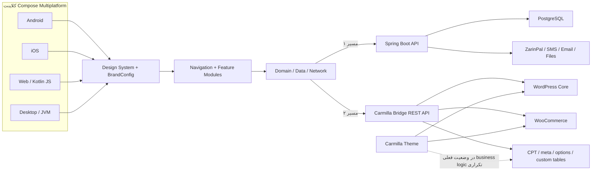
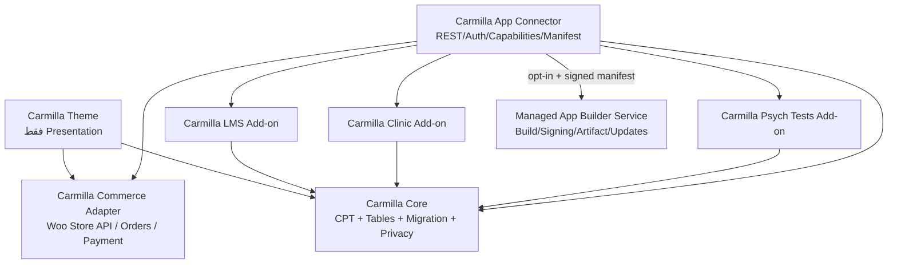
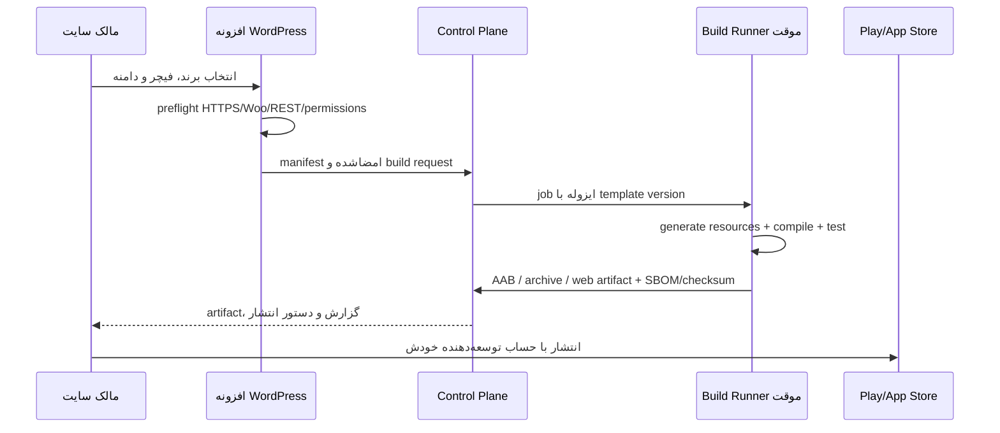
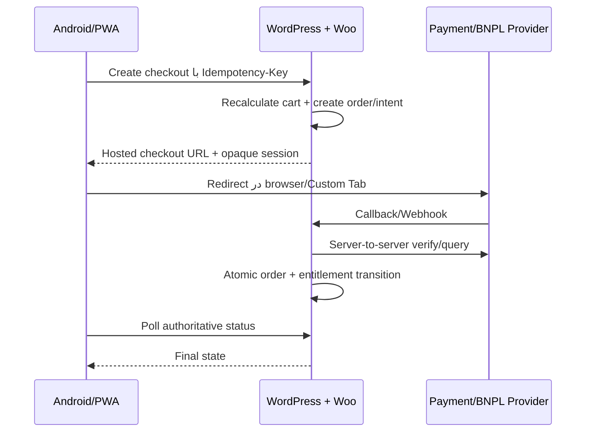

# سند جامع ممیزی معماری، فیچرها و نقشه انتشار Carmilla

> تاریخ ممیزی: ۲۸ ژوئیه ۲۰۲۶  
> دامنه بررسی: کلاینت Kotlin Multiplatform، سرور Kotlin/Spring Boot، افزونه `Carmilla Bridge` و قالب `Carmilla`  
> نسخه سند: ۲.۰ — به‌روزرسانی‌شده با تصمیم دو Backend Profile، Feature Toggle، برنامه QA دستی، درگاه‌ها و برنامه درآمد  
> وضعیت سند: مبنای تصمیم‌گیری محصول و backlog انتشار؛ نه گواهی امنیت یا انطباق حقوقی  
> اولویت مصوب نسخه ۲: `WordPress Theme/Plugin → PWA → Android → Spring → iOS/Desktop`

> **قاعده خواندن نسخه ۲:** جزئیات و ترتیب اجرایی بخش‌های ۱۴، ۱۵، ۱۷ و ۲۱ تا ۲۹ جایگزین ترتیب کلی نسخه قبلی شده‌اند. امنیت پرداخت، دسترسی و داده حساس در هر خروجی همچنان شرط توقف انتشار است؛ «عقب‌افتادن Spring» به‌معنای عقب‌انداختن امنیت مسیر WordPress یا کلاینت نیست.

---

## ۱. خلاصه مدیریتی

پروژه از نظر وسعت دامنه و مقدار پیاده‌سازی، یک نمونه ساده یا صرفاً UI نیست. فروشگاه، LMS، کلینیک/مشاوره، تست روان‌شناسی، مدیریت محتوا، پنل ادمین، وایت‌لیبل، چهار خروجی کلاینت، سرور مستقل و مسیر WordPress در کد وجود دارند. ساختار KMP نیز در سطح کلان به لایه‌های `domain/data/network/feature` تفکیک شده و سرور یک modular monolith قابل‌فهم دارد.

بااین‌حال، نسخه فعلی را باید «prototype پیشرفته و پایه‌ی یک محصول تجاری» دانست، نه نسخه آماده انتشار عمومی. موانع فعلی فقط مربوط به صفحه فروش، آیکن یا امضای اپ نیستند؛ چند نقص قابل‌اثبات در پرداخت، مجوزهای ادمین، کیف پول، رزرو، دسترسی محتوای پولی و حفاظت از داده‌های درمانی وجود دارد که تا زمان رفع آن‌ها انتشار عمومی یا تحویل به مشتری پرریسک است.

### حکم نهایی

| خروجی/محصول | وضعیت فعلی | حکم انتشار |
|---|---|---|
| اپ فروشگاهی با Spring Boot | دامنه وسیع، اما پرداخت/RBAC/کیف پول/مهاجرت و امنیت production ناقص | **عدم انتشار عمومی تا رفع P0** |
| اپ LMS | UI و API واقعی دارد، اما entitlement و پرداخت دیجیتال قابل دورزدن است | **عدم انتشار تا تکمیل paywall و billing** |
| اپ مشاوره/روان‌شناسی | فیچرهای عمیق دارد، اما داده حساس، نقش‌ها، audit و بسته حقوقی/بالینی ناقص‌اند | **عدم انتشار تا ممیزی مستقل امنیتی، حقوقی و بالینی** |
| Android | target و flavorها موجود؛ release signing/AAB/store workflow کامل نیست | **قابل رساندن به RC پس از hardening** |
| iOS | target موجود؛ signing، bundle، privacy و StoreKit آماده نیست | **آماده انتشار نیست** |
| Web | JS compile می‌شود؛ production security، token model، CSP و انتشار پایدار ناقص است | **فقط demo/beta کنترل‌شده** |
| Desktop | JVM compile می‌شود؛ signing/notarization/update channel ناقص است | **اولویت پایین‌تر، آماده انتشار نیست** |
| افزونه WordPress | اکنون یک REST bridge بزرگ است، نه App Builder کامل؛ چند P0 مالی/دسترسی دارد | **برای WordPress.org یا فروش آماده نیست** |
| قالب WordPress | UI غنی دارد، اما business logic زیادی داخل theme است | **در شکل فعلی با قواعد WordPress.org سازگار نیست** |

### مهم‌ترین blockerها در یک نگاه

1. اپ نتیجه پرداخت را از deep link کلاینت می‌پذیرد و حتی در مسیر شکست، صفحه پایان می‌تواند سبد را پاک کند.
2. کلاینت request/response کامل را log و token را در storage عادی نگه می‌دارد؛ وب نیز API دلخواه از query string می‌پذیرد.
3. سرور JWT secret و credentialهای seed پیش‌فرض دارد و client HTTP بیرونی آن TLS را trust-all می‌کند.
4. برداشت منفی و raceهای wallet/payment می‌توانند موجودی مالی را دست‌کاری کنند.
5. چند endpoint ادمین Spring فقط login می‌خواهند و shipping/tracking نیز IDOR دارند.
6. paywall دوره و فایل‌های LMS/درمانی در Spring و WordPress قابل دورزدن‌اند.
7. افزونه Editor/Shop Manager را برای عملیات درمانی/مالی بیش از حد مجاز می‌داند و برخی deleteها post type را کنترل نمی‌کنند.
8. IDهای per-user، wallet/booking غیراتمیک و callbackهای replayپذیر در افزونه می‌توانند رکورد یا پول کاربر اشتباه را تغییر دهند.
9. قالب و افزونه یک domain را با storage و schemaهای متفاوت می‌نویسند؛ یک منبع حقیقت وجود ندارد.
10. test/migration/release pipeline production وجود ندارد؛ context test سرور نیز بدون PostgreSQL محلی fail می‌شود.
11. داده‌های سلامت روان role، audit، consent، retention و deletion متناسب ندارند.
12. افزونه فعلی فقط connector است؛ build/signing/artifact/store workflow برای App Builder هنوز ساخته نشده است.

### تصمیم معماری پیشنهادی

در کلاینت فقط دو Backend Profile با شناسه‌های `WORDPRESS` و `SPRING` باقی بماند. shop/LMS/clinic/psych دیگر flavor نیستند و از Feature Manifest نسخه‌دار، همراه با compiled ceiling و enforcement سمت backend، کنترل می‌شوند. اولویت تجاری نیز WordPress Theme/Plugin، سپس PWA و Android است؛ Spring، iOS و Desktop به release trainهای آخر منتقل می‌شوند.

محصول را به سه لایه مستقل تبدیل کنید:

1. **Carmilla Theme**: فقط نمایش، template، style، accessibility و integration ظاهری WooCommerce.
2. **Carmilla Core / App Connector**: مالک واحد داده، CPT/table، REST، auth، commerce integration، privacy و lifecycle.
3. **Carmilla App Builder Service**: سرویس بیرون از WordPress برای branding، build، signing و تحویل artifact؛ WordPress نباید روی هاست مشتری Gradle/Xcode اجرا کند.

برای نسخه اول، استقرار جداگانه‌ی backend/database به‌ازای هر مشتری امن‌تر و عملی‌تر از SaaS چندمستاجری است. مدل multi-tenant فقط پس از اضافه‌شدن `tenant_id` اجباری، isolation تست‌شده، vault، quota، audit و billing پیشنهاد می‌شود.

### نقشه تغییرات نسخه ۲

| درخواست | تصمیم/خروجی | بخش |
|---|---|---|
| حذف variantهای vertical | فقط `WORDPRESS/SPRING` + Feature Manifest hybrid | ۲۱ |
| نبود تست دستی | strategy، matrix، suite، severity و release gate | ۲۲ |
| ZarinPal/BNPL/بانک | Payment Provider، DigiPay، SnappPay gate و PSP مستقیم | ۲۳ |
| API شخصی SMS/Email | پنل Integrations، Generic HTTP/SMTP و secret policy | ۲۴ |
| درون‌ریزی بر اساس feature | Seed Pack، dry-run، idempotency، resume و rollback | ۲۵ |
| ژاکت/راست‌چین | benchmark، submission و unit economics | ۱۷ و ۲۶ |
| WordPress/PWA/Android اول | roadmap و برنامه ۳۰/۶۰/۹۰ روزه جدید | ۱۴ و ۱۵ |
| partnership/ایده/نسخه مشتری | compatibility partner، product ideas و overlay/migration | ۲۵، ۲۷ و ۲۸ |

---

## ۲. روش بررسی و محدودیت‌ها

### مخازن بررسی‌شده

- کلاینت KMP و WordPress:
  - `D:\Android\AndroidStudioProjects\kmp-shop`
- سرور:
  - `D:\Android\AndroidStudioProjects\ShopServer\Shop`

### روش

- بررسی استاتیک ساختار Gradle، source setها، dependencyها، DTO/APIها، controller/service/entityها، workflowها و فایل‌های انتشار.
- ردیابی جریان‌های حساس پرداخت، کیف پول، auth، booking، LMS entitlement و پرونده درمانی.
- مقایسه قراردادهای KMP، Spring و WordPress.
- تطبیق نیازهای انتشار با مستندات رسمی WordPress، WooCommerce، Google Play و Apple در تاریخ بالای سند.
- کامپایل واقعی `:composeApp:compileKotlinJs` و `:composeApp:compileKotlinJvm`.

### نتیجه اعتبارسنجی اجرایی

- `compileKotlinJs` و `compileKotlinJvm` با Gradle 8.14.3 موفق شدند.
- build هشدار داد که ترکیب KMP با `com.android.application` با AGP 9 ناسازگار خواهد شد و ساختار Android باید به subproject مستقل مهاجرت کند.
- اجرای بسته کامل وب `jsBrowserDistribution` در مهلت ابزار پایان نیافت؛ بنابراین موفقیت compile به‌معنی تأیید کامل artifact وب، asset path و hosting نیست.
- PHP CLI در محیط موجود نبود؛ `php -l`، Plugin Check، Theme Check و smoke testهای WordPress محلی اجرا نشدند.
- تست‌های موجود Spring اجرا شدند: ۲ تست، ۱ موفق و ۱ ناموفق. `UserEntityDefaultsTest` موفق شد، اما `ShopApplicationTests.contextLoads` به‌علت نبود test profile/database ایزوله تلاش کرد به PostgreSQL روی `localhost:5432` وصل شود و ApplicationContext بالا نیامد. گزارش محلی در `ShopServer/Shop/build/reports/tests/test/index.html` ساخته شد.
- PostgreSQL واقعی، WooCommerce، ZarinPal، concurrency و مسیرهای end-to-end اجرا نشدند.
- پروژه KMP هیچ تست Kotlin پیدا‌شده‌ای ندارد و سرور فقط همین دو تست را دارد؛ بنابراین test suite فعلی نه مستقل است و نه پوشش معناداری از رفتار محصول می‌دهد.
- فایل `RTK.md` که در دستور `AGENTS.md` ارجاع شده بود، در هیچ‌یک از دو مخزن پیدا نشد؛ بنابراین دستور اضافه‌ای از آن قابل اعمال نبود.
- تغییر موجود کاربر در `PlatformConfig.android.kt` و crash dumpهای untracked دست‌نخورده باقی ماندند.

### معنای وضعیت‌ها در این سند

- **موجود**: سطحی از کد/endpoint/UI مشاهده شده است.
- **جزئی**: کد وجود دارد، ولی parity، guard، consistency یا validation ناقص است.
- **تأییدشده**: build یا شاهد مستقیم کافی برای ادعای محدود موردنظر وجود دارد.
- هیچ «موجود»ی به‌تنهایی به‌معنی production-ready، امن یا مطابق مقررات نیست.

---

## ۳. اندازه و نقشه کل پروژه

### آمار پایه

| بخش | اندازه تقریبی مشاهده‌شده |
|---|---:|
| ماژول‌های Gradle کلاینت | ۲۹ ماژول |
| فایل‌های Kotlin در مخزن KMP | ۷۲۱ فایل |
| خطوط Kotlin در مخزن KMP | حدود ۵۳٬۳۱۳ خط |
| تست Kotlin در KMP | ۰ |
| فایل‌های PHP در WordPress | ۱۰۵ فایل |
| خطوط PHP | حدود ۱۴٬۷۰۵ خط |
| ثبت routeهای REST در WordPress | حدود ۲۳۱ مورد |
| فایل‌های Kotlin سرور، با تست‌ها | حدود ۳۸۲ فایل |
| خطوط Kotlin سرور | حدود ۱۶٬۸۶۸ خط |
| controllerهای سرور | حدود ۶۰ فایل |
| annotationهای endpoint سرور | حدود ۲۸۳ مورد |
| SQLهای `db/init` | ۴۰ فایل |
| تست سرور | ۲ فایل |

### معماری فعلی در یک نگاه



### نکته مهم معماری

Spring Boot و WordPress Bridge دو backend جایگزین برای یک کلاینت‌اند، اما قرارداد مشترک versioned و test‌شده‌ای میان آن‌ها وجود ندارد. در حال حاضر DTO و رفتار endpointها با پیاده‌سازی موازی نگه داشته می‌شوند؛ این ساختار مستعد contract drift است. باید یک OpenAPI canonical و provider contract test برای هر دو backend ایجاد شود.

---

## ۴. ممیزی معماری کلاینت KMP

### ۴.۱ نقاط قوت

- targetهای Android، iOS، JS و JVM تعریف شده‌اند: `composeApp/build.gradle.kts:14-36`.
- تفکیک `core:domain`, `core:data`, `core:network`, `core:designSystem`, `core:navigation` و feature moduleها خواناست: `settings.gradle.kts:47-75`.
- repository/use case، Ktor client، mapper و ViewModel/Screen تا حد قابل‌توجهی جدا هستند.
- Koin composition root و type-safe navigation استفاده شده است.
- `BrandConfig` و feature flagها پایه مناسبی برای white-label ساخته‌اند: `core/designSystem/.../Brand.kt:72-118`.
- شش flavor اندروید برای Carmila/Atris/Chronos/Academy/Psych/WP وجود دارد: `composeApp/build.gradle.kts:123-160`.
- JS و JVM در ممیزی فعلی compile شدند.

### ۴.۲ مشکلات معماری

1. **`core:navigation` عملاً core نیست.** به تقریباً همه featureها وابسته است: `core/navigation/build.gradle.kts:58-77`. این dependency inversion را برعکس کرده و navigation را integration/god module می‌کند.
2. `AppNavigation.kt` حدود ۷۷۰ خط دارد؛ graphهای فروشگاه، academy، clinic و admin باید در feature-level ثبت شوند.
3. `composeApp` همه featureهای مصرف‌کننده و ادمین را برای همه برندها bundle می‌کند. feature flag عمدتاً visibility است، نه entitlement یا حذف کد.
4. `feature:admin:products` به بیشتر admin moduleها وابسته است: `feature/admin/products/build.gradle.kts:58-67`.
5. `feature:profile` مستقیم به catalog/academy/psychtest/clinic وابسته است: `feature/profile/build.gradle.kts:60-66`.
6. `domain` کاملاً platform-agnostic نیست و dependencyهای Koin/Compose Resource دارد.
7. مسیرهای admin سمت کلاینت guard مرکزی ندارند؛ پنهان‌کردن tab یا لینک کنترل امنیتی نیست. authorization باید در backend قطعی و در client صرفاً UX باشد.
8. build scriptهای ۲۹ ماژول تکرار زیادی دارند؛ convention plugin و version catalog باید source of truth شوند.
9. Gradle هشدار مهاجرت اجباری AGP 9 داده است؛ Android application shell باید از KMP library/shared module جدا شود.
10. README فعلی template قدیمی است و به `/server`، `/shared` و Wasm ناموجود اشاره می‌کند: `README.md:15-18,47-71`.

### ۴.۳ وایت‌لیبل فعلی

زیرساخت فعلی برای demo چندبرند مناسب است، ولی App Builder کامل نیست:

| قابلیت | وضعیت فعلی |
|---|---|
| palette و app name در `BrandConfig` | موجود |
| feature flag سطح بالا | موجود |
| Android flavor | موجود |
| API base هنگام Android build | موجود |
| package/bundle ID منحصربه‌فرد برای هر مشتری | موجود نیست |
| icon/splash/store assets برای همه flavorها | ناقص |
| iOS artifact مستقل به‌ازای مشتری | موجود نیست |
| Web/Desktop artifact مستقل و versioned | ناقص |
| manifest امضاشده tenant | موجود نیست |
| entitlement سمت backend | موجود نیست/ناقص |
| build job، signing، artifact delivery | موجود نیست |
| compatibility matrix و upgrade channel | موجود نیست |

`WpBrand` هنوز `https://example.com/wp-json/carmilla/v1/` دارد: `Brand.kt:300-311`. flavor `wp` نیز فقط suffix عمومی `.wp` می‌گیرد؛ این برای مشتریان متعدد package ID یکتا تولید نمی‌کند.

### ۴.۴ ریسک‌های امنیتی کلاینت

#### پرداخت

- deep link فقط `status` و `orderId` را از URL می‌خواند؛ نتیجه از backend دوباره verify نمی‌شود:
  - Android: `composeApp/src/androidMain/.../MainActivity.kt:26-31`
  - iOS: `composeApp/src/iosMain/.../MainViewController.kt:24-31`
  - Web: `composeApp/src/webMain/.../main.kt:39-45`
- `AppNavigation` هر دو status برابر `success` و `failed` را به صفحه پایان می‌برد: `core/navigation/.../AppNavigation.kt:94-101`.
- آرگومان success در destination عملاً به UI تحویل داده نمی‌شود: `AppNavigation.kt:748-764`.
- `PaymentViewModel` هنگام ساخته‌شدن همیشه سبد را پاک می‌کند: `feature/cart/.../PaymentViewModel.kt:24-42`.
- نتیجه نمایش‌داده‌شده از موفقیت پاک‌کردن سبد می‌آید، نه verification تراکنش: `PaymentCompleted.kt:47+`.
- scheme عمومی `myapp://payment-result` verified link نیست و قابل collision/hijack است.

**معیار اصلاح:** callback فقط یک identifier/nonce یک‌بارمصرف حمل کند؛ اپ `GET /payments/{id}/status` را از backend اصلی بخواند؛ backend gateway را verify و state machine را idempotent کند؛ cart فقط بعد از status قطعی paid پاک شود؛ Android App Links و iOS Universal Links روی دامنه تأییدشده فعال شوند.

#### token و شبکه

- Ktor در همه buildها `LogLevel.ALL` دارد: `core/network/.../HttpClientFactory.kt:41-47`.
- bearer برای همه requestها بدون محدودیت host ارسال می‌شود: `HttpClientFactory.kt:58-72`.
- access/refresh token مستقیماً در Settings ذخیره می‌شود: `core/data/.../TokenManager.kt:12-33`.
- storageها امن نیستند:
  - Android: SharedPreferences عادی، `SettingsFactory.android.kt:12-14`
  - iOS: NSUserDefaults، `SettingsFactory.ios.kt:8-10`
  - JS: browser storage، `SettingsFactory.js.kt:8-10`
  - JVM: Preferences، `SettingsFactory.jvm.kt:7-9`
- وب `?api=<URL>` دلخواه می‌پذیرد: `composeApp/src/webMain/.../main.kt:27-36`. ترکیب آن با token موجود و CORS permissive می‌تواند credential را به API مهاجم بفرستد.
- Android `allowBackup=true` و `usesCleartextTraffic=true` دارد: `AndroidManifest.xml:5,11`.
- `network_security_config.xml` wildcard دامنه‌های tunnel و حتی یک domain entry دارای `https://` نامعتبر دارد.
- mapperهای URL تصویر از `PlatformConfig.baseUrl` استفاده می‌کنند، نه `ApiConfig.baseUrl`; در حالت WP/override ممکن است relative URL روی backend اشتباه resolve شود: `CatalogMapper.kt:26,53,76,82`.

**معیار اصلاح:** logging release خاموش و body/header redact شود؛ token در Keychain/Keystore یا storage امن platform ذخیره شود؛ روی وب از session امن/BFF یا token کوتاه‌عمر با isolation tenant استفاده شود؛ runtime API override از production حذف یا allowlist و امضاشده شود؛ cleartext و backup داده حساس غیرفعال شوند؛ resolver URL تنها از `ApiConfig` canonical استفاده کند.

### ۴.۵ وضعیت پلتفرم‌ها

| پلتفرم | آنچه وجود دارد | شکاف انتشار |
|---|---|---|
| Android | target، API 36، min 24، شش flavor | signing config، AAB release، R8، adaptive icon، verified links، store metadata، privacy/data safety |
| iOS | arm64 و simulator framework، app shell | `TEAM_ID` خالی، bundle ID مشکوک `com.kazemieh.shop.kmpShop(TEAM_ID)`، PrivacyInfo، StoreKit، Universal Links، archive/TestFlight |
| Web | Kotlin JS compile موفق، runtime brand/API | distribution/hosting verification، CSP/HSTS، token model، arbitrary API override، PWA/SEO decision |
| Desktop | JVM compile موفق، DMG/MSI/DEB declaration | build روی هر OS، code signing، macOS notarization، auto-update، crash reporting |

برای video/media parity نیز شکاف وجود دارد:

- player اصلی LMS/details روی Web و Desktop placeholder است.
- story video روی iOS/JS/JVM کامل نیست.
- media picker بخش admin blog روی iOS/JS/JVM no-op است.
- جلسه آنلاین داخل اپ پیاده نشده و URL/شماره خارجی باز می‌شود.

---

## ۵. موجودی فیچرهای محصول

جدول زیر «سطح کد مشاهده‌شده» را نشان می‌دهد، نه تأیید end-to-end.

| حوزه | KMP | Spring | WordPress Bridge | Theme | ارزیابی |
|---|---|---|---|---|---|
| auth/password/OTP/refresh | موجود | موجود | موجود | وابسته به WP | نیازمند hardening/rate limit/revocation |
| catalog/category/search/filter | موجود | موجود | موجود/Woo | موجود | گسترده؛ contract و filter parity لازم |
| product/variant/options/inventory | موجود | موجود | موجود/Woo | موجود | commerce correctness تست نشده |
| cart/coupon/shipping/checkout | موجود | موجود | موجود ولی ناسازگاری total | موجود | P0/P1 مالی |
| payment/ZarinPal | موجود | موجود | موجود | flow وب | P0؛ callback/idempotency/Store billing |
| order/cancel/return/tracking | موجود | موجود | موجود | موجود | IDOR/state/refund issues |
| wallet/membership/referral | موجود | موجود | موجود | جزئی | race و ledger P0 |
| favorites/recent/review/question/alerts | موجود | موجود | موجود | موجود | admin permissions و moderation |
| blog/story/page/media | موجود | موجود | موجود | موجود | ownership/i18n/media parity |
| support ticket/message | موجود | موجود | موجود | storage جداگانه | split-brain |
| LMS course/lesson/progress | موجود | موجود | موجود | موجود | entitlement قابل دورزدن |
| quiz/certificate/project/peer review | موجود | موجود | موجود | موجود | paywall و canonical storage لازم |
| organization/cohort/seat/refund | موجود | موجود | موجود | جزئی | تست و نقش سازمانی لازم |
| therapist/slot/appointment | موجود | موجود | موجود | موجود | concurrency و assignment P0 |
| mood/journal/homework/message | موجود | موجود | موجود | موجود با schema متفاوت | داده بسیار حساس و split-brain |
| patient file/note/CRM | موجود | موجود | موجود | جزئی | RBAC/audit/retention P0 |
| psych tests/result/interpretation | موجود | موجود | موجود | موجود | licensing/consent/diagnostic claims |
| consumer admin panel | موجود | backend endpoints | backend endpoints | wp-admin | نقش‌ها و route guard ناقص |
| white-label | پایه موجود | tenant ندارد | site-specific | presentation | App Builder کامل نیست |

### ۵.۱ فروشگاه

سطوح زیر در کلاینت و حداقل یکی از backendها مشاهده شد:

- ثبت‌نام، login، OTP، بازیابی رمز و refresh token
- category، search، filter، campaign، banner، story
- product detail، variant/option، موجودی، complementary products
- price/stock alert، favorites، recently viewed، review و Q&A
- cart، saved-for-later، coupon، address و checkout
- سفارش، cancel، tracking، reorder و return request
- wallet، gift، membership و referral
- blog، page، support
- پنل admin برای محصول، تصویر/video، variant، stock، category، order، coupon، review/question و آمار

### ۵.۲ LMS

پیاده‌سازی صرفاً mock نیست:

- course list/detail، enrollment و دوره‌های من
- section/lesson، ویدئو، subtitle و resource
- lesson progress
- final quiz و lesson quiz
- certificate و verify certificate
- waitlist
- project submission با فایل/لینک، peer review و Q&A
- placement test، refund request
- cohort/organization/seat
- admin CRUD برای course/section/lesson/quiz/project/organization

اما paywall در هر دو backend قابل دورزدن است:

- Spring enrollment مستقیم رایگان/خرید را enforce نمی‌کند: `CourseService.kt:95-119`.
- routeهای progress/quiz/project افزونه صرفاً login می‌خواهند: `class-cb-academy-controller.php:53-79,398-714`.
- قالب URL ویدئوی locked را در DOM قرار می‌دهد: `single-cb_course.php:84-96`.

### ۵.۳ کلینیک و مشاوره

- therapist list/detail
- slot، booking، cancel و receipt
- session credit و plan
- mood check-in/history
- matching و switch request
- messaging، homework و journal
- patient file، note، tag و CRM
- admin therapist/schedule/appointment/file
- meeting link/phone بیرونی

این حوزه داده‌های بسیار حساس تولید می‌کند. نقش مستقل therapist در Spring وجود ندارد و WordPress نیز از capability عمومی editor/shop-manager استفاده می‌کند. قبل از عرضه باید relationship-based authorization، audit مشاهده/تغییر، consent، retention، export/delete، encryption و emergency protocol تعریف شود.

### ۵.۴ تست روان‌شناسی

- test catalog/detail
- question/answer/submit/result
- اتصال تست پولی به محصول
- admin CRUD، scoring range و human interpretation queue

پیش از انتشار:

- مجوز نشر/استفاده هر ابزار سنجش بررسی شود.
- تست به‌عنوان screening معرفی شود، نه diagnosis، مگر مجوز و فرایند بالینی لازم وجود داشته باشد.
- رضایت آگاهانه، محدوده استفاده، disclaimer، emergency notice و مسیر ارجاع متخصص تعریف شود.
- incomplete submission، resubmission و interpretation access test شود.
- داده پاسخ و نتیجه مانند داده سلامت حفاظت شود.

---

## ۶. ممیزی سرور Spring Boot

### ۶.۱ معماری

سرور یک **modular monolith تک‌ماژولی** است، نه microservice:

- packageها feature-first و عمدتاً دارای `api/application/persistence/entity` هستند.
- PostgreSQL و JPA بین همه دامنه‌ها مشترک‌اند.
- `OrderService` به wallet، academy، clinic، psychtest، membership و referral متصل است.
- event/outbox، queue و integration boundary رسمی وجود ندارد.

این انتخاب برای مرحله فعلی مناسب است؛ توصیه نمی‌شود قبل از enforce شدن مرزها آن را به microservice تقسیم کنید. ابتدا:

- boundaryها با Spring Modulith/ArchUnit enforce شوند.
- side effectهای سفارش با event/outbox قابل retry شوند.
- payment، entitlement، wallet و booking state machineهای صریح پیدا کنند.

### ۶.۲ نقاط مثبت

- feature-first package layout خواناست.
- در امور مالی عمدتاً `BigDecimal` استفاده شده است.
- در بخشی از inventory و booking pessimistic lock وجود دارد.
- refresh token hash می‌شود و rotation دارد: `RefreshTokenService.kt:21-69`.
- BCrypt و stateless session فعال‌اند.
- ownership check در بخشی از endpointهای کاربر رعایت شده است.
- جست‌وجوی PostgreSQL با `pg_trgm` و `tsvector` طراحی شده است.
- order/financial snapshot در بخش‌هایی از مدل نگه داشته می‌شود.

### ۶.۳ P0های سرور

#### Secret، credential و TLS

- JWT secret عمومی پیش‌فرض دارد: `application.properties:23`.
- seed پیش‌فرض روشن است: `application.properties:48`.
- credentialهای ثابت demo برای admin/user ساخته می‌شوند: `DataSeeder.kt:83-88,354-367`.
- workflow عمومی tunnel می‌تواند seed و Swagger را روشن کند: `.github/workflows/run-server.yml`.
- `RestTemplate` certificate و hostname را trust-all می‌کند: `ShopApplication.kt:23-43`.

**Done:** production profile در نبود secretها fail-fast شود؛ demo seed فقط profile محلی و opt-in؛ secret rotation؛ TLS verification استاندارد؛ timeout و محدودیت endpoint بیرونی؛ credentialها invalidate شوند.

#### کیف پول و پرداخت

- withdrawal مثبت validate نشده و عدد منفی balance را زیاد می‌کند: `WalletService.kt:54-76`, `WalletDtos.kt:22-29`.
- Wallet فاقد `@Version`/lock سراسری است.
- Payment lock/idempotency کامل ندارد.
- callback در controller public طراحی شده، ولی در permit list نیست و ممکن است 401 شود.
- scheduler و callback دیرهنگام می‌توانند state ناسازگار بسازند.

**Done:** immutable double-entry ledger یا حداقل ledger append-only، amount positive constraint در DTO/DB، row lock/version، idempotency key و unique constraint، payment attempt binding، webhook/callback replay test و reconciliation job.

#### RBAC و IDOR

- policy عمومی فقط `authenticated()` است: `SecurityConfig.kt:84-108`.
- سه controller ادمین بدون `@PreAuthorize`:
  - `AdminQuestionController.kt:11-24`
  - `AdminReviewController.kt:11-24`
  - `AdminReturnRequestController.kt:8-21`
- تغییر shipping در controller عادی است و ownership/role لازم را enforce نمی‌کند: `OrderController.kt:43-53`, `OrderService.kt:63-67,320-332`.
- فقط `CUSTOMER` و `ADMIN` تعریف شده‌اند.

**Done:** deny-by-default برای `/api/admin/**`، method policy و security integration test؛ نقش‌های `THERAPIST`, `INSTRUCTOR`, `SUPPORT`, `FINANCE`, `ORG_ADMIN`؛ resource ownership و therapist-patient assignment روی همه endpointهای حساس.

#### LMS، فایل و کلینیک

- enrollment دوره پولی بدون purchase check ممکن است.
- `/uploads/**` عمومی است و فایل‌های course/project/medical با دانستن URL قابل دریافت‌اند.
- upload validation/scan/quota/signed URL وجود ندارد.
- cancel تکراری appointment دوباره session credit اضافه می‌کند: `ClinicService.kt:109-127`.

**Done:** entitlement service واحد، private object storage، signed short-lived URL، MIME/signature scan، quota/AV؛ cancel idempotent با transition guard و concurrency test.

#### دیتابیس و container

- `ddl-auto=update` فعال است: `application.properties:9`.
- Flyway/Liquibase وجود ندارد.
- migration دستی exception را swallow می‌کند: `DatabaseMigrationConfig.kt:11-23`.
- ۴۰ SQL در Docker init فقط روی volume تازه اجرا می‌شوند و numbering تکراری نیز وجود دارد.
- Dockerfile از wildcard jar، runtime root و image mirror بدون healthcheck استفاده می‌کند.

**Done:** Flyway baseline/versioned migration، `ddl-auto=validate`، migration test روی empty و upgrade DB، backup/restore drill؛ multi-stage image با یک bootJar قطعی، non-root user، healthcheck، pinned base و writable volume/object storage.

### ۶.۴ P1های سرور

- OTP با `kotlin.random.Random` تولید می‌شود و plaintext است.
- rate limit/attempt limit/lockout برای auth، OTP، reset، payment، upload و message وجود ندارد.
- account enumeration در forgot password محتمل است.
- reset password همه sessionها را revoke نمی‌کند.
- حدود ۱۱۰ `RequestBody` در برابر حدود ۳۶ validation مشاهده شده است.
- coupon/cart total در order نهایی parity کامل ندارد.
- cancel/refund entitlementهای LMS/clinic/psych را به‌شکل جامع revoke نمی‌کند.
- داده journal، note، message و psych result plaintext است.
- access audit، consent، retention، export/delete و break-glass وجود ندارد.
- CORS با credentials و origin pattern باز قابل تنظیم است.
- frame options خاموش و Swagger پیش‌فرض روشن است.
- stacktrace در log چاپ می‌شود.
- schedulerها distributed lock ندارند.
- OpenAPI ثابت حدود ۴۰ path را توصیف می‌کند، ولی پیاده‌سازی حدود ۲۸۳ mapping دارد.
- backup/PITR، DB SSL، secret manager، health، metrics، tracing و alerting مشاهده نشد.

---

## ۷. ممیزی WordPress

### ۷.۱ ماهیت واقعی افزونه

`Carmilla Bridge` اکنون یک connector/REST backend پرقابلیت است، نه App Builder:

- auth و JWT
- catalog/blog/media
- cart/order/payment/wallet
- academy/clinic/psychtest
- support/story/bundle
- admin controllerهای متعدد

این پوشش ارزشمند است، اما افزونه فعلاً UI تنظیم برند، package ID، signing، build queue، artifact delivery، store workflow، compatibility check یا licensing service ندارد.

### ۷.۲ مشکل اصلی قالب: plugin territory

`functions.php:17-41` فایل‌های CPT، REST، psych test، booking، course، support، clinic، academy، order، bundle، assistant و demo import را بارگذاری می‌کند. قواعد فعلی WordPress.org صریحاً CPT، custom role، shortcode و functionality غیرنمایشی را از theme منع می‌کند و demo import را در onboarding مجاز نمی‌داند.

در نتیجه:

- داده با تعویض theme وابسته/گم‌دسترس می‌شود.
- قالب و افزونه business logic را دو بار پیاده می‌کنند.
- storage و schema آن‌ها ناسازگار است.
- احتمال رد theme در review بسیار بالاست.

### ۷.۳ split-brain میان قالب و افزونه

| حوزه | قالب | افزونه |
|---|---|---|
| booking | appointment CPT | CPT + `wp_cb_bookings` |
| project | `cb_submission` CPT/comments | option سراسری `cb_submissions` |
| support | `cb_ticket` CPT/comments | user meta array |
| clinic message | comments روی appointment | comments روی therapist |
| returns | `cb_return` CPT | user meta |
| mood/journal/homework | schemaهای theme | schemaهای متفاوت bridge |

فعال‌بودن هم‌زمان آن‌ها می‌تواند رزرو، پیام، پروژه و رکورد درمانی را در دو silo جدا نگه دارد یا آرایه‌های ناسازگار را روی یک meta key مخلوط کند.

**تصمیم قطعی پیشنهادی:** افزونه مالک یگانه domain/data/REST باشد؛ theme فقط از service/API افزونه برای نمایش استفاده کند.

### ۷.۴ P0های افزونه

#### capability و داده درمانی

- `require_admin()` داشتن `edit_others_posts` یا `manage_woocommerce` را کافی می‌داند: `class-cb-plugin.php:206-210`.
- Editor عادی می‌تواند از این مسیر admin تلقی شود.
- routeهای پرونده بیمار، test، journal، homework و message همان permission عمومی را دارند.
- therapist assignment بررسی نمی‌شود و sender type قابل جعل است.
- چند DELETE پیش از `wp_delete_post(..., true)` post type را کنترل نمی‌کنند؛ ID دلخواه می‌تواند محتوای نامرتبط را حذف کند.

**Done:** custom capabilityهای جدا، deny-by-default، post type/ownership check و therapist-patient relationship روی هر resource؛ تست نقش Editor/Shop Manager/Customer/Therapist.

#### IDهای محلی و رکورد اشتباه

attempt، wallet transaction، refund، switch و return ID در برخی آرایه‌های user meta از ۱ شروع می‌شوند. admin همه کاربران را scan و اولین ID مشابه را تغییر می‌دهد. بنابراین رکورد شماره ۱ کاربران مختلف collision دارد.

**Done:** ID سراسری UUID/ULID یا table canonical؛ route شامل resource ID canonical و user scope؛ unique constraint و migration.

#### کیف پول، booking و cancel

- wallet read-modify-write روی user meta و غیراتمیک است.
- withdrawal هم‌زمان ممکن است overspend کند.
- status rejected می‌تواند چند بار refund شود.
- credit check، booking insert و debit یک transaction نیست.
- theme و plugin booking را در دو storage جدا می‌نویسند.
- cancel تکراری theme می‌تواند چند بار credit بدهد.

**Done:** ledger/table versioned، transaction و conditional update، idempotency key، state machine و تست concurrency.

#### LMS

- progress/quiz/project فقط login می‌خواهند.
- enrollment/purchase/ownership مرکزی enforce نمی‌شود.
- certificate بدون خرید قابل اخذ است.
- URL ویدئوی locked در HTML theme قرار می‌گیرد.

**Done:** entitlement service مرکزی و provider-agnostic؛ media URL امضاشده؛ تمام handlerها قبل از دسترسی course/test ownership را verify کنند.

#### پرداخت، top-up و commerce total

- Authority callback با Authority ذخیره‌شده به‌طور قطعی bind نمی‌شود.
- callback failed روی order دلخواه قابل ارسال است.
- top-up transient و credit idempotent/atomic نیست.
- coupon helper محدودیت تاریخ، usage، product، email و spend را کامل لحاظ نمی‌کند.
- coupon/shipping نمایش‌داده‌شده لزوماً به Woo order واقعی منتقل نمی‌شود.

**Done:** استفاده حداکثری از Woo CRUD/Store API/checkout primitives؛ payment attempt table؛ authority/amount/order/merchant binding؛ replay protection؛ callback concurrency test؛ coupon/tax/shipping/stock parity test.

### ۷.۵ auth و CORS افزونه

- JWT در نبود `CB_JWT_SECRET` و `AUTH_KEY` به secret ثابت ناامن می‌رسد: `class-cb-jwt.php:17-27`.
- refresh token stateless و بدون `jti`, store, rotation/revocation است.
- rate limit و lockout برای login/register/OTP/reset وجود ندارد.
- `cb_otp_debug=1` OTP را در response برمی‌گرداند.
- password policy ضعیف است.
- CORS هر Origin را reflect و credentials را مجاز می‌کند: `class-cb-plugin.php:48-59`.

**Done:** افزونه بدون secret قوی activate نشود؛ refresh session table و rotation/revocation؛ rate limit؛ OTP hashed/attempt-limited؛ origin allowlist؛ debug option در production غیرقابل‌فعال‌سازی؛ logout/reset همه sessionهای لازم را revoke کند.

### ۷.۶ ناسازگاری callback اپ و WordPress

- اپ `myapp://payment-result` را می‌شنود.
- helper افزونه به‌صورت پیش‌فرض `carmilla://payment/result` می‌سازد: `includes/helpers.php:548`.

این mismatch می‌تواند بازگشت پرداخت WP را از کار بیندازد. callback باید با scheme عمومی جایگزین نشود؛ verified HTTPS link tenant و manifest واحد باید source of truth باشند.

---

## ۸. فاصله تا انتشار WordPress.org

### ۸.۱ قالب

موارد blocker فعلی:

- business logic/CPT/REST/LMS/clinic/test داخل theme
- demo importer داخل theme
- `readme.txt` وجود ندارد
- `comments.php` وجود ندارد
- `screenshot.png` استاندارد وجود ندارد
- `style.css` فاقد `Tested up to` و `License URI`
- folder/slug برابر `carmilla-theme` ولی Text Domain برابر `carmilla`
- version mismatch: `style.css` برابر 0.8.0 و constant برابر 0.7.7
- رشته‌های فارسی hard-coded و RTL تحمیلی؛ i18n/LTR ناقص
- `languages/`/POT و attribution کامل وجود ندارد
- LICENSE/منبع و مجوز font/image/scriptها وجود ندارد
- skip link، keyboard focus و accessibility audit ناقص
- Woo template overrideها version tracking ندارند
- `wp_link_pages()` و چند الزام classic theme باید بازبینی شوند

قواعد رسمی theme همچنین screenshot حداکثر 1200×900 با نسبت 4:3، GPL-compatible بودن همه assetها، attribution و presentation-only بودن را می‌خواهند.

### ۸.۲ افزونه

موارد blocker/ضروری:

- `readme.txt` استاندارد وجود ندارد
- LICENSE/NOTICE/asset attribution وجود ندارد
- `uninstall.php` یا uninstall policy وجود ندارد
- privacy exporter/eraser و Privacy Policy Guide integration وجود ندارد
- textdomain/POT و i18n کامل نیست
- `Requires Plugins: woocommerce` یا dependency UX روشن نیست
- HPOS compatibility declaration/test وجود ندارد
- admin settings/onboarding/preflight وجود ندارد
- schema version/migration فقط activation-time و ناقص است
- WordPress Coding Standards، Plugin Check و QIT gate وجود ندارد
- سرویس‌های خارجی SMS/Email/Payment/BNPL/App Builder و داده ارسالی opt-in/disclosed نیستند
- نسخه WordPress/PHP/Woo minimum/current matrix تست نشده است

افزونه WordPress.org می‌تواند connector یک SaaS پولی باشد، مشروط به اینکه code داخل افزونه خوانا و کامل، ارتباط خارجی شفاف و با رضایت، نسخه رایگان واقعاً قابل استفاده و محصول trialware نباشد.

---

## ۹. معماری هدف پیشنهادی محصول

### ۹.۱ بسته‌بندی منطقی



برای کاهش هزینه نسخه اول می‌توان `Core + Commerce + Connector` را در یک plugin نگه داشت، اما مرز داخلی namespace/module و ownership داده باید از روز اول روشن باشد. Clinic بهتر است بسته جدا با role و privacy سخت‌گیرانه باشد.

### ۹.۲ مدل داده canonical

حداقل رکوردهای زیر باید table/versioned و دارای ID سراسری شوند:

- `schema_migrations`
- `app_sites` / `tenant_manifest`
- `auth_sessions` / refresh token rotation
- `entitlements`
- `payment_attempts`
- `wallet_accounts` و `wallet_ledger`
- `bookings` و `session_credit_ledger`
- `therapist_patient_relationships`
- `clinical_records` و `clinical_access_audit`
- `course_enrollments`, `progress`, `quiz_attempts`, `submissions`
- `psych_test_attempts` و interpretation audit
- `returns/refunds`
- `build_projects`, `build_jobs`, `artifacts` در control plane

اصول:

- ID سراسری و foreign-key منطقی
- state machine صریح
- unique constraint و idempotency key
- optimistic/pessimistic locking متناسب
- immutable ledger برای پول/اعتبار
- migration قابل resume با dry-run، backup و conflict report
- حذف option/user-meta arrayهای بزرگ و غیراتمیک

### ۹.۳ قرارداد API

- OpenAPI 3.1 یک منبع حقیقت باشد.
- Spring و WordPress هر دو provider contract test اجرا کنند.
- KMP client از schema generated یا حداقل DTO compatibility test استفاده کند.
- endpointها prefix version داشته باشند.
- `GET /client-manifest` منبع نسخه‌دار قابلیت‌ها باشد؛ checksum/signature، ETag و minimum client version داشته باشد.
- error envelope، pagination cap، enum و validation یکسان شوند.
- deprecation و minimum-client-version policy تعریف شود.

### ۹.۴ مرز App Builder

WordPress plugin نباید Android/iOS را روی هاست PHP build کند. جریان درست:



### ۹.۵ چیزهایی که App Builder واقعی باید اضافه کند

- wizard نصب و preflight
- انتخاب vertical و feature entitlement
- app name، logo، color، icon، splash و store artwork
- package name/bundle ID یکتا و validation
- domain، privacy، support و deletion URL
- Android signing/Play App Signing workflow
- iOS team/bundle/provisioning و customer-owned account
- build job queue، retry، cancel، log redaction و status webhook
- ephemeral runner و dependency cache کنترل‌شده
- vault/HSM برای secretها؛ عدم ذخیره plaintext در WordPress
- artifact expiry، checksum، SBOM و audit
- template/app/connector compatibility matrix
- update channel، minimum backend version و rollback
- licensing/subscription و grace period بدون قفل‌کردن داده مشتری
- support bundle و diagnostics بدون PHI/PII

---

## ۱۰. الزامات انتشار بر اساس پلتفرم

### ۱۰.۱ Android / Google Play

وضعیت مثبت: پروژه `targetSdk=36` دارد و از نظر target API با الزام ۳۱ اوت ۲۰۲۶ هم‌راستاست.

کارهای لازم:

- build واقعی release AAB، نه debug APK
- upload key و Play App Signing؛ rotation/runbook
- versionCode خودکار و SemVer/versionName
- package ID یکتا و پایدار برای هر app
- R8/minify/resource shrinking و baseline profile
- adaptive icon، splash، screenshots، feature graphic و listing
- verified App Links
- حذف cleartext/tunnel/demo endpoint
- Data Safety form دقیق
- privacy policy عمومی و داخل اپ
- مسیر حذف account داخل اپ و URL وب
- Health Apps declaration برای نسخه clinic/psych
- disclaimer و شواهد claimهای پزشکی/سلامت
- تست accessibility، tablet، locale و RTL/LTR
- Play Billing برای محتوای دیجیتال، مگر استثنای policy قابل اعمال باشد
- internal/closed testing، pre-launch report و staged rollout

### ۱۰.۲ iOS / App Store

کارهای لازم:

- Xcode 26+ و iOS 26 SDK برای uploadهای فعلی
- Team ID، bundle ID، signing و provisioning واقعی
- archive/IPA/TestFlight pipeline
- per-customer icon/splash/display name/bundle
- Privacy Manifest و required-reason API audit
- App Privacy answers شامل health، contact، messages، purchases و identifiers
- privacy policy و حذف account داخل اپ
- Universal Links و Associated Domains
- StoreKit 2 برای digital course/test/subscription
- server-side transaction/entitlement validation
- age rating و review notes مخصوص سلامت
- medical/health disclaimer و professional review
- restore purchase/refund/revocation
- screenshots و metadata هر locale

محدودیت بسیار مهم Apple: طبق بند 4.2.6، اپ تولیدشده توسط app generation service باید مستقیماً توسط ارائه‌دهنده محتوای آن اپ submit شود؛ سرویس نباید انبوه اپ‌های مشتریان را از حساب خودش منتشر کند. بنابراین مشتری باید مالک Apple Developer/App Store Connect باشد و App Builder ابزار build/customize/delivery بدهد. گزینه دیگر یک اپ aggregator واحد است، ولی با مدل وایت‌لیبل مستقل شما هم‌راستا نیست.

### ۱۰.۳ ماتریس پرداخت

| نوع کالا/خدمت | Android Play | iOS App Store | Web/WordPress |
|---|---|---|---|
| کالای فیزیکی فروشگاه | gateway بیرونی مجاز/لازم | روش پرداخت بیرونی | Woo + ZarinPal/BNPL/PSP |
| دوره و ویدئوی دیجیتال | معمولاً Play Billing | In-App Purchase/StoreKit | Woo + provider adapter |
| تست دیجیتال پولی | معمولاً Play Billing | In-App Purchase/StoreKit | Woo + provider adapter |
| subscription محتوایی | Play Billing | StoreKit subscription | Woo/subscription provider |
| مشاوره زنده یک‌به‌یک | برای clinical regulated از Play Billing استفاده نشود؛ policy/بازار بررسی شود | طبق 3.1.3(d) پرداخت بیرونی ممکن است | gateway بیرونی |
| کارگاه زنده یک‌به‌چند | policy دقیق بررسی؛ غالباً digital service | IAP لازم است | gateway بیرونی |

یک `EntitlementService` باید نتیجه Play/StoreKit/Woo/PaymentProvider را به دسترسی canonical تبدیل کند؛ UI نباید صرفاً status callback را trust کند.

### ۱۰.۴ Web

- WordPress Theme سطح عمومی/SEO باشد و Compose Web به‌صورت PWA در `/app/` یا origin کنترل‌شده عرضه شود؛ business flow دو بار مستقل پیاده نشود.
- HTTPS، CSP، HSTS، Referrer-Policy و Permissions-Policy
- حذف `?api=` آزاد از production
- tenant/domain binding و CORS allowlist
- جلوگیری از token در localStorage در صورت امکان؛ BFF/secure cookie
- asset path و GitHub Pages subpath test
- PWA فقط اگر offline/cache/update strategy روشن است
- source map/private error reporting policy
- accessibility و keyboard navigation
- SEO metadata، sitemap و canonical URL در مسیر public commerce

### ۱۰.۵ Desktop

- ساخت native package روی Windows/macOS/Linux واقعی
- Authenticode برای Windows
- Developer ID signing و notarization برای macOS
- update feed امضاشده و rollback
- OS keychain برای token
- deep link registration یکتا
- crash reporter با redaction
- تصمیم محصول: اگر تقاضای واقعی ندارید، Desktop را پس از Android/iOS/Web منتشر کنید.

### ۱۰.۶ Spring production

- production profile fail-closed
- secret manager و rotation
- Flyway و migration gate
- PostgreSQL TLS، backup/PITR و restore drill
- private object storage، signed URL و AV scanning
- payment reconciliation و idempotency
- rate limiting/WAF
- Actuator health با exposure محدود
- metrics/tracing/structured log و alert
- non-root container و image scan/SBOM
- staging شبیه production
- SLO، incident response، on-call و runbook
- tenant model قطعی

---

## ۱۱. امنیت، حریم خصوصی و سلامت روان

### ۱۱.۱ طبقه‌بندی داده

| سطح | نمونه |
|---|---|
| عمومی | catalog، مقاله، اطلاعات public therapist |
| داخلی | build logs، inventory operation، admin metadata |
| شخصی | نام، ایمیل، موبایل، آدرس، سفارش |
| مالی حساس | payment attempt، wallet ledger، refund |
| سلامت بسیار حساس | test answers/result، mood، journal، message، patient note/file، appointment |
| secret | JWT/signing keys، gateway token، SMS credential |

### ۱۱.۲ کنترل‌های ضروری

- encryption in transit و at rest
- application-level encryption برای فیلدهای واقعاً حساس در صورت اقتضای مدل تهدید
- field-level/log redaction
- least privilege و relationship-based access
- immutable audit برای مشاهده و تغییر رکورد درمانی
- consent versioning و purpose limitation
- retention schedule
- export/delete/anonymize و legal hold
- backup encryption و access audit
- incident response و notification process
- vendor/subprocessor register
- data residency decision
- threat model و penetration test مستقل
- emergency/crisis content بازبینی‌شده و locale-aware
- ممنوعیت ادعای تشخیص/درمان بدون مجوز و شواهد

این سند نظر حقوقی یا پزشکی نیست. بازار مقصد، نوع مجوز متخصصان، قواعد داده سلامت، پرداخت و مصرف‌کننده باید توسط وکیل و متخصص بالینی همان حوزه بررسی شود.

---

## ۱۲. CI/CD و کیفیت هدف

### ۱۲.۱ وضعیت فعلی

- workflow کلاینت عمدتاً manual است.
- Android فقط debug APK می‌سازد.
- Desktop فقط current OS runner را package می‌کند.
- iOS app build failure non-fatal است.
- WordPress workflow فقط syntax lint و ZIP می‌سازد.
- server workflow `bootJar` دارد، ولی security/migration/integration gate ندارد.
- JaCoCo 50٪ تعریف شده، اما verification به `check` متصل نیست.
- KMP صفر تست و Spring فقط دو تست دارد؛ اجرای ممیزی نیز ۱/۲ تست Spring را به‌علت اتصال مستقیم context test به PostgreSQL محلی ناموفق نشان داد. test profile یا Testcontainers مستقل وجود ندارد.

### ۱۲.۲ pipeline پیشنهادی PR

1. format/lint:
   - ktlint/detekt
   - PHPCS + WordPress Coding Standards
2. unit tests
3. PostgreSQL Testcontainers integration tests
4. WordPress/Woo test matrix
5. OpenAPI lint و breaking-change check
6. provider/consumer contract tests
7. authorization matrix tests
8. migration clean-install و upgrade test
9. dependency/SAST/secret/license scan
10. Android/JVM/JS compile؛ iOS framework روی macOS
11. Plugin Check/Theme Check/QIT
12. artifact SBOM و provenance

### ۱۲.۳ pipeline release

- tag امضاشده و changelog
- version consistency check
- release AAB و Play internal upload
- iOS archive و TestFlight upload
- Web immutable artifact و deployment
- Desktop packages روی سه OS با signing/notarization
- reproducible WordPress ZIP با checksum
- container build/scan/sign
- staging E2E
- approval gate
- canary/staged rollout و rollback

### ۱۲.۴ تست‌های اجباری

- auth: brute force، OTP، reset، refresh rotation، logout
- RBAC: همه roleها × همه endpointهای حساس
- IDOR: order، patient، therapist، test، file
- money: negative/zero/overflow، double callback، concurrent withdrawal/refund
- booking: concurrent slot/credit/cancel
- LMS: paid/free enrollment، quiz/project/certificate entitlement
- psych: incomplete/resubmit/scoring/interpretation ownership
- Woo: coupon/tax/shipping/stock/HPOS/Blocks
- migration: current production-like data → new schema و rollback
- deletion/export/retention
- accessibility، RTL/LTR و screen reader
- Android/iOS deep link و payment return
- offline/retry/token expiry

---

## ۱۳. backlog اولویت‌بندی‌شده با معیار اتمام

### P0 — Stop-ship

| ID | کار | مسئول پیشنهادی | معیار اتمام |
|---|---|---|---|
| P0-01 | بازطراحی callback پرداخت کلاینت | KMP + Backend | هیچ status از URL trust نشود؛ verification server-side و تست success/fail/replay |
| P0-02 | حذف full logging و امن‌سازی token | KMP/Security | release log بدون header/body حساس؛ Keychain/Keystore؛ web token threat model |
| P0-03 | حذف runtime API آزاد و cleartext | KMP/Web | tenant allowlist/signed manifest؛ TLS-only؛ تست عدم ارسال token به origin دیگر |
| P0-04 | حذف secret/credential پیش‌فرض و trust-all TLS | Backend/DevOps | startup production بدون secret fail شود؛ seed off؛ TLS استاندارد |
| P0-05 | atomic wallet/payment | Backend | positive constraints، ledger/lock، idempotency و concurrency tests |
| P0-06 | بستن RBAC و IDOR سرور | Backend/Security | deny-by-default `/api/admin/**`؛ role/ownership integration suite |
| P0-07 | paywall و private file سرور | Backend | entitlement روی enrollment/quiz/file؛ signed URL و test |
| P0-08 | idempotent appointment cancel/credit | Backend | transition guard، unique operation و concurrent retry test |
| P0-09 | migration production | Backend/DBA | Flyway baseline، clean/upgrade test، `ddl-auto=validate` |
| P0-10 | capability granular WordPress | WP/Security | Editor/Shop Manager به clinic/finance دسترسی نداشته باشند؛ arbitrary delete بسته |
| P0-11 | ID canonical و ledger WordPress | WP/DB | ID سراسری، table migration، wallet/booking atomic |
| P0-12 | LMS entitlement WordPress | WP | quiz/project/certificate/media بدون خرید قابل دسترسی نباشد |
| P0-13 | حذف split-brain قالب/افزونه | WP Architecture | یک مالک data/service؛ theme بدون write business logic |
| P0-14 | Woo total/payment correctness | WP/Woo | cart/order/coupon/tax/shipping برابر؛ callback replay-safe |
| P0-15 | طرح حفاظت داده سلامت | Security/Legal/Clinical | data map، roles، audit، consent، retention، deletion و approval تخصصی |

### P1 — پیش‌نیاز Release Candidate

| ID | کار | معیار اتمام |
|---|---|---|
| P1-01 | OpenAPI canonical و contract test | هر دو backend با یک suite سازگار؛ breaking change gate |
| P1-02 | role model کامل | therapist/instructor/support/finance/org-admin و least privilege |
| P1-03 | auth hardening | rate limit، CSPRNG، hash OTP/reset، attempt lock، session revoke |
| P1-04 | upload hardening | private storage، MIME/signature allowlist، quota، AV |
| P1-05 | observability امن | health/metrics/trace/alert بدون PHI/PII |
| P1-06 | release builds | AAB، TestFlight، web artifact و signed desktop packages در CI |
| P1-07 | white-label manifest | name/package/icon/domain/legal/features versioned و validated |
| P1-08 | Store billing/entitlement | Play Billing و StoreKit 2 با receipt validation |
| P1-09 | WordPress directory hygiene | readme/license/i18n/privacy/uninstall/dependency/HPOS |
| P1-10 | Theme presentation-only | Theme Check/Plugin Check blocker صفر |
| P1-11 | تست‌های پایه | پوشش رفتار بحرانی، نه صرفاً درصد؛ PR gate |
| P1-12 | backup/restore/incident | restore drill موفق و runbook تست‌شده |
| P1-13 | account deletion/export | داخل اپ + URL وب + backend workflow |
| P1-14 | platform parity تصمیم‌گیری‌شده | قابلیت‌های unsupported صریحاً حذف یا تکمیل شوند |

### P2 — بلوغ و مقیاس

- شکستن navigation graph و سرویس‌های بسیار بزرگ
- convention plugin و مهاجرت ساختار AGP 9
- Spring Modulith/ArchUnit
- outbox/queue برای SMS/email/fulfillment
- distributed lock برای scheduler
- cache/CDN و query profiling
- dependency locking/verification
- auto-update desktop
- multi-region/tenant scaling فقط در صورت نیاز واقعی
- analytics opt-in و privacy-preserving
- ADR، architecture handbook و support matrix

---

## ۱۴. نقشه راه اجرایی

این نسخه، اولویت تجاری موردنظر را اعمال می‌کند: ابتدا قالب و افزونه WordPress، سپس PWA و Android؛ Spring مستقل، iOS و Desktop در قطارهای انتشار آخر قرار می‌گیرند. برآوردها تقریبی و برای تیم باتجربه ۴ تا ۵ نفره با کار موازی‌اند و نباید بدون تخمین backlog به مشتری تعهد شوند.

### اصل حاکم بر اولویت

عقب‌انداختن Spring فقط یعنی توسعه و انتشار **محصول مستقل Spring-backed** دیرتر انجام شود. هر P0 مشترک یا موجود در WordPress، Android، PWA، پرداخت و داده سلامت باید پیش از انتشار همان خروجی رفع شود. هیچ milestone درآمدی مجوز عبور از کنترل مبلغ، callback معتبر، RBAC یا حریم خصوصی را نمی‌دهد.

### فاز ۰ — تثبیت تصمیم و توقف ریسک، ۱ هفته

- ثبت ADR برای فقط دو `BackendProfile`: `SPRING` و `WORDPRESS`
- حذف verticalها از مفهوم flavor و تعریف schema نسخه‌دار Feature Manifest
- تعیین SKUهای قابل فروش: Theme، Connector، PWA، Android، LMS add-on و Clinic/Psych add-on
- freeze فیچر جدید و تبدیل همه P0های WordPress/کلاینت/پرداخت به issue خصوصی با owner
- تعیین حداقل نسخه WordPress، PHP، WooCommerce و Android
- ساخت چهار محیط مرجع: shop-only، academy، clinic/psych و all-features
- تعریف معیار خروج QA و مدل severity

خروجی: ADR تأییدشده، feature catalog، release train و backlog ownerدار.

### فاز ۱ — هسته محصول WordPress و قرارداد کلاینت، ۳ تا ۵ هفته

- استخراج business logic از قالب و تبدیل قالب به presentation-only
- توقف split-brain میان theme و plugin و تعیین یک مالک برای هر entity
- اصلاح P0های capability، IDOR، پرداخت، entitlement، booking و private files
- جداکردن `BackendProfile` از `BrandConfig` و featureها
- حذف endpoint aliasهای موقت و ایجاد contract canonical/versioned
- پیاده‌سازی capability/manifest معتبر، fail-closed و قابل cache
- تعریف adapterهای Payment، SMS و Email
- طراحی migration/rollback برای کاربران فعلی و داده‌های meta/options

خروجی: Core/Connector داخلی با contract پایدار و بدون P0 شناخته‌شده در مسیر WordPress.

### فاز ۲ — Release Candidate قالب و افزونه، ۴ تا ۷ هفته

- پنل onboarding، preflight، feature toggle و branding
- پنل providerهای SMS/Email و gatewayها با test connection
- seed/import نسخه‌دار، preview، dry-run، rollback و log
- privacy exporter/eraser، uninstall policy و disclosure سرویس خارجی
- RTL/LTR، accessibility، responsive، i18n و POT
- Woo HPOS، Cart/Checkout Blocks و compatibility matrix قالب‌ها
- WPCS، Plugin Check، Theme Check و QIT در CI
- readme، changelog، license، attribution، screenshot، ویدئوی نصب و knowledge base
- اجرای دور اول و دوم تست دستی بر اساس بخش ۲۲

خروجی: RC قابل پایلوت قالب و افزونه برای shop-only؛ verticalهای سلامت هنوز عمومی نیستند.

### فاز ۳ — PWA مبتنی بر WordPress، ۳ تا ۵ هفته

- Compose Web/PWA به‌عنوان surface مستقل در `/app/` یا subdomain و WordPress Theme به‌عنوان سطح SEO
- Web App Manifest، icon، service worker، install/update/offline fallback
- deep link، share، push opt-in و analytics opt-in
- cache فقط برای catalog/article عمومی؛ عدم cache داده auth، پرداخت و سلامت
- tenant/domain binding، CSP/HSTS، حذف `?api=` آزاد و storage امن‌تر session
- تست Chrome/Edge/Firefox، Android Chrome و Safari install behavior
- budget عملکرد و accessibility و مسیر rollback service worker

خروجی: PWA RC متصل به WordPress، قابل عرضه در بسته Theme/Connector.

### فاز ۴ — Android WordPress و سازنده خروجی، ۴ تا ۶ هفته

- نگه‌داشتن فقط دو backend profile در Gradle و انتشار تجاری ابتدا برای `wordpress`
- package/applicationId و signing یکتای هر مشتری، بدون ساخت flavor جدید
- build job، artifact، checksum، expiry، log redaction و retry
- AAB/APK signed، App Links، callback امن و وضعیت پرداخت server-verified
- branding resources، نسخه، privacy/support/deletion URL و diagnostics
- internal/closed testing، device matrix و rollout مرحله‌ای
- مالکیت حساب Google Play و کلیدها برای مشتری؛ نه انتشار انبوه از حساب واحد شما

خروجی: Android closed beta برای ۳ تا ۵ مشتری پایلوت.

### فاز ۵ — پایلوت، بازار و درآمد اولیه، ۴ تا ۶ هفته

- UAT با سایت واقعی ولی داده sanitised
- تست نصب/upgrade/rollback روی نسخه‌های پشتیبانی‌شده WordPress/PHP/Woo
- رفع blockerها، pentest محدود مسیرهای public و payment reconciliation
- آماده‌سازی صفحه فروش جدا برای Theme، PWA و Android Connector
- ارسال به ژاکت و راست‌چین طبق قرارداد روز submission
- مذاکره با ۳ تا ۵ تولیدکننده قالب پرفروش و اجرای یک compatibility pilot
- runbook پشتیبانی، SLA، refund taxonomy و dashboard KPI

خروجی: GA محدود shop-only و آغاز فروش کنترل‌شده.

### فاز ۶ — add-onهای آموزشی و مشاوره، ۴ تا ۸ هفته برای هر قطار

- LMS: entitlement، media protection، quiz/progress/certificate و قوانین کالای دیجیتال
- Clinic/Psych: role/relationship access، consent، audit، retention و review حقوقی/بالینی
- seed و test suite اختصاصی هر vertical
- انتشار add-onها جدا از core و با compatibility matrix
- برای سلامت روان: پایلوت محدود و pentest مستقل قبل از فروش عمومی

خروجی: ابتدا LMS Pro و سپس Clinic/Psych با release train و قرارداد پشتیبانی جدا.

### فاز ۷ — محصول مستقل Spring، ۴ تا ۸ هفته

- production profile fail-closed، secret manager، Flyway و Testcontainers
- رفع همه P0های wallet/payment/RBAC/files/entitlement
- هم‌ترازی provider contract با WordPress
- observability، backup/restore، reconciliation و incident drill
- فعال‌کردن backend profile `spring` برای مشتریان منتخب

خروجی: Spring-backed private beta؛ نه پیش‌نیاز درآمد اولیه WordPress.

### فاز ۸ — iOS و Desktop، پس از اثبات تقاضا

- iOS: customer-owned Apple account، signing، StoreKit، privacy manifest و TestFlight
- Desktop: فقط با قرارداد/تقاضای معتبر؛ signing، notarization و update channel
- تکرار QA و policy review مستقل برای هر store

خروجی: توسعه بر اساس سفارش یا KPI بازار، نه صرفاً به‌دلیل وجود target در KMP.

### برآورد سطح بالا

- **Theme + Connector + shop-only pilot:** حدود ۸ تا ۱۳ هفته با تیم موازی.
- **افزودن PWA RC:** حدود ۳ تا ۵ هفته، قابل هم‌پوشانی با پایان فاز ۲.
- **Android WordPress closed beta:** حدود ۴ تا ۶ هفته پس از پایدارشدن contract.
- **Managed Builder تجاری و پایدار:** حدود ۴ تا ۶ ماه از شروع، بسته به signing، support و تعداد templateها.
- **LMS و به‌ویژه Clinic/Psych:** قطار مستقل؛ زمان review حقوقی/بالینی داخل تخمین فنی نیست.

---

## ۱۵. برنامه ۳۰/۶۰/۹۰ روزه

### ۳۰ روز اول

- ADR دو Backend Profile و Feature Manifest تصویب شود.
- همه P0های WordPress، کلاینت و پرداخت ticket، owner و معیار اتمام داشته باشند.
- business write از theme متوقف و مالک canonical داده مشخص شود.
- محیط‌های مرجع و test data چهار preset ساخته شوند.
- قالب test case، severity، device/browser matrix و اولین smoke pass آماده شود.
- adapter contract پرداخت/SMS/Email و مدل تنظیمات tenant-owned نهایی شود.

### تا روز ۶۰

- Theme presentation-only و Core/Connector دارای مرز روشن باشند.
- Feature toggle، dependency validation و fail-closed manifest در staging کار کند.
- پنل SMS/Email و حداقل ZarinPal sandbox/contract fake دارای test connection باشد.
- importer با dry-run/idempotency/rollback روی preset shop و academy تست شود.
- Plugin/Theme Check، WPCS، HPOS/Blocks و clean-install/upgrade gate شوند.
- PWA install/update/offline fallback و security headers در محیط staging فعال باشد.
- دور اول regression دستی shop-only بدون blocker/critical باز تمام شود.

### تا روز ۹۰

- Theme + Connector + PWA به RC برسند و با ۳ تا ۵ مشتری پایلوت UAT شوند.
- Android WordPress internal/closed build برای حداقل دو برند ساخته شود.
- ZarinPal، یک BNPL قراردادی یا sandbox/fake و gateway مستقیم contract test داشته باشند.
- import/export نسخه‌دار و انتقال sanitised یک سایت آزمایشی end-to-end اجرا شود.
- صفحه محصول، مستند نصب، compatibility matrix و runbook پشتیبانی آماده باشد.
- پرونده فروشندگی ژاکت/راست‌چین و حداقل یک مذاکره partnership قالب آغاز شود.
- Spring مستقل، iOS و Desktop همچنان خارج از critical path درآمد اولیه بمانند.

---

## ۱۶. چک‌لیست Go/No-Go

انتشار فقط وقتی Go است که همه موارد زیر پاسخ مثبت داشته باشند:

### امنیت و داده

- [ ] P0 باز شناخته‌شده وجود ندارد.
- [ ] pentest مستقل blocker ندارد.
- [ ] secret پیش‌فرض و demo credential وجود ندارد.
- [ ] role/ownership matrix تست شده است.
- [ ] PHI/PII در log نیست.
- [ ] consent/retention/export/delete فعال است.
- [ ] backup restore آزمایش شده است.

### تجارت

- [ ] callback، webhook و retry idempotent هستند.
- [ ] مبلغ cart/order/gateway/reconciliation برابر است.
- [ ] wallet/credit concurrency test موفق است.
- [ ] refund entitlement را revoke می‌کند.
- [ ] digital/physical/clinical billing بر اساس store policy تفکیک شده است.

### WordPress

- [ ] theme فقط presentation است.
- [ ] Theme Check blocker صفر است.
- [ ] Plugin Check/WPCS/QIT blocker صفر است.
- [ ] Woo HPOS و Blocks تست شده‌اند.
- [ ] readme/license/attribution/i18n/privacy/uninstall کامل‌اند.
- [ ] clean install و upgrade migration موفق‌اند.

### اپ‌ها

- [ ] signed release artifact از CI reproducible ساخته می‌شود.
- [ ] deep link verified و payment status server-verified است.
- [ ] account deletion داخل اپ و وب وجود دارد.
- [ ] Data Safety/App Privacy/Health declaration دقیق است.
- [ ] store screenshots/metadata/support/privacy آماده‌اند.
- [ ] closed beta و crash-free/ANR معیار داخلی را پاس کرده است.

### عملیات

- [ ] monitoring/alerting/on-call/runbook فعال است.
- [ ] rollback و incident drill انجام شده است.
- [ ] compatibility matrix plugin/backend/app مستند است.
- [ ] customer support و SLA متناسب با پلن مشخص است.

---

## ۱۷. مدل تجاری و انتشار پیشنهادی

### نردبان محصول و درآمد

| سطح | محصول | خریدار هدف | مدل درآمد پیشنهادی |
|---|---|---|---|
| ۱ | **Carmilla Theme** | فروشگاه تازه یا redesign | فروش مجوز marketplace + تمدید پشتیبانی طبق قواعد بازار |
| ۲ | **Theme + PWA Pack** | کسب‌وکار mobile-first با بودجه محدود | قیمت بالاتر از Theme، بدون هزینه انتشار store |
| ۳ | **App Connector + Android Build** | فروشگاه فعال WooCommerce | مجوز connector + هزینه setup/build + نگهداری سالانه |
| ۴ | **LMS Add-on** | مدرس/آکادمی | add-on جدا + بسته دمو/راه‌اندازی |
| ۵ | **Clinic/Psych Add-on** | مرکز مشاوره واجد شرایط | قرارداد سازمانی، onboarding و پشتیبانی جدا؛ نه فروش بی‌قید عمومی در نسخه اول |
| ۶ | **Partner Edition** | تولیدکننده قالب و آژانس | white-label/co-brand، revenue share یا قیمت عمده |
| ۷ | **Managed Builder** | مشتری غیرتکنیکی | setup + subscription نگهداری، build و update |

نسخه رایگان Connector فقط در صورتی منتشر شود که بدون پرداخت نیز کاربرد واقعی، محدود و شفاف داشته باشد؛ افزونه‌ای که صرفاً trialware یا قفل تبلیغاتی است با مسیر WordPress.org هم‌راستا نیست.

### ترتیب درآمدی

1. فروش Theme و PWA Pack برای کوتاه‌کردن زمان رسیدن به بازار.
2. فروش Android Build به‌صورت محصول + خدمت، زیرا signing و انتشار برای هر مشتری هزینه واقعی دارد.
3. cross-sell بسته LMS بعد از ثبات commerce/entitlement.
4. قراردادهای co-branded با قالب‌های پرفروش.
5. recurring revenue از نگهداری، compatibility، push/build quota و SLA؛ نه از گروگان‌گرفتن داده.
6. Clinic/Psych پس از review مستقل و با قرارداد پرریسک/پشتیبانی متناسب.

### ژاکت و راست‌چین

- برای هر marketplace پرونده محصول و economics مستقل داشته باشید؛ همان ZIP، متن و قیمت را کورکورانه کپی نکنید.
- پیش از submission، درصد سهم بازار، انحصار، روش لایسنس، زمان تسویه، بازه پشتیبانی، شرایط refund، حق فروش در سایت شخصی و هزینه کمپین را **کتبی** دریافت کنید.
- Theme، Connector/PWA و Android Service را به SKUهای روشن تقسیم کنید تا review، پشتیبانی و expectation مخلوط نشوند.
- لندینگ و دمو باید نشان دهد کدام قابلیت «داخل لایسنس»، کدام «نیازمند سرویس ساخت» و کدام «سفارشی» است.
- changelog واقعی، compatibility matrix، ویدئوی نصب، sandbox/demo و pre-sale FAQ بخشی از محصول‌اند.
- launch را ابتدا در یک بازار و با cohort محدود انجام دهید؛ پس از سنجش ticket/refund، بازار دوم را باز کنید تا دو صف پشتیبانی هم‌زمان شما را از پا نیندازد.

### مدل قیمت‌گذاری بدون اتکا به حدس تورمی

به‌جای عدد ثابت بلندمدت، قیمت را نسبت به مرجع بازار در روز تصمیم تعیین کنید:

- `Theme + PWA`: حدود ۳۵٪ تا ۶۰٪ قیمت محصول مرجع Android در بازار.
- `Connector + Android`: حدود ۹۰٪ تا ۱۲۰٪ مرجع، فقط اگر build، مستندات و پشتیبانی قابل‌مقایسه باشد.
- هر vertical add-on: حدود ۲۰٪ تا ۴۰٪ Core.
- setup/انتشار اختصاصی: حدود ۱ تا ۳ برابر مجوز Core، بسته به حساب store و سفارشی‌سازی.
- maintenance سالانه: بر مبنای هزینه واقعی regression، سازگاری و پاسخ‌گویی؛ نه درصد دلخواه.

این بازه‌ها فرضیه آزمایش‌اند، نه قیمت نهایی. قیمت و رقبا حداقل ماهانه و پیش از هر کمپین بازبینی شوند.

### economics اجباری پیش از انتشار

برای هر SKU این محاسبات در یک شیت نگهداری شود:

```text
درآمد ناخالص = قیمت فروش × تعداد فروش
درآمد پس از بازار = درآمد ناخالص × (۱ - سهم بازار - نرخ refund - کسورات قانونی)
حاشیه مشارکت هر فروش = درآمد خالص هر فروش - هزینه متغیر build - هزینه متوسط پشتیبانی
نقطه سربه‌سر = هزینه ثابت توسعه/بازاریابی ÷ حاشیه مشارکت هر فروش
LTV تقریبی = درآمد مجوز + setup + تمدیدها - هزینه پشتیبانی و زیرساخت طول عمر مشتری
```

سه سناریوی محافظه‌کارانه، پایه و رشد فقط با داده واقعی conversion، refund و support-hours پر شوند. ادعاهای درآمدی خود marketplace یا فروشنده‌ها سیگنال بازاریابی‌اند و نباید وارد forecast شوند.

### KPIهای درآمد و عملیات

- بازدید صفحه محصول → دمو → خرید
- activation rate و زمان تا اولین PWA/Android build
- build success rate و median delivery time
- attach rate بسته PWA، Android و verticalها
- refund rate و دلیل refund
- ticket به‌ازای هر ۱۰۰ نصب و ساعت پشتیبانی هر فروش
- crash-free users، checkout success و payment mismatch
- renewal rate، churn و gross margin
- فروش و lead به تفکیک ژاکت، راست‌چین، سایت مستقیم و partner

### مالکیت و portability

- داده سایت، دامنه، حساب store و signing identity متعلق به مشتری باشد.
- export و migration path مستند باشد.
- لغو subscription داده یا app فعال را گروگان نگیرد؛ فقط سرویس‌های آینده طبق قرارداد متوقف شوند.
- source/license همه dependencyها و assetها شفاف باشد.
- قرارداد پشتیبانی، scope سفارشی‌سازی، update window، EOL و مسئولیت انتشار روشن باشد.
- secretها، داده سفارش و داده سلامت هیچ‌گاه داخل demo pack، support bundle یا build log قرار نگیرند.

---

## ۱۸. شواهد کلیدی فایل‌ها

### KMP

- module list: `settings.gradle.kts:47-75`
- targets/flavors/release: `composeApp/build.gradle.kts:14-36,102-190`
- six legacy brand/flavor definitions: `composeApp/build.gradle.kts:123-160`
- mixed brand/backend/feature config: `core/designSystem/src/commonMain/kotlin/com/kazemieh/designsystem/brand/Brand.kt:72-118`
- all feature DI modules loaded: `composeApp/src/commonMain/kotlin/com/kazemieh/shop/App.kt:74-100`
- broad route registration without central feature guard: `core/navigation/src/commonMain/kotlin/com/kazemieh/navigation/AppNavigation.kt:330-470,607-699`
- hardcoded `/api/...` routes requiring WordPress alias: `ProfileApiImpl.kt:23-30`, `AddressApiImpl.kt:26-57`, `wordpress/carmilla-bridge/includes/class-cb-plugin.php:69-90`
- media mapper fallback outside active backend override: `CatalogMapper.kt:22-26,48-54,74-83`, `CartMapper.kt:22-30`
- network logging/auth: `core/network/src/commonMain/kotlin/com/kazemieh/network/common/HttpClientFactory.kt:41-109`
- token storage: `core/data/src/commonMain/kotlin/com/kazemieh/data/local/TokenManager.kt:12-33`
- API override: `core/network/src/commonMain/kotlin/com/kazemieh/network/common/ApiConfig.kt:8-11`
- web arbitrary API: `composeApp/src/webMain/kotlin/com/kazemieh/shop/main.kt:27-36`
- current web shell without manifest/service worker: `composeApp/src/webMain/resources/index.html:1-27`
- payment routing: `core/navigation/src/commonMain/kotlin/com/kazemieh/navigation/AppNavigation.kt:94-101,748-764`
- unconditional cart clear: `feature/cart/src/commonMain/kotlin/com/kazemieh/cart/payment_completed/PaymentViewModel.kt:24-42`
- Android manifest: `composeApp/src/androidMain/AndroidManifest.xml:5-26`
- iOS config: `iosApp/Configuration/Config.xcconfig:1-4`

### Spring

- build stack: `build.gradle.kts:2-59`
- insecure/default config: `src/main/resources/application.properties:1-48`
- security policy: `shared/security/SecurityConfig.kt:46-108`
- migration: `shared/config/DatabaseMigrationConfig.kt:11-23`
- file storage: `catalog/application/FileStorageService.kt:11-29`
- OTP/reset: `identity/application/AuthService.kt:83-199`
- wallet: `wallet/application/WalletService.kt:54-76`
- payment: `payment/application/PaymentService.kt:21-83`
- clinic cancel: `clinic/application/ClinicService.kt:109-127`
- course enrollment: `academy/application/CourseService.kt:95-119`
- Docker: `Dockerfile`, `docker-compose.yml`

### WordPress

- plugin bootstrap/controllers: `wordpress/carmilla-bridge/carmilla-bridge.php:29-81`
- JWT: `includes/class-cb-jwt.php:17-88`
- auth/OTP: `includes/class-cb-auth-controller.php`
- OTP plaintext/debug/hook-only flow: `includes/class-cb-auth-controller.php:72-103`
- CORS/admin permission: `includes/class-cb-plugin.php:48-66,206-210`
- all controllers registered without feature guard: `includes/class-cb-plugin.php:110-140`
- booking table/payment return: `includes/helpers.php:548-571`
- theme plugin territory: `wordpress/carmilla-theme/functions.php:17-41`
- theme-only toggle source: `wordpress/carmilla-theme/inc/customizer.php:28-43`
- non-idempotent demo importer: `wordpress/carmilla-theme/inc/demo-import.php:3-37,98-162`
- version mismatch: `wordpress/carmilla-theme/style.css:6`, `functions.php:11`

---

## ۱۹. منابع رسمی انتشار

همه قواعد زیر باید نزدیک زمان submit دوباره بررسی شوند، چون policyها تغییر می‌کنند.

### WordPress و WooCommerce

- [WordPress Theme Review Requirements](https://make.wordpress.org/themes/handbook/review/required/)
- [Required Theme Files](https://developer.wordpress.org/themes/releasing-your-theme/required-theme-files/)
- [Detailed Plugin Guidelines](https://developer.wordpress.org/plugins/wordpress-org/detailed-plugin-guidelines/)
- [Plugin readme.txt](https://developer.wordpress.org/plugins/wordpress-org/how-your-readme-txt-works/)
- [WordPress Privacy Handbook](https://developer.wordpress.org/plugins/privacy/)
- [WooCommerce HPOS compatibility](https://developer.woocommerce.com/docs/features/orders/high-performance-order-storage/recipe-book/)
- [WooCommerce extension best practices](https://developer.woocommerce.com/docs/extensions/best-practices-extensions/extension-development-best-practices/)
- [WooCommerce security practices](https://developer.woocommerce.com/docs/best-practices/security/security-best-practices/)
- [WooCommerce QIT/getting started](https://developer.woocommerce.com/docs/extensions/getting-started-extensions/)

### Google Play

- [Target API requirements](https://support.google.com/googleplay/android-developer/answer/11926878)
- [Payments policy](https://support.google.com/googleplay/android-developer/answer/10281818)
- [Data Safety](https://support.google.com/googleplay/android-developer/answer/10787469)
- [Account deletion](https://support.google.com/googleplay/android-developer/answer/13327111)
- [Health Apps declaration](https://support.google.com/googleplay/android-developer/answer/14738291)
- [Health Content and Services policy](https://support.google.com/googleplay/android-developer/answer/16679511)
- [Android app signing](https://developer.android.com/studio/publish/app-signing)

### Apple

- [App Review Guidelines](https://developer.apple.com/app-store/review/guidelines/)
- [Upcoming SDK and submission requirements](https://developer.apple.com/news/upcoming-requirements/)
- [Privacy Manifest files](https://developer.apple.com/documentation/bundleresources/privacy-manifest-files)
- [App Privacy details](https://developer.apple.com/app-store/app-privacy-details/)

### پرداخت و integration

- [WooCommerce Payment Gateway API](https://developer.woocommerce.com/docs/features/payments/payment-gateway-api/)
- [WooCommerce Store Checkout API](https://developer.woocommerce.com/docs/apis/store-api/resources-endpoints/checkout)
- [زرین‌پال: اتصال به درگاه](https://www.zarinpal.com/docs/paymentGateway/connectToGateway)
- [دیجی‌پی: مستندات پذیرندگان](https://www.mydigipay.com/developers/docs/upg/)
- [اسنپ‌پی: کانال رسمی تماس](https://www.snapppay.com/contact-us/)
- [SEP: راهنما و مستندات فنی](https://www.sep.ir/%D8%B1%D8%A7%D9%87%D9%86%D9%85%D8%A7-%D9%88-%D9%85%D8%B3%D8%AA%D9%86%D8%AF%D8%A7%D8%AA-%D9%81%D9%86%DB%8C)
- [WordPress safe remote request](https://developer.wordpress.org/reference/functions/wp_safe_remote_request/)

### بازار و benchmark

- [ژاکت: فروشنده شوید](https://www.zhaket.com/landing/become-seller/)
- [ژاکت: آموزش فروشندگان](https://www.zhaket.com/landing/supplier-tutorials/)
- [AppMySite WordPress pricing](https://www.appmysite.com/wordpress-pricing/)
- [WPMobile pricing](https://wpmobile.app/en/price/)
- [MobiLoud pricing](https://www.mobiloud.com/pricing)
- [AppPresser connector plugin](https://wordpress.org/plugins/apppresser/)

---

## ۲۰. نتیجه نهایی

این پروژه ارزش ادامه‌دادن دارد: breadth فیچرها، اشتراک UI چندپلتفرمی، backend مستقل، مسیر WordPress و پایه white-label مزیت واقعی‌اند. راه درست انتشار، بازنویسی کامل از صفر یا تبدیل عجولانه به microservice نیست؛ باید ریسک‌های P0 بسته، منبع حقیقت داده و API یکی، قالب از business logic جدا و App Builder به سرویس build امن بیرونی تبدیل شود.

ترتیب محصول در نسخه ۲ چنین است:

1. امنیت و صحت پول/دسترسی/داده برای همان سطحی که قرار است منتشر شود
2. Theme و Core/Connector وردپرس با contract canonical
3. PWA متصل به WordPress
4. Android متصل به WordPress و App Builder اولیه
5. LMS و سپس Clinic/Psych به‌صورت add-on و release train جدا
6. Spring-backed product
7. iOS و Desktop پس از اثبات تقاضا

تا پیش از بستن P0های مسیر WordPress، ZIP یا اپ را production معرفی نکنید. اولویت پایین Spring/iOS/Desktop مجاز است؛ پایین‌آوردن کیفیت یا امنیت محصول اولویت‌بالا مجاز نیست. جزئیات تصمیم‌های جدید در بخش‌های بعدی آمده است.

---

## ۲۱. معماری نهایی دو Backend Profile و Feature Toggle

این بخش معماری هدف است و هنوز وضعیت فعلی کد نیست. اکنون شش flavor برند وجود دارد، `BrandConfig` backend/ظاهر/feature را مخلوط می‌کند، همه moduleهای Koin و routeهای vertical بارگذاری می‌شوند و toggleهای قالب فقط UI را تا حدی پنهان می‌کنند؛ controllerهای افزونه همچنان فعال‌اند. بنابراین حذف نام flavorها به‌تنهایی feature toggle امن ایجاد نمی‌کند.

### ۲۱.۱ تصمیم قطعی

در کل محصول فقط دو نوع backend وجود داشته باشد:

| شناسه | مقصد | زمان انتخاب | خروجی اولویت‌دار |
|---|---|---|---|
| `WORDPRESS` | Carmilla Connector/WooCommerce روی سایت مشتری | build/deployment | Theme، PWA و Android |
| `SPRING` | سرور مستقل Kotlin/Spring | build/deployment | فاز آخر |

فروشگاه، آموزش، مشاوره و تست روان‌شناسی **build variant نیستند**. آن‌ها feature/capability نسخه‌دارند که برای هر app/site به‌صورت `true/false` تنظیم می‌شوند. بنابراین در Android فقط یک flavor dimension به نام مثلاً `backend` با دو مقدار `wordpress` و `spring` باقی می‌ماند و flavorهایی مانند shop/academy/clinic حذف می‌شوند.

`applicationId`، نام اپ، icon، رنگ و domain همچنان برای هر مشتری یکتا هستند، اما این‌ها customer configuration هستند و نباید flavor جدید بسازند.

### ۲۱.۲ چرا مدل hybrid لازم است

سه لایه باید با هم کار کنند:

1. **Compiled ceiling:** مشخص می‌کند این template اصولاً چه feature moduleهایی را در binary دارد.
2. **Tenant entitlement/config:** مالک سایت چه بسته‌ای خریده و فعال کرده است.
3. **Backend capability:** backend واقعاً چه endpoint/schema/versionی را پشتیبانی می‌کند.

فعال‌بودن مؤثر:

```text
effectiveFeature =
    compiledCapability
    AND customerEntitlement
    AND tenantToggle
    AND backendCapability
    AND policyAllows(platform, productType)
```

این مدل از دو خطا جلوگیری می‌کند: انفجار build variant در حالت compile-time-only، و بازشدن route/API حساس فقط با تغییر یک Boolean کلاینت در حالت runtime-only. toggle هرگز جای authorization سمت backend را نمی‌گیرد.

### ۲۱.۳ catalog پیشنهادی featureها

| Feature ID | مفهوم | وابستگی لازم |
|---|---|---|
| `content.blog` | نوشته، برگه و دسته‌بندی | base |
| `commerce.core` | cart، order، payment و entitlement پایه | auth برای checkout |
| `commerce.physical` | محصول فیزیکی، موجودی، حمل | `commerce.core` |
| `commerce.digital` | فایل/محتوای پولی | `commerce.core` + entitlement |
| `academy.core` | دوره، درس، پیشرفت | auth + content |
| `academy.quiz` | آزمون آموزشی | `academy.core` |
| `academy.certificate` | گواهی | `academy.core` + completion |
| `clinic.booking` | متخصص، زمان‌بندی و رزرو | auth + consent |
| `clinic.messaging` | پیام امن | clinic relationship + audit |
| `psych.tests` | آزمون روان‌شناسی | auth + consent + retention |
| `wallet` | کیف پول/ledger | `commerce.core` |
| `social.stories` | story/banner قابل تعامل | content |
| `support.tickets` | تیکت | auth |
| `admin.mobile` | عملیات مدیریتی مجاز | role/capability سخت‌گیرانه |

فروشگاه فیزیکی را از `commerce.core` جدا کنید؛ ممکن است academy یا clinic فروشگاه کالا نداشته باشد، ولی برای دوره یا وقت مشاوره به order/payment/entitlement نیاز داشته باشد.

### ۲۱.۴ Feature Manifest

Manifest هیچ secret یا API keyای ندارد و schema/version/checksum دارد. نمونه:

```json
{
  "schemaVersion": 1,
  "manifestVersion": "2026.07.1",
  "backendProfile": "WORDPRESS",
  "tenantId": "demo-academy",
  "minimumAppVersion": "1.4.0",
  "features": {
    "content.blog": true,
    "commerce.core": true,
    "commerce.physical": false,
    "commerce.digital": true,
    "academy.core": true,
    "academy.quiz": true,
    "academy.certificate": true,
    "clinic.booking": false,
    "clinic.messaging": false,
    "psych.tests": false,
    "wallet": false
  },
  "seedPack": "academy-fa-v1",
  "issuedAt": "2026-07-28T00:00:00Z"
}
```

قواعد:

- Android یک default manifest داخل artifact دارد؛ config remote فقط در سقف compiled و entitlement آن را محدود/فعال می‌کند.
- PWA manifest tenant هنگام deploy یا از endpoint امضاشده دریافت می‌شود؛ نه از query string آزاد.
- cache با ETag و زمان انقضا باشد و آخرین config معتبر به‌صورت محدود نگه داشته شود.
- schema ناشناخته، signature/checksum نامعتبر یا dependency ناقص باید fail-closed شود.
- تغییر feature حساس audit شود و در صورت نیاز approval دوم داشته باشد.
- خاموش‌کردن feature داده را حذف نکند؛ purge یک عملیات جدا، صریح و قابل backup است.

### ۲۱.۵ تغییرات ساختاری KMP

- `BrandConfig` به چهار مفهوم جدا شود: `BackendProfile`، `BrandingConfig`، `FeatureManifest` و `BuildIdentity`.
- یک `BackendAdapter` canonical برای WordPress/Spring ایجاد شود؛ UI نباید path یا DTO اختصاصی backend را بداند.
- featureها `FeatureDefinition` شامل ID، dependency، route، DI module، seed requirement و policy داشته باشند.
- navigation به route registry تبدیل شود؛ route غیرفعال register نشود و deep link آن پاسخ امن بدهد.
- DI moduleهای feature با manifest بارگذاری شوند؛ shared singletonهای لازم در core بمانند.
- mapperها فقط config تزریق‌شده فعال را مصرف کنند و به `PlatformConfig` global یا fallback پنهان وابسته نباشند.
- prefix/pathهای WordPress و Spring داخل adapter حل شوند؛ alias endpoint برای جبران `/api/...`های hardcoded حذف شود.
- تست ماتریسی برای هر backend profile و preset feature ایجاد شود.

### ۲۱.۶ مهاجرت از variantهای فعلی

1. از flavorها و مصرف‌کننده‌های `BuildConfig` inventory بگیرید.
2. دو profile جدید را کنار ساختار قدیم اضافه و رفتار فعلی را با golden contract ثبت کنید.
3. config و mapperها را از global state جدا کنید.
4. adapter contract و route registry را بسازید.
5. presetهای قدیمی را به manifest تبدیل کنید.
6. CI هر دو profile و presetهای مرجع را build/test کند.
7. یک release سازگار با migration بدهید، سپس flavorها و endpoint aliasهای قدیمی حذف شوند.

معیار اتمام: فقط دو backend build در CI دیده شود، فعال/غیرفعال‌کردن vertical بدون تغییر source انجام شود، route/API غیرفعال قابل استفاده نباشد و داده قبلی بعد از upgrade حفظ شود.

### ۲۱.۷ bootstrap، هویت و امنیت profile

`BackendProfile` immutable باید حداقل `kind`، `apiRoot`، `assetRoot`، `allowedAuthHosts`، contract version و manifest path داشته باشد. remote manifest اجازه تغییر `apiRoot` یا افزودن auth host ندارد؛ origin bootstrap از build/pairing trusted می‌آید.

- Bearer token فقط برای scheme/host/port مجاز همان profile ارسال شود؛ وضعیت فعلی `sendWithoutRequest { true }` باید حذف شود.
- storage token/cache با fingerprint ترکیبی `backendKind + tenantId + normalizedOrigin` namespace شود.
- تغییر tenant/backend/origin باید HttpClient و cache خصوصی قبلی را نابود، token را پاک و ورود مجدد را اجباری کند.
- schema ناشناخته reject و feature ناشناخته log/ignore شود.
- `backendKind` manifest باید با artifact برابر باشد.
- HTTPS اجباری است؛ localhost فقط در debug/internal.
- Clinic/Psych/Admin/Payment در failure bootstrap fail-closed باشند.

نام flavor برای store هویت اپ نیست. اگر packageهای فعلی قبلاً منتشر شده‌اند، `applicationId`، signing key و versionCode آن‌ها باید حفظ شود. mapping فعلی شامل `com.kazemieh.shop` و suffixهای `atris/chronos/academy/psych/wp` است؛ قبل از migration باید artifact/store inventory انجام شود. tenant build می‌تواند ID قدیمی را از config بگیرد، بدون ایجاد flavor جدید.

در وب، Kotlin/JS product flavor Android ندارد. یک bundle مشترک می‌تواند با دو packaging task و `app-config.json` trusted برای Spring/WordPress بسته‌بندی شود. cache namespace حتماً tenant/revision را شامل شود. PWA WordPress ترجیحاً same-origin باشد.

### ۲۱.۸ rollout سازگار

1. ابتدا WordPress و Spring endpoint مشترک manifest را بدون تغییر رفتار قدیمی منتشر کنند.
2. aliasهای legacy WordPress موقتاً باقی بمانند.
3. کلاینت جدید manifest را در shadow mode بخواند و اختلاف با flagهای قدیمی telemetry کند.
4. gateها featureبهfeature enforce شوند.
5. presetهای قدیمی به manifest مهاجرت و package/signing تست شوند.
6. alias و compatibility adapter فقط پس از حداقل یک چرخه major client حذف شوند.

---

## ۲۲. برنامه جامع تست دستی Functional و UI

### ۲۲.۱ هدف و ترتیب

چون تا امروز تست دستی سیستماتیک انجام نشده، اولین دور نباید «تست همه‌چیز روی همه‌چیز» باشد. ترتیب کم‌ریسک و قابل‌کنترل:

1. smoke و golden path برای Theme/Plugin shop-only
2. regression کامل WordPress
3. PWA shop-only
4. Android WordPress
5. academy
6. clinic/psych با تیم و داده تست جدا
7. Spring، iOS و Desktop در فازهای آخر

### ۲۲.۲ خروجی‌های آماده‌سازی QA

- test strategy و scope هر release
- requirements/feature-to-test traceability matrix
- environment و test accountهای ثابت
- dataset نسخه‌دار و قابل reset
- test case repository
- device/browser/WordPress compatibility matrix
- defect workflow، severity و SLA triage
- evidence policy شامل screenshot/video/network log بدون PII/PHI
- daily test report و release sign-off

### ۲۲.۳ ماتریس پایه

| محور | مقادیر حداقل |
|---|---|
| Backend | WordPress؛ Spring بعداً |
| Preset | shop-only، academy، clinic/psych، all-features، minimal/no-commerce |
| نقش | مهمان، مشتری، مدیر، Shop Manager، مدرس، درمانگر، پشتیبان |
| زبان/جهت | فارسی RTL؛ یک locale LTR آزمایشی |
| حالت UI | light/dark، font scale عادی و ۲۰۰٪ |
| شبکه | Wi-Fi، موبایل کند، offline، timeout، قطع در callback |
| داده | خالی، معمول، مرزی، حجم زیاد، داده خراب/legacy |
| نصب | clean install، upgrade، deactivate/reactivate، uninstall/reinstall |

به‌جای آزمودن همه ترکیب‌های `2^n`، presetهای بالا و pairwise testing استفاده شود. هر feature حساس و هر dependency آن یک تست negative مستقل دارد.

### ۲۲.۴ دستگاه و مرورگر اولویت اول

- Android API حداقل پروژه، API 29، 33 و API جاری target؛ دستگاه کوچک، متداول، تبلت و low-memory
- Chrome Android برای PWA install/update/offline/push
- Chrome، Edge و Firefox desktop
- Safari iPhone برای رفتار PWA حتی اگر iOS native فعلاً عقب باشد
- عرض‌های 360، 390، 412، 768، 1024 و 1440 پیکسل
- WordPress/PHP/WooCommerce: minimum supported، latest stable و یک نسخه میانی
- Woo HPOS روشن/خاموش و Cart/Checkout Blocks
- قالب Carmilla و حداقل یک قالب پیش‌فرض WordPress، WoodMart و یک قالب آموزشی منتخب در compatibility lab

نسخه‌های دقیق در release matrix قفل شوند و پیش از هر major update بازبینی شوند.

### ۲۲.۵ suiteهای Functional مشترک

1. **نصب و lifecycle**
   - prerequisite، activation، migration، rollback، cron، REST permalink
   - upgrade از دو نسخه قبلی، deactivate/reactivate، uninstall policy
2. **onboarding/config**
   - domain، branding، backend profile، feature dependency، invalid config
   - test connection و diagnostics
3. **auth/account**
   - ثبت‌نام، ورود، OTP، refresh/logout، reset، lock/rate limit
   - role/ownership، session expiry، export/delete account
4. **content**
   - نوشته/برگه، pagination، search، media، draft/private، deleted item
5. **commerce**
   - product type/variant، stock، cart، coupon، tax، shipping، checkout
   - order status، note، cancel، refund، return، inventory restore
6. **payment**
   - success، cancel، fail، timeout، duplicate callback، wrong amount
   - app killed، browser back، retry، webhook before/after redirect، reconciliation
7. **feature toggle**
   - روشن/خاموش، dependency conflict، stale manifest، downgrade و deep link غیرفعال
8. **notification**
   - consent، template، provider fail، retry، duplicate suppression و opt-out
9. **admin**
   - capability matrix، bulk action، delete و audit
10. **import/export**
   - dry-run، conflict، retry، idempotency، rollback، media failure و version mismatch

### ۲۲.۶ suite فروشگاه

- simple/variable/digital/physical/out-of-stock/backorder
- price sale، currency/rounding، coupon usage limit و minimum basket
- guest/user checkout، address validation، shipping combinations
- order creation فقط یک‌بار حتی با refresh/callback تکراری
- refund کامل/جزئی و تطبیق مبلغ gateway/order
- cart sync میان سایت، PWA و Android با conflict policy روشن
- product visibility، protected download و entitlement

### ۲۲.۷ suite LMS

- دوره رایگان/پولی، پیش‌نیاز، drip و enrollment
- entitlement پس از پرداخت و revoke پس از refund
- lesson progress، resume، quiz attempts، score boundary و timeout
- assignment/upload، instructor feedback، certificate eligibility
- فایل خصوصی و جلوگیری از URL عمومی؛ دانلود offline فقط در صورت مجوز
- نقش مدرس فقط روی دوره‌های خودش

### ۲۲.۸ suite Clinic/Psych

- intake، consent version، انتخاب متخصص و timezone
- slot collision، رزرو هم‌زمان، reschedule/cancel/no-show و refund
- relationship-based access درمانگر/مراجع
- message/file access، audit، export/delete و retention
- تست روان‌شناسی ناقص/کامل، scoring boundary، versioned interpretation
- عدم نمایش داده سلامت در log، notification preview یا support bundle
- محتوای بحران، disclaimer و escalation توسط متخصص/حقوق‌دان بازار هدف بازبینی شود

هیچ داده واقعی بیمار در QA استفاده نشود. داده‌ها synthetic و برچسب‌خورده باشند.

### ۲۲.۹ suite PWA

- installability، icon/name/theme color و launch mode
- first load، update available، update loop و rollback service worker
- offline fallback؛ عدم وعده checkout آفلاین
- cache purge در logout و عدم cache auth/payment/health
- deep link، history/back، share و push permission
- storage quota، incognito، expired cache و چند tab
- performance روی شبکه کند و دستگاه ضعیف

### ۲۲.۱۰ suite Android

- clean install/upgrade، process death، rotation/resizing و background resume
- App Links، browser redirect، notification deep link و cold start
- permission denial، battery saver و network change
- locale/RTL، accessibility، keyboard و large font
- release-signed AAB/APK، versionCode و branding چند مشتری
- crash/ANR، low-memory و recoverable error

### ۲۲.۱۱ UI و Visual QA

- baseline screenshot برای صفحه‌ها و stateهای کلیدی
- حالت loading، empty، error، partial و success
- RTL واقعی: alignment، icon direction، number/currency و mixed text
- contrast، focus، touch target، screen reader label و keyboard traversal
- font scale ۲۰۰٪ بدون clipping؛ zoom وب تا ۲۰۰٪
- dark/light و dynamic content طولانی
- safe area، status/navigation bars و foldable/tablet resizing
- visual diff در widthهای مرجع؛ تفاوت intentional با approval ثبت شود

### ۲۲.۱۲ قالب test case

```text
ID: PAY-WP-ZP-007
عنوان: callback تکراری پرداخت موفق
پیش‌شرط: سفارش unpaid با paymentAttempt مشخص
داده: مبلغ، currency، provider transaction id
گام‌ها: request → پرداخت → verify → تکرار callback
انتظار: یک order transition، یک ledger entry، پاسخ idempotent
شواهد: screenshot + request IDs + redacted log
شدت شکست: Blocker
```

### ۲۲.۱۳ severity و معیار خروج

| سطح | تعریف | تصمیم |
|---|---|---|
| Blocker | پول/داده/دسترسی اشتباه، نصب یا checkout غیرممکن | No-Go |
| Critical | خرابی جریان اصلی بدون workaround قابل‌قبول | No-Go |
| Major | رفتار مهم با workaround محدود | فقط با owner و تصمیم release |
| Minor | visual/copy کم‌اثر | می‌تواند با deadline ثبت‌شده بماند |

معیار release:

- ۱۰۰٪ تست‌های Blocker/Critical اجرا و موفق
- حداقل ۹۵٪ سناریوهای Major موفق و هیچ defect بحرانی باز
- clean install و upgrade/rollback موفق
- payment reconciliation بدون mismatch
- sign-off جداگانه Product، QA، Security و برای Clinic/Psych حقوقی/بالینی
- یک دور exploratory بدون blocker جدید

تست دستی جایگزین automation نیست. بعد از تثبیت هر golden path، همان مسیر به regression خودکار تبدیل شود.

---

## ۲۳. معماری درگاه پرداخت: ZarinPal، BNPL و بانک مستقیم

### ۲۳.۱ تصمیم نسخه اول

در مسیر اولویت‌دار WordPress، خود WooCommerce مرجع `Order` و Carmilla Core مرجع `PaymentIntent/Event/Entitlement` باشد. Android و PWA مستقیماً provider را صدا نزنند و merchant secret هرگز در artifact کلاینت قرار نگیرد.



در Android از Custom Tabs و HTTPS App Links استفاده شود، نه WebView و نه schemeای که `success=true` را قابل جعل کند. یک URL مانند زیر فقط شناسه session مبهم دارد و نتیجه واقعی همیشه از API خوانده می‌شود:

```text
https://shop.example.com/app/payment-result/{opaque-session-token}
```

### ۲۳.۲ قرارداد Provider

```text
PaymentProvider
├── capabilities()
├── createPayment(intent)
├── verifyPayment(reference)
├── queryPayment(reference)
├── cancelOrReverse(reference)
├── refund(reference, amount, reason)
├── markDelivered(reference, items)
└── fetchSettlements(range)
```

هر adapter قابلیت‌های خود را اعلام کند: refund کامل/جزئی، webhook، inquiry، reverse، delivery confirmation، settlement API، ارزها، min/max مبلغ، mixed basket و نوع کالا.

adapterهای برنامه:

1. `ZarinPalProvider` — P0 و اولین اتصال واقعی
2. `DigiPayProvider` — P1 پس از sandbox/قرارداد پذیرنده
3. `SnappPayProvider` — P1 ولی disabled تا دریافت مستند رسمی merchant
4. `SepProvider` یا PSP منتخب — P2 برای terminal مستقل مشتری
5. `PlayBillingProvider` — فقط برای SKU دیجیتال Android در صورت الزام policy

در WooCommerce هر روش یک `WC_Payment_Gateway` مستقل با Checkout کلاسیک/Block، HPOS و `process_refund()` متناسب با capability داشته باشد. راهنمای رسمی: [WooCommerce Payment Gateway API](https://developer.woocommerce.com/docs/features/payments/payment-gateway-api/) و [HPOS compatibility](https://developer.woocommerce.com/docs/features/orders/high-performance-order-storage/recipe-book/).

### ۲۳.۳ مدل داده و state machine

جدول‌های حداقل:

- `payment_intents`: UUID، site/order، provider/method، `amount_minor`، currency، status، idempotency، provider refs، URL و expiry
- `payment_events`: event/hash یکتا، signature status، raw-body hash، retry و زمان پردازش
- `payment_refunds`: amount، reason، provider reference، idempotency و state
- `payment_settlements`: gross، fee، reserve، expected/actual net/date و reconciliation state
- `entitlements`: order line، resource/type، grant/consume/revoke

unique constraintها حداقل روی `(site_id,idempotency_key)` و referenceهای provider باشند.

```text
CREATED → REQUIRES_ACTION → REDIRECTED → PENDING_VERIFICATION
        → SUCCEEDED → PARTIALLY_REFUNDED / REFUNDED / REVERSED
        → FAILED / CANCELED / EXPIRED
```

وضعیت payment، Woo order، fulfillment و entitlement جدا ولی با outbox/transaction هماهنگ باشند. `cancel order` مساوی `refund succeeded` نیست.

### ۲۳.۴ زرین‌پال

جریان رسمی request → `authority` → `StartPay` → callback → verify پیاده شود. مرجع جاری: [راهنمای اتصال زرین‌پال](https://www.zarinpal.com/docs/paymentGateway/connectToGateway).

- `Status=OK` فقط اجازه verify است، نه اثبات پرداخت.
- amount، currency، authority و intent محلی قبل از verify تطبیق داده شوند.
- ارز `IRR|IRT` صریح باشد؛ تبدیل ریال/تومان فقط در یک `MoneyNormalizer` انجام شود.
- پاسخ اولین verify موفق و verify تکراری idempotent طبق قرارداد provider مدیریت شود.
- inquiry برای recovery است، نه جایگزین verify: [ZarinPal Inquiry](https://www.zarinpal.com/docs/paymentGateway/otherMethods/Inquiry).
- reverse/refund فقط مطابق قابلیت حساب و قرارداد جاری فعال شود: [ZarinPal Reverse](https://www.zarinpal.com/docs/paymentGateway/moreFeatures/reverse).

### ۲۳.۵ دیجی‌پی

دیجی‌پی برای Credit/BNPL، کیف پول و IPG مستند merchant دارد: [مستندات پذیرندگان دیجی‌پی](https://www.mydigipay.com/developers/docs/upg/).

- OAuth token فقط در WordPress نگهداری شود.
- `providerId` یکتا و ticket قبل از redirect ثبت شود.
- callback شامل amount/provider/tracking/type با رکورد محلی تطبیق و سپس verify شود.
- برای BNPL/Credit، `deliver` یک مرحله مستقل است و فقط پس از تحویل واقعی کالا یا entitlement انجام شود.
- زمان deliver برای کالای فیزیکی، دوره، آزمون و جلسه از قرارداد و سیاست هر SKU استخراج شود.
- refund، reverse، fee و settlement برای هر روش ممکن است متفاوت باشد و hardcode نشود.

### ۲۳.۶ اسنپ‌پی

[سایت رسمی اسنپ‌پی](https://www.snapppay.com/contact-us/) وجود سرویس BNPL ایران را تأیید می‌کند، اما در این بررسی مستند فنی عمومی و رسمی merchant API پیدا نشد. سایت‌های خارجی هم‌نام منبع معتبر این سرویس نیستند.

adapter فقط بعد از دریافت و archiveکردن این موارد فعال شود:

- sandbox/production URL و test data
- merchant ID/secret و signature scheme
- create/reserve/commit/verify/query
- cancel/reverse/refund/partial refund
- delivery confirmation
- callback/webhook، replay و acknowledgment
- currency/min/max/category/mixed basket
- settlement/fee/reserve/chargeback و SLA

UI می‌تواند provider را نشان دهد، ولی تا `contractProfile=VERIFIED` و credential تست‌شده، toggle آن disabled بماند.

### ۲۳.۷ درگاه مستقیم بانکی

هر مشتری باید terminal و قرارداد خودش را داشته باشد. عبور پرداخت همه مشتریان از terminal متعلق به شما بدون مجوز و قرارداد مناسب ریسک حقوقی و تسویه دارد.

اولین adapter مستقیم می‌تواند SEP باشد، چون مسیر درخواست، مستند فنی و گزارش تراکنش رسمی دارد: [مستندات SEP](https://www.sep.ir/%D8%B1%D8%A7%D9%87%D9%86%D9%85%D8%A7-%D9%88-%D9%85%D8%B3%D8%AA%D9%86%D8%AF%D8%A7%D8%AA-%D9%81%D9%86%DB%8C) و [شرایط پذیرندگی SEP](https://www.sep.ir/%D8%B4%D8%B1%D8%A7%DB%8C%D8%B7-%D9%88-%D9%85%D8%AF%D8%A7%D8%B1%DA%A9-%D9%84%D8%A7%D8%B2%D9%85). پارسیان نیز مسیر IPG/استرداد دارد: [PEC](https://pec.ir/).

هر PSP adapter باید دقیقاً بر اساس مستند همان terminal نوشته شود؛ نمونه SOAP یا کد قدیمی اینترنت contract عمومی محسوب نمی‌شود.

### ۲۳.۸ callback، retry و reconciliation

- callback عمومی است ولی trusted نیست؛ reference مبهم + state دارای nonce/expiry/HMAC لازم است.
- amount/currency از DB خوانده و verify فقط server-to-server انجام شود.
- callback تکراری همان نتیجه قبلی را بدهد و write دوم نسازد.
- webhook امضاشده روی raw body بررسی و event ID یکتا ذخیره شود.
- event خارج از ترتیب تحمل و failed event به manual review/dead-letter برود.
- checkout، refund، deliver و fulfillment هرکدام idempotency مستقل داشته باشند.
- intentهای بلاتکلیف در بازه‌های کوتاه query شوند.
- reconciliation روزانه transaction/refund/reverse و settlement انجام شود.
- `SUCCEEDED` به‌معنای `SETTLED` نیست؛ gross، fee، reserve و net جدا ثبت شوند.
- در WordPress از Action Scheduler و cron واقعی سرور استفاده شود؛ CSV import تطبیق می‌تواند fallback عملیاتی نسخه اول باشد.

### ۲۳.۹ قواعد refund بر اساس محصول

- کالا: پس از سیاست مرجوعی و تأیید provider
- LMS: refund موفق باید entitlement را revoke کند
- آزمون: شروع/تکمیل آزمون در policy refund اثر دارد
- مشاوره: refund مالی و بازگردانی session credit یک عملیات idempotent باشد
- BNPL: refund حتماً به provider گزارش شود؛ wallet credit داخلی کافی نیست
- provider بدون API refund: وضعیت `MANUAL_REVIEW` با reference اپراتور

### ۲۳.۱۰ policy کانال Android

| SKU | WordPress/PWA | Android در Google Play |
|---|---|---|
| کالای فیزیکی | gateway/BNPL/PSP | پرداخت خارجی |
| مشاوره زنده 1:1 | gateway/BNPL/PSP | معمولاً خارج از Play Billing، با review policy |
| دوره/ویدئو/عضویت دیجیتال | gateway/BNPL/PSP | معمولاً Play Billing یا consumption-only |
| آزمون دیجیتال خودکار | gateway/BNPL/PSP | digital service؛ بررسی سخت‌گیرانه |

مرجع رسمی روز انتشار: [Google Play Payments policy](https://support.google.com/googleplay/android-developer/answer/9858738?hl=en) و [Payments policy FAQ](https://support.google.com/googleplay/android-developer/answer/10281818?hl=en). basket ترکیبی physical/digital در Play باید split یا بر اساس policy route شود.

معیار اتمام: callback قابل جعل نتواند سفارش را paid کند، retry هیچ رکورد مالی تکراری نسازد، refund و entitlement هماهنگ باشند و گزارش provider با ledger محلی تطبیق‌پذیر باشد.

---

## ۲۴. پنل تنظیم SMS و Email برای هر مشتری

### ۲۴.۱ هدف

در Theme هیچ ارتباط SMS/Email قرار نگیرد. همه تنظیمات در `Carmilla → Integrations` داخل Core/Connector و متعلق به همان سایت باشند. صاحب سایت می‌تواند provider آماده یا Generic HTTP/SMTP را با API key/URL خودش تنظیم کند.

```text
Domain Event
  → Notification Service
  → Template Renderer
  → Consent/Rate Limit
  → Queue یا Fast OTP Path
  → Provider Adapter
  → Delivery Result
  → Redacted Audit/Health
```

قرارداد:

```text
supports(channel)
validate(config)
send(message): DeliveryResult
healthCheck(): ProviderHealth
```

### ۲۴.۲ ساختار پنل

- **SMS:** provider، HTTPS endpoint، method، auth type، API key/token، sender، template/pattern ID
- **Email:** `wp_mail` پیش‌فرض، SMTP host/port/TLS/user/pass یا REST provider
- **Templates:** event و locale، variable allowlist، preview فارسی/RTL
- **Reliability:** timeout، retry policy، primary/fallback
- **Test:** شماره/ایمیل تست، test connection و test send
- **Health/Log:** آخرین موفقیت/شکست، latency، provider message ID و خطای redacted

برای Email، `wp_mail` adapter پیش‌فرض باشد تا افزونه‌های SMTP متداول WordPress بدون دوباره‌کاری قابل استفاده باشند.

### ۲۴.۳ امنیت credential و URL

- secret هرگز در REST برگردانده نشود؛ UI فقط چند کاراکتر آخر را نشان دهد.
- secret option با `autoload=no` و ترجیحاً AEAD با key مستقل در `wp-config.php`/environment نگهداری شود؛ key داخل همان DB نباشد.
- rotation و recovery برای تغییر key/salt تعریف شود.
- secret، header، OTP، متن سلامت و گیرنده کامل در log/export/backup عمومی نباشند.
- Generic URL فقط HTTPS؛ loopback، private/link-local، metadata endpoint و redirect ناامن مسدود شوند.
- برای URL قابل تنظیم از `wp_safe_remote_request()` با timeout، محدودیت response و validation هر redirect استفاده شود؛ WordPress این API را برای کاهش SSRF در URLهای دلخواه ارائه کرده است: [wp_safe_remote_request](https://developer.wordpress.org/reference/functions/wp_safe_remote_request/).
- endpoint خصوصی فقط با constant صریح و هشدار امنیتی برای محیط سازمانی مجاز شود.
- اپ فقط status اعلان را ببیند و هرگز credential provider را دریافت نکند.

### ۲۴.۴ template و event

variableها allowlist:

```text
{{code}}, {{expires_minutes}}, {{site_name}}, {{order_id}},
{{appointment_time}}, {{customer_name}}, {{course_title}}
```

- `eval` و PHP template دلخواه ممنوع.
- SMS plain text و Email HTML sanitised.
- eventهای نسخه اول: OTP، reset، order status، enrollment، certificate، appointment create/remind/cancel.
- تشخیص، پاسخ آزمون، journal و جزئیات درمانی داخل notification قرار نگیرند.

### ۲۴.۵ سخت‌سازی OTP

وضعیت فعلی نیازمند اصلاح است: OTP plaintext در transient ذخیره می‌شود، hook ارسال نتیجه قابل اتکا ندارد و debug می‌تواند کد را در response برگرداند.

- فقط hash کد به‌همراه purpose، destination نرمال، expiry، attempt/sends و consumed timestamp ذخیره شود.
- یک OTP فعال برای destination/purpose؛ cooldown، rate limit IP/destination و lockout.
- پاسخ عمومی برای جلوگیری از account enumeration.
- OTP مسیر سریع با timeout کوتاه؛ اعلان‌های دیگر async با Action Scheduler.
- hook قدیمی فقط یک release برای compatibility باقی بماند.
- `sent=true` فقط پس از پذیرش واقعی provider/queue صادر شود.
- debug OTP در production fail-closed باشد.

معیار اتمام: Generic SMS و Email پیش‌فرض در sandbox موفق، config ناقص غیرقابل‌فعال‌سازی، secret در UI/REST/log غایب و retry کنترل‌شده باشد.

---

## ۲۵. Seed Pack، درون‌ریزی Feature-aware و نسخه مشتری

### ۲۵.۱ مشکل فعلی

importer موجود داخل Theme است، یک option سراسری را معادل idempotency می‌گیرد و با اجرای مجدد می‌تواند duplicate بسازد. featureهای Theme/KMP/API نیز منبع واحد ندارند. importer باید به Core Plugin منتقل و به Feature Manifest متصل شود.

### ۲۵.۲ بسته‌های داده پیشنهادی

| Pack | محتوای نمونه | شرط |
|---|---|---|
| `base-fa-v1` | برگه‌ها، منو، branding، FAQ و محتوای عمومی | base |
| `shop-fa-v1` | دسته، محصول ساده/متغیر/فیزیکی/دیجیتال، coupon و shipping fixture | `commerce.*` |
| `academy-fa-v1` | دوره، فصل، درس، quiz، assignment و certificate template | `academy.*` |
| `clinic-public-fa-v1` | پروفایل synthetic متخصص، خدمت و slot نمونه | `clinic.booking` |
| `psych-synthetic-fa-v1` | تست کاملاً synthetic یا ابزار دارای مجوز روشن | `psych.tests` |
| `content-fa-v1` | مقاله، story، banner و page | content |
| `all-fa-v1` | composition بسته‌ها، نه کپی مستقل داده | dependency-resolved |

هیچ instrument روان‌شناسی دارای copyright نامشخص، داده بیمار، سفارش واقعی، شماره واقعی یا credential داخل pack نباشد.

### ۲۵.۳ manifest بسته

```json
{
  "packId": "academy-fa",
  "packVersion": "1.0.0",
  "formatVersion": 1,
  "requiredPluginVersion": "2.0.0",
  "requiredFeatures": ["academy.core"],
  "optionalFeatures": ["academy.quiz", "academy.certificate"],
  "locale": "fa_IR",
  "entities": [
    {
      "key": "demo.course.photography-101",
      "type": "course",
      "requires": ["academy.core"],
      "checksum": "sha256:..."
    }
  ]
}
```

کلیدها stable و namespaced باشند، نه فقط title/slug.

### ۲۵.۴ الگوریتم importer

1. version، checksum، license و dependency را validate کند.
2. lock سایت/pack بگیرد و feature snapshot ثبت کند.
3. dry-run تعداد create/update/skip/conflict را نشان دهد.
4. entity متعلق به feature خاموش را اصلاً نسازد.
5. با stable key upsert کند.
6. اگر مشتری رکورد قبلی را تغییر داده، preserve و conflict گزارش کند؛ overwrite فقط با تأیید.
7. relationها را در pass دوم وصل کند.
8. asset را با HTTPS/host allowlist/MIME/size/hash/license به‌صورت محلی sideload کند.
9. journal و cursor داشته باشد تا resume ممکن شود.
10. publish و purge فقط با اقدام صریح کاربر.
11. rollback فقط object ساخته‌شده توسط همان run و تغییرنکرده را حذف کند.

دو registry:

- `cb_seed_runs`: run، version، feature snapshot، status، cursor، actor و error
- `cb_seed_objects`: pack/entity key، object ID، source hash، last applied hash و ownership

معیار اتمام: اجرای دوباره صفر duplicate، قطع در ۳۰٪ و resume برابر اجرای کامل، feature خاموش صفر داده وابسته و rollback بدون حذف داده مشتری.

### ۲۵.۵ خاموش‌کردن feature

- به‌طور پیش‌فرض فقط UI/API/route غیرفعال شود و داده حفظ گردد.
- admin تعداد رکورد پنهان را ببیند.
- purge یک wizard جدا با backup، dry-run، capability، nonce، approval و audit باشد.
- روشن‌کردن دوباره feature باید داده قبلی را سالم بازگرداند.

### ۲۵.۶ Demo Import و Customer Migration دو محصول متفاوت‌اند

برای «کپی داده هر نسخه از سایت خودش برای افراد مشخص»، raw database clone مسیر پیش‌فرض نباشد. بسته قابل‌حمل:

```text
manifest.json
content.ndjson
products.ndjson
academy.ndjson
clinic-public.ndjson
media-manifest.ndjson
checksums.json
media/*
```

versionها جدا:

```text
base:carmilla-demo@1.3.0
customer:acme@1.0.0
```

`Base Pack` با update محصول قابل ارتقاست؛ `Customer Overlay` سفارشی‌سازی مشتری را نگه می‌دارد و خودکار overwrite نمی‌شود.

### ۲۵.۷ scope انتقال

پیش‌فرض مجاز:

- post/page/taxonomy/media
- catalog/product/variation/category
- course و محتوای عمومی
- therapist public profile و تنظیمات عمومی
- feature manifest، theme option و menu

پیش‌فرض حذف:

- password hash/session/user token
- order/payment/wallet/API key/JWT/SMS/Email/Payment secret
- appointment/message/journal/mood/homework
- پاسخ/نتیجه تست روان‌شناسی
- OTP/raw audit/crash payload

انتقال داده حساس فقط پروژه مهاجرت اختصاصی با رضایت مالک داده، مبنای حقوقی، encryption، audit و retention مشخص است.

### ۲۵.۸ نسخه مخصوص فرد/مشتری

- هر export دارای `customerId`، source site UUID، scope، expiry و one-time entitlement باشد.
- bundle با AEAD معتبر رمز و checksum/signature قبل از import بررسی شود؛ key خارج از فایل منتقل شود.
- mapping با `(source_site_uuid, source_object_id)` انجام شود تا delta import duplicate نسازد.
- URL/domain بعد از mapping بازنویسی و media metadata بازسازی شود.
- download link زمان‌دار، actor allowlist و audit داشته باشد.
- bundle در پایان acceptance window پاک و deletion ثبت شود.
- هیچ PHP یا serialized object نامطمئن از bundle اجرا نشود.

Runbook: inventory → scope/consent → backup → staging dry-run → export → draft import → count/hash/relation validation → UAT → delta/freeze → cutover → smoke → rollback window.

معیار اتمام: count و relation منتخب برابر، import دوم صفر duplicate، URL مقصد صحیح، secret/data خارج scope صفر و rollback آزمایش‌شده.

---

## ۲۶. بنچ‌مارک بازار اپ‌ساز WordPress

### ۲۶.۱ روش و محدودیت

اعداد فروش، امتیاز و قیمت marketplace دائماً تغییر می‌کنند. اعداد زیر snapshot مشاهده‌شده در ۲۸ ژوئیه ۲۰۲۶ هستند و برای اثبات وجود تقاضا و positioning استفاده می‌شوند، نه forecast قطعی. قبل از pricing/submission دوباره صفحه زنده و قرارداد بازار بررسی شود.

### ۲۶.۲ نمونه‌های ایرانی

| محصول/الگو | snapshot و قابلیت برجسته | درس برای Carmilla |
|---|---|---|
| [همراه وردپرس Android](https://www.zhaket.com/web/woocommerce-android) | صفحه زنده هنگام بررسی حدود ۲۸۷۳ فروش، امتیاز ۳٫۶ و قیمت ۵٫۳ میلیون تومان؛ build سریع، drag/drop home، push، analytics و Android/iOS جدا | تقاضای Android اثبات شده؛ کیفیت، release cadence، سازگاری و support فرصت تمایز هستند |
| [قاب: PWA + Android](https://www.zhaket.com/web/ghab-app-maker-plugin) | حدود ۲۳۴ فروش، امتیاز ۳٫۶ و قیمت ۵٫۱ میلیون تومان؛ نسخه موبایل/PWA/Android یکجا | PWA قابل فروش است؛ محدودیت سازگاری theme/plugin باید قبل از خرید شفاف باشد |
| [نیرلرن](https://www.zhaket.com/web/nirlearn-app-plugin/) | محصول عمودی LMS با build وردپرسی | vertical مستقل می‌تواند SKU جدا باشد؛ entitlement/media/test از ظاهر مهم‌ترند |
| [بسته استادیار + اپ](https://www.zhaket.com/web/bundle-studiare-app-theme/) | bundle قالب آموزشی و اپ | bundle با فروشنده قالب کانال جذب قدرتمندی است، ولی مسئولیت support باید تفکیک شود |
| [نگار PWA](https://www.zhaket.com/web/negar-web-application-plugin/) | PWA بدون APK و صفحه‌ساز موبایل | برای مشتری کم‌بودجه، PWA-only یک tier واقعی است |

در صفحات رقبا محدودیت‌هایی مانند پشتیبانی‌نکردن همه افزونه‌های Woo، شرط نسخه PHP/loader، وابستگی به قالب یا عدم خروجی APK دیده می‌شود. Carmilla باید یک **Compatibility Matrix صادقانه**، preflight خودکار و خطای قابل‌فهم ارائه کند؛ ادعای «سازگار با همه‌چیز» ندهد.

### ۲۶.۳ نمونه‌های جهانی

| محصول | مدل | نکته قابل اقتباس |
|---|---|---|
| [AppMySite](https://www.appmysite.com/wordpress-pricing/) | no-code SaaS، preview/build و agency white-label | control plane، نقش تیمی، برند آژانس و self-service onboarding |
| [AppMySite plugin](https://wordpress.org/plugins/appmysite/) | connector وردپرس به سرویس بیرونی | جداسازی plugin connector از build service همان مرز مناسب Carmilla است |
| [AppPresser](https://wordpress.org/plugins/apppresser/) | plugin صریحاً connector است و app در SaaS ساخته می‌شود | expectation شفاف؛ افزونه نباید خودش را به‌اشتباه builder کامل بنامد |
| [WPMobile.App](https://wpmobile.app/en/price/) | قیمت per-site/lifetime، حساب store مشتری، push/update | سادگی خرید، مالکیت مشتری و package روشن |
| [MobiLoud](https://www.mobiloud.com/pricing) | managed service گران با launch/maintenance کامل | بازار premium برای «نتیجه و پشتیبانی» وجود دارد، نه فقط ZIP |

snapshot بررسی: WPMobile حدود ۱۲۹ یورو برای یک platform و ۲۳۹ یورو برای هر دو را نمایش می‌داد؛ MobiLoud پلن managed حدود ۱۴۹۹ دلار در ماه داشت. این اعداد صرفاً نشان‌دهنده دو سر طیف self-service و managed هستند و مبنای تبدیل مستقیم به تومان نیستند.

### ۲۶.۴ مزیت رقابتی قابل‌دفاع Carmilla

- یک UI مدرن Compose برای PWA/Android و امکان Spring آینده
- فقط دو backend profile و feature packهای قابل ترکیب
- سه vertical در یک هسته، ولی با add-on و داده/role جدا
- importer نسخه‌دار وابسته به feature
- tenant-owned SMS/Email/Payment credentials
- hosted checkout و payment ledger قابل reconciliation
- diagnostics، preflight و compatibility matrix
- customer-owned package/signing/store identity
- مسیر PWA ارزان و سریع، سپس upgrade به Android
- قرارداد data portability و عدم گروگان‌گرفتن اطلاعات

مواردی مثل drag/drop، push، analytics و build سریع اکنون table stakes هستند؛ مزیت اصلی نباید فقط «تعداد فیچر» باشد.

### ۲۶.۵ برنامه ورود به ژاکت و راست‌چین

#### آماده‌سازی مشترک

- seller account، احراز هویت و قرارداد
- SKU، license، support scope و refund FAQ جدا
- ZIP تمیز، changelog، version matrix و hash
- demo عمومی بدون credential/PII
- ویدئوی نصب، onboarding و ساخت PWA/Android
- compatibility page و known limitations
- privacy/external services disclosure
- response macros و triage پشتیبانی

#### ژاکت

- مسیر [فروشنده‌شدن ژاکت](https://www.zhaket.com/landing/become-seller/) و [آموزش فروشندگان](https://www.zhaket.com/landing/supplier-tutorials/) در روز اقدام دوباره خوانده شود.
- شرایط فروش در سایت شخصی، تعرفه، لایسنس، زمان تسویه و SLA support از قرارداد همان روز استخراج شود.
- ابتدا Theme یا PWA Pack کم‌ریسک submit و پس از داده واقعی support، Android SKU باز شود.

#### راست‌چین

- فرم «فروشنده شوید» و قرارداد جاری مستقیماً از پنل/پشتیبانی دریافت شود؛ در بررسی عمومی، جدول قابل اتکای جاری برای سهم بازار و انحصار پیدا نشد.
- صفحه‌های بازار ۶ ماه پشتیبانی را تبلیغ می‌کنند، اما scope و تعهد دقیق فروشنده باید از قرارداد رسمی استخراج شود.
- ادعاهای درآمدی [مقاله بازاریابی راست‌چین](https://www.rtl-theme.com/blog/make-money-profitable-web-products/) forecast مستقل نیستند.

#### سیاست دو بازار

- یک version core و changelog واحد، ولی package/license adapter و listing مستقل.
- release هم‌زمان فقط وقتی capacity پشتیبانی کافی است.
- قیمت، coupon و promotion به‌گونه‌ای نباشد که قرارداد یکی از بازارها نقض شود.
- attribution فروش و هزینه پشتیبانی به تفکیک channel ثبت شود.

---

## ۲۷. همکاری با قالب‌های پرفروش و ایده محصول

### ۲۷.۱ pipeline همکاری

1. **Long list:** ۲۰ قالب فروشگاهی، آموزشی و کلینیکی با فروش/رضایت/آپدیت بالا.
2. **Scoring:** installed base، Woo standard adherence، کیفیت API، cadence، overlap مشتری، توان support و مالکیت IP.
3. **Technical preflight:** نصب demo، smoke checkout، CSS/content mapping، plugin conflicts و performance.
4. **Proposal:** PWA رایگان آزمایشی یا Android co-branded برای یک demo رسمی.
5. **Pilot:** حداکثر یک قالب در هر vertical و ۱۰ مشتری منتخب.
6. **Commercial rollout:** bundle، coupon cross-sell، white-label یا revenue share.
7. **Quarterly review:** attach/refund/ticket/crash و سازگاری update.

### ۲۷.۲ targetهای اولیه

- **WoodMart:** بزرگ‌ترین pool فروشگاهی قابل‌مشاهده؛ یک صفحه راست‌چین هنگام نمایه‌سازی بیش از ۳۱ هزار فروش و bundle Android نشان می‌داد. هم فرصت partnership است و هم رقیب مستقیم؛ آمار زنده و مالک حقوق محصول باید تأیید شود: [WoodMart در راست‌چین](https://www.rtl-theme.com/tag/%D8%AF%D8%A7%D9%86%D9%84%D9%88%D8%AF-%D9%82%D8%A7%D9%84%D8%A8-%D8%A8%D8%A7%D9%85%DB%8C%D9%84%D9%88/).
- **استادیار:** صفحه ژاکت در snapshot نمایه‌شده بیش از ۹۴۰۰ فروش نشان می‌داد و قبلاً bundle app دارد؛ بهترین benchmark/partner عمودی LMS است: [قالب استادیار](https://www.zhaket.com/web/studiare-education-wordpress-theme).
- **قالب‌های فروشگاهی ایرانی پرفروش:** برای pilot بعدی، محصولی انتخاب شود که توسعه‌دهنده ایرانی و امکان تغییر contract/compatibility داشته باشد؛ صرفاً فروشنده ترجمه یک theme خارجی الزاماً حق bundle/تغییر محصول ندارد.
- **قالب‌های کلینیکی:** ابتدا فقط نمایش عمومی متخصص/نوبت؛ داده سلامت و psych تا تکمیل review وارد bundle عمومی نشود.

### ۲۷.۳ Compatibility Kit

برای هر partner:

- شناسه و نسخه adapter
- fixture site قابل reset
- supported/unsupported plugin list
- mapping منو، صفحه اصلی، product/course/therapist
- checkout/Blocks/HPOS smoke tests
- screenshot baselines و performance budget
- advance-notice policy برای update قالب
- issue ownership matrix: Theme / Carmilla / Woo / Hosting / Custom code
- rollback و compatibility EOL

اصل معماری: اپ native/PWA باید از contract canonical داده بگیرد و به DOM/CSS قالب وابسته نشود. integration با قالب بیشتر برای onboarding، deep link، branding و compatibility است، نه scraping UI.

### ۲۷.۴ قرارداد تجاری partner

- نام/برند و حق استفاده از screenshot/demo
- IP و GPL assetها
- bundle price، سهم درآمد، refund و مالیات
- مالک customer relationship و دسترسی به داده
- SLA، escalation و مسئول هر نوع ticket
- release calendar و notice تغییر breaking
- exclusivity محدود و زمان‌دار، نه قفل دائمی
- license/domain count و transfer
- termination، ادامه سرویس مشتری موجود و data portability

هیچ لیست مشتری یا دیتای سایت بدون رضایت و قرارداد پردازش داده میان دو تیم ردوبدل نشود.

### ۲۷.۵ ایده‌های benchmark برای فروشگاه

اولویت بر اساس ارزش و قابلیت اندازه‌گیری:

- checkout سریع، address book و order tracking
- wishlist/price-drop/back-in-stock
- abandoned cart push با consent
- loyalty/referral و coupon wallet
- shoppable stories و campaign deep link
- review/Q&A و product comparison
- delivery ETA و return status
- analytics funnel از install تا purchase

از اضافه‌کردن marketplace/multi-vendor یا AI shopping assistant پیش از ثبات checkout و analytics خودداری شود.

### ۲۷.۶ ایده‌های benchmark برای LMS

- progress/resume و streak اختیاری
- lesson note/bookmark و calendar
- quiz، assignment، feedback و certificate verify
- drip/prerequisite و cohort
- instructor Q&A و اعلان برنامه
- دانلود کنترل‌شده/offline با رعایت مجوز محتوا
- trial lesson و bundle دوره
- dashboard تکمیل/ریزش برای مدرس

اولویت درآمدی: access مطمئن و تجربه مصرف محتوا پیش از gamification سنگین.

### ۲۷.۷ ایده‌های benchmark برای مشاوره و Psych

- onboarding، consent و intake
- therapist matching با توضیح محدودیت الگوریتم
- booking/reminder/reschedule
- secure messaging و homework/journal/mood
- لینک جلسه با provider بیرونی معتبر
- آزمون دارای مجوز، scoring نسخه‌دار و review متخصص
- نمودار روند با متن غیرتشخیصی
- crisis resources locale-aware
- clinician audit، export و retention

این vertical نباید با ادعای تشخیص/درمان یا ابزار دارای copyright نامشخص منتشر شود. ایده‌گرفتن از محصول دیگر یعنی benchmark flow و usability؛ کپی متن، asset، سوال آزمون یا کد مجاز نیست.

---

## ۲۸. برنامه ۱۲ماهه درآمد و Go-to-Market

### ۲۸.۱ ماه ۰ تا ۳ — اثبات محصول

- RC قالب/افزونه shop-only
- PWA Pack و سه demo عمودی
- ۳ تا ۵ مشتری design partner با تخفیف در برابر UAT ساختاریافته
- یک listing marketplace، نه دو launch هم‌زمان
- هدف KPI: activation، time-to-first-PWA، checkout success، ticket/refund baseline
- Android فقط closed beta و خدمت دستی؛ هنوز self-service عمومی نه

### ۲۸.۲ ماه ۴ تا ۶ — درآمد تکرارشونده

- Android build service برای مشتریان تأییدشده
- maintenance/compatibility plan سالانه
- ZarinPal و DigiPay production پس از قرارداد
- یک bundle با partner فروشگاهی یا آموزشی
- dashboard build/support/license
- LMS add-on beta

### ۲۸.۳ ماه ۷ تا ۹ — مقیاس کنترل‌شده

- بازار دوم پس از اثبات capacity پشتیبانی
- self-service onboarding و build queue محدود
- agency/white-label pilot
- partner adapter دوم و سوم
- pricing و packaging بر اساس cohort واقعی
- Clinic public booking pilot؛ psych/clinical data هنوز gated

### ۲۸.۴ ماه ۱۰ تا ۱۲ — تصمیم سرمایه‌گذاری

- تصمیم درباره Spring SaaS بر اساس نیاز واقعی مشتری، نه جذابیت فنی
- تصمیم iOS بر اساس تعداد lead آماده پرداخت و مالکیت Apple account
- Clinic/Psych GA فقط در صورت pass حقوقی/بالینی/security
- حذف SKUهای کم‌حاشیه یا support-heavy
- برنامه سال دوم بر اساس LTV/CAC/churn

### ۲۸.۵ آزمایش‌های فروش

| فرضیه | آزمایش | معیار |
|---|---|---|
| PWA دروازه ورود کم‌هزینه است | Theme vs Theme+PWA bundle | attach rate و activation |
| مشتری خروجی Android را به ZIP ترجیح می‌دهد | license-only vs managed setup | conversion و support hours |
| vertical باعث willingness-to-pay می‌شود | shop core vs LMS add-on | attach و refund |
| partnership CAC را کم می‌کند | direct listing vs theme bundle | net CAC و lead quality |
| demo/import فروش را بالا می‌برد | demo ویدیویی vs sandbox interactive | demo-to-purchase |

هر آزمایش یک cohort، مدت، sample حداقل داخلی و stop condition داشته باشد؛ تغییر هم‌زمان قیمت، listing و onboarding تحلیل را خراب می‌کند.

### ۲۸.۶ برنامه نسخه و مشتریان مشخص

- `Core/Theme/Connector` از SemVer و release channel `stable/beta` استفاده کنند.
- هر build مشتری دارای `templateVersion + connectorVersion + featureManifestRevision + customerOverlayVersion` باشد.
- release manifest شامل checksum، compatibility، migration و rollback باشد.
- entitlement دانلود artifact و data bundle به customer/domain مشخص متصل شود.
- نسخه مشتری از branch دائمی fork نشود؛ config/overlay نسخه‌دار باشد تا update core ممکن بماند.
- customization عمومی به core/add-on برگردد؛ customization خاص در overlay با owner/EOL.
- snapshot داده مشتری فقط طبق بخش ۲۵ و با expiry/audit تحویل شود.

### ۲۸.۷ داشبورد مالی

حداقل ستون‌ها به تفکیک SKU/channel/month:

```text
visits, demos, purchases, gross revenue, marketplace share,
refunds, net revenue, build cost, infra cost, support hours,
support cost, contribution margin, renewals, churn, active apps
```

بدون ثبت support hours، محصولی با فروش بالا ممکن است در واقع زیان‌ده باشد.

### ۲۸.۸ ریسک‌های تجاری و پاسخ

| ریسک | پاسخ |
|---|---|
| تغییر policy بازار/store | review پیش از release و adapter billing |
| هزینه پشتیبانی بالا | compatibility محدود، preflight، SLA tier و docs |
| شکستن با update Woo/theme | test lab، partner notice و staged update |
| نشت کلید مشتری | tenant-owned secret، encryption، masking و rotation |
| refund زیاد به‌علت وعده نامشخص | capability matrix و demo واقعی |
| وابستگی کامل به یک marketplace | بازار دوم + سایت مستقیم مطابق قرارداد + partner |
| variant/fork explosion | دو profile + manifest/overlay |
| ریسک Clinic/Psych | release/contract/review مستقل |

---

## ۲۹. Backlog نسخه ۲ و معیار تحویل

### P0 — پیش از هر فروش عمومی

- [ ] P0های امنیتی WordPress/کلاینت/پرداخت قبلی بسته شوند.
- [ ] Deep Link پرداخت WordPress/Android/PWA یکسان و server-verified شود.
- [ ] فقط دو Backend Profile تعریف و `BrandConfig` تفکیک شود.
- [ ] Feature Manifest واحد و dependency validation پیاده شود.
- [ ] route، deep link، API و background call feature خاموش guard شوند.
- [ ] roleها capability-based شوند؛ Shop Manager ادمین درمانی نباشد.
- [ ] Theme business logic/write متوقف و Core منبع حقیقت شود.
- [ ] PWA، `?api=` آزاد و CORS ناامن اصلاح شوند.
- [ ] ZarinPal intent/idempotency/verify/reconciliation پایه آماده شود.
- [ ] QA baseline، synthetic data و test environments ساخته شوند.

### P1 — پیش از Release Candidate بازار

- [ ] پنل SMS/Email با Generic provider، `wp_mail` و secret policy
- [ ] importer feature-aware با dry-run/upsert/resume/rollback
- [ ] Theme/Plugin clean install و upgrade از دو نسخه قبلی
- [ ] HPOS، Checkout Blocks، Plugin/Theme Check، WPCS و QIT
- [ ] PWA install/update/offline/privacy cache
- [ ] Android WordPress signed build و customer identity/signing workflow
- [ ] full manual regression و accessibility مسیرهای بحرانی
- [ ] DigiPay sandbox/contract و SnappPay contract gate
- [ ] backup/restore، incident و support runbook
- [ ] marketplace listing، demo، docs، compatibility و pricing sheet

### P2 — رشد

- [ ] LMS add-on و entitlement regression
- [ ] partner compatibility kit و bundle اول
- [ ] self-service build/control plane
- [ ] customer overlay/delta migration
- [ ] PSP مستقیم برای terminal مشتری
- [ ] agency/white-label plan
- [ ] Spring private beta
- [ ] iOS/Desktop فقط با تقاضای معتبر
- [ ] Clinic/Psych بعد از review مستقل

### Definition of Done هر آیتم

- requirement و threat/edge cases ثبت
- code review و migration/rollback
- test خودکار مناسب + test case دستی
- success/error/empty/offline state
- accessibility و RTL
- logging/metrics بدون secret/PII
- docs/changelog/compatibility
- security/privacy review متناسب
- evidence اجرای staging
- owner و support runbook

### تصمیم نهایی نسخه ۲

این پروژه برای درآمد اولیه نباید منتظر Spring، iOS و Desktop بماند. کوتاه‌ترین مسیر قابل‌دفاع:

```text
WordPress Core/Theme
    → Feature Manifest + Provider/Seed
    → PWA
    → Android WordPress
    → Marketplace + Partner
    → LMS
    → Clinic/Psych
    → Spring
    → iOS/Desktop
```

این ترتیب فقط زمانی اقتصادی است که کیفیت و امنیت هر مرحله gate واقعی داشته باشد. هدف نسخه اول «بیشترین تعداد خروجی» نیست؛ هدف، یک محصول WordPress قابل نصب و پشتیبانی است که PWA و Android آن به‌طور تکرارپذیر ساخته، تست و تحویل شوند.
