# Evidence for P02-CORE-DISC-001

## Baseline
- Commit: `02545cb3` (develop)
- Date: 2026-08-25
- Method: static analysis of `build.gradle.kts` files via `Select-String "implementation(project"`

## Module Inventory (29 modules)

### Core Layer (6 modules)
| # | Module | Dependencies |
|---|--------|-------------|
| 1 | `:core:common` | (none — leaf) |
| 2 | `:core:domain` | common |
| 3 | `:core:network` | common |
| 4 | `:core:data` | domain, network, common |
| 5 | `:core:designSystem` | common, domain |
| 6 | `:core:navigation` | common, + 17 feature modules (see below) |

### Feature Layer (22 modules)
| # | Module | Core deps | Feature deps |
|---|--------|-----------|-------------|
| 7 | `:feature:auth` | designSystem, domain, common | — |
| 8 | `:feature:blog` | designSystem, domain, common | — |
| 9 | `:feature:cart` | designSystem, domain, common | — |
| 10 | `:feature:catalog` | designSystem, domain, common | — |
| 11 | `:feature:clinic` | designSystem, domain, common | details |
| 12 | `:feature:comparison` | designSystem, domain, common | — |
| 13 | `:feature:details` | designSystem, domain, common | — |
| 14 | `:feature:orders` | designSystem, domain, common | — |
| 15 | `:feature:psychtest` | designSystem, domain, common | — |
| 16 | `:feature:settings` | designSystem, domain, common | — |
| 17 | `:feature:support` | designSystem, domain, common | — |
| 18 | `:feature:academy` | designSystem, domain, common | details |
| 19 | `:feature:main` | designSystem, domain, common | cart, catalog |
| 20 | `:feature:profile` | designSystem, domain, common | catalog, academy, psychtest, clinic |
| 21 | `:feature:admin:products` | designSystem, domain, common | admin:options, admin:orders, admin:wallet, admin:blog, admin:academy, admin:clinic, admin:psychtest |
| 22 | `:feature:admin:orders` | designSystem, domain, common | — |
| 23 | `:feature:admin:options` | designSystem, domain, common | — |
| 24 | `:feature:admin:wallet` | designSystem, domain, common | — |
| 25 | `:feature:admin:blog` | designSystem, domain, common | — |
| 26 | `:feature:admin:academy` | designSystem, domain, common | — |
| 27 | `:feature:admin:clinic` | designSystem, domain, common | — |
| 28 | `:feature:admin:psychtest` | designSystem, domain, common | — |

### App Layer (1 module)
| # | Module | Dependencies |
|---|--------|-------------|
| 29 | `:composeApp` | 6 core + 22 feature modules (aggregator) |

## Dependency Graph (Mermaid)

```mermaid
graph TD
    subgraph Core
        common["core:common"]
        domain["core:domain"] --> common
        network["core:network"] --> common
        data["core:data"] --> domain & network & common
        ds["core:designSystem"] --> common & domain
        nav["core:navigation"] --> common
    end

    subgraph Feature-Leaf
        auth["feature:auth"] --> ds & domain & common
        blog["feature:blog"] --> ds & domain & common
        cart["feature:cart"] --> ds & domain & common
        catalog["feature:catalog"] --> ds & domain & common
        comparison["feature:comparison"] --> ds & domain & common
        details["feature:details"] --> ds & domain & common
        orders["feature:orders"] --> ds & domain & common
        psychtest["feature:psychtest"] --> ds & domain & common
        settings["feature:settings"] --> ds & domain & common
        support["feature:support"] --> ds & domain & common
    end

    subgraph Feature-Composite
        academy["feature:academy"] --> ds & domain & common & details
        clinic["feature:clinic"] --> ds & domain & common & details
        main["feature:main"] --> ds & domain & common & cart & catalog
        profile["feature:profile"] --> ds & domain & common & catalog & academy & psychtest & clinic
    end

    subgraph Admin
        ao["admin:orders"] --> ds & domain & common
        aopt["admin:options"] --> ds & domain & common
        aw["admin:wallet"] --> ds & domain & common
        ab["admin:blog"] --> ds & domain & common
        aac["admin:academy"] --> ds & domain & common
        acl["admin:clinic"] --> ds & domain & common
        apt["admin:psychtest"] --> ds & domain & common
        ap["admin:products"] --> ds & domain & common & aopt & ao & aw & ab & aac & acl & apt
    end

    nav --> auth & main & cart & catalog & settings & profile & orders & ap & ao & aopt & aw & ab & details & support & blog & academy & clinic & psychtest & comparison

    app["composeApp"] --> nav & data & network & ds & common & domain
    app --> auth & profile & orders & main & cart & catalog & settings & details & ap & ao & aopt & aw & ab & aac & acl & blog & support & academy & clinic & psychtest & apt & comparison
```



## Cycle Analysis

**No direct cycles detected.** The dependency flow is strictly:

```
core:common → core:domain → core:data
                           → core:network
            → core:designSystem
            → core:navigation → feature:*
                              → composeApp
```

All feature modules depend **downward** on core modules only. No feature module depends on another feature module's core layer.

## Boundary Violations & Coupling Issues

### 🔴 HIGH — `core:navigation` depends on 17 feature modules
- **Problem**: `core:navigation` (a **core** module) imports 17 feature modules. This violates the Clean Architecture principle that core should not depend on features.
- **Impact**: Any change in a feature module forces recompilation of navigation and all its dependents.
- **Recommendation**: Extract navigation into an `app`-level module or use interface-based routing with feature registration.

### 🟡 MEDIUM — `feature:profile` has 4 feature-to-feature dependencies
- **Problem**: `feature:profile` depends on `catalog`, `academy`, `psychtest`, `clinic`.
- **Impact**: Profile becomes a "God feature" that couples unrelated verticals.
- **Recommendation**: Profile should depend only on core. Display of catalog/academy/etc. items should use shared domain models, not direct feature dependencies.

### 🟡 MEDIUM — `feature:admin:products` aggregates 7 admin sub-modules
- **Problem**: `admin:products` imports all other admin sub-modules (options, orders, wallet, blog, academy, clinic, psychtest).
- **Impact**: Acts as a hidden aggregator; any admin change triggers full recompilation.
- **Recommendation**: Extract admin tab navigation to a dedicated `feature:admin:shell` module.

### 🟡 MEDIUM — `feature:main` depends on `cart` and `catalog`
- **Problem**: Main screen directly imports two feature modules.
- **Impact**: Moderate coupling, but acceptable for a home screen that shows catalog previews and cart badge.
- **Recommendation**: Consider using shared ViewModels via DI instead of direct module dependency.

### 🟢 LOW — `feature:academy` and `feature:clinic` depend on `feature:details`
- **Problem**: Two features share the product details module.
- **Impact**: Acceptable — `details` is a shared UI component.
- **Recommendation**: No action needed; this is a valid shared-UI pattern.

## Summary

| Severity | Issue | Modules |
|----------|-------|---------|
| 🔴 HIGH | Core→Feature boundary violation | `core:navigation` → 17 features |
| 🟡 MEDIUM | Feature God-module coupling | `feature:profile` → 4 features |
| 🟡 MEDIUM | Admin aggregator coupling | `feature:admin:products` → 7 admin modules |
| 🟡 MEDIUM | Home screen coupling | `feature:main` → cart, catalog |
| 🟢 LOW | Shared UI component | academy, clinic → details |
